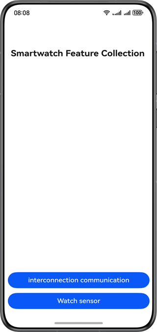
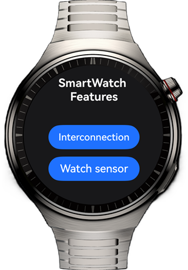

# Phone-Watch Interconnection and Heart Rate Monitoring

### **Overview**

This sample demonstrates the interconnection of mobile phones and watches and the use of watch sensors, helping developers understand and master the development of specific scenarios related to smart watches. The interconnection between the phone and watch involves the use of **WearEngine**. Therefore, you need to [apply for integrating WearEngine](https://developer.huawei.com/consumer/en/doc/harmonyos-guides/wearengine_apply) in AGC. For details about how to apply for the WearEngine permission and manually configure the signature, please refer to the link.

### **Preview**
Running effect on the mobile phone



Running effect on the watch




### **Project Directory**
```                                      
├───commons                                                   // Layer of commons 
│   └───utils/src/main/ets/utils                              // Utility 
│       └───ConnectUtil.ets                                   // Connection utility 
└───products                                                  // Product customization layer 
    ├───phone/src/main/ets                                    // Mobile phone module 
    │   ├───entryability                             
    │   │   └───EntryAbility.ets                              // Entry point class 
    │   ├───entrybackupability                       
    │   │   └───EntryBackupAbility.ets                        // Data backup and restoration 
    │   ├───pages                       
    │   │   ├───Index.ets                                     // Home Page       
    │   │   └───NotifyPage.ets                                // Interconnection page     
    │   └───view                                    
    │       └───ConnectView.ets                                // Interconnection page view 
    ├───phone/src/main/resources  
    ├───wearable/src/main/ets                                  // Watch module 
    │   ├───applicationbackupability                             
    │   │   └───ApplicationBackupAbility.ets                   // Data backup and restoration 
    │   ├───pages                       
    │   │   └───Index.ets                                      // Home page 
    │   ├───view     
    │   │   ├───ConnectPageView.ets                            // Interconnection page view 
    │   │   └───SensorsPageView.ets                            // Sensor usage page view 
    │   └───wearable                                    
    │       └───Wearable.ets                                   // Watch applications entry class 
    └───wearable/src/main/resources                            // Resource
```

### **How to Use**
This project allows for installation on both mobile phones and watches by selecting different modules in the **products** layer. Select **phone** for the mobile phone and **wearable** for the watch. When this application is installed on both the mobile phone and the watch and the interconnection page is displayed, the mobile phone and the watch can communicate with each other. This project involves interconnection between the phone and watch, as well as obtaining watch sensor information. Therefore, the emulator is not supported.
1. Go to the home page and touch the **interconnection communication** button to access the interconnection page. On the phone, you can enter information and send it to the watch. The entered information is displayed on the watch. On the watch, you can send information back to the phone. The reply information sent from the watch is displayed on the phone.
2. The sensor button needs to be verified on the watch. Touch the **Watch sensor** button on the watch to go to the sensor verification page. Start the heart rate monitoring functionality, and wear the watch between the wrists to display the heart rate information on the screen.

### **Required Permissions**

1. For **wearEngine** permissions, you need to apply for **wearEngine** permission approval for the application on AGC, configure manual signing, and set the **client_id** in **module.json5**. For details, you can search on the HUAWEI Developers website.
2. **ohos.permission.READ_HEALTH_DATA**: heartbeat information obtaining permission


### **Constraints**

1. This sample is only supported on Huawei phones and Huawei smart wearables running standard systems.
2. The HarmonyOS version must be HarmonyOS 5.1.0 Release or later.
3. The DevEco Studio version must be DevEco Studio 5.1.0 Release or later.
4. The HarmonyOS SDK version must be HarmonyOS 5.1.0 Release SDK or later.