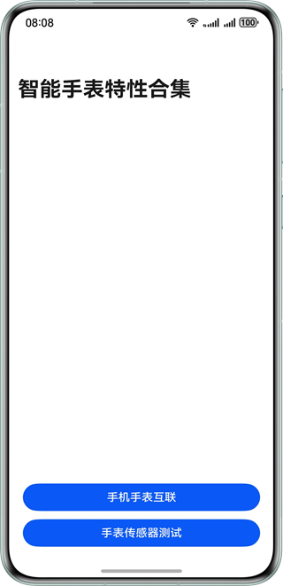
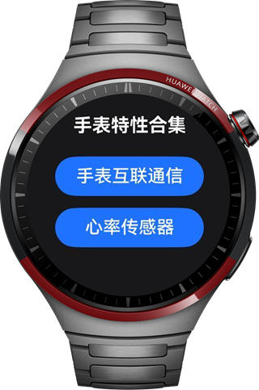

# 实现手机手表互联通信与手表心率监听

### 简介

本示例主要通过展示手机手表的互联通信，以及手表传感器的使用等场景，帮助开发者了解与掌握智能手表相关的特有场景开发。
由于手机手表互联通信涉及到WearEngine的使用，因此需要去AGC上[申请接入WearEngine服务](https://developer.huawei.com/consumer/cn/doc/harmonyos-guides/wearengine_apply)，请开发者参考链接进行WearEngine权限的申请与签名的手动配置。

### 效果预览
手机运行效果图：



手表地图页：




### 工程代码结构
```                                      
├───commons                                                   // commons层
│   └───utils/src/main/ets/utils                              // 工具
│       └───ConnectUtil.ets                                   // 互联工具类
└───products                                                  // 产品定制层
    ├───phone/src/main/ets                                    // 手机模块
    │   ├───entryability                            
    │   │   └───EntryAbility.ets                              // 程序入口类
    │   ├───entrybackupability                      
    │   │   └───EntryBackupAbility.ets                        // 数据备份恢复
    │   ├───pages
    │   │   ├───Index.ets                                     // 首页         
    │   │   └───NotifyPage.ets                                // 互联通信页       
    │   └───view                                   
    │       └───ConnectView.ets                                // 互联通信页视图
    ├───phone/src/main/resources 
    ├───wearable/src/main/ets                                  // 手表模块
    │   ├───applicationbackupability                            
    │   │   └───ApplicationBackupAbility.ets                   // 数据备份恢复
    │   ├───pages                      
    │   │   └───Index.ets                                      // 首页                         
    │   ├───view    
    │   │   ├───ConnectPageView.ets                            // 互联通信页视图
    │   │   └───SensorsPageView.ets                            // 传感器使用页视图
    │   └───wearable                                   
    │       └───Wearable.ets                                   // 手表程序入口类
    └───wearable/src/main/resources                            // 资源
```

### 使用说明
本工程可以通过选择products层的不同模块，分别安装在手机与手表上。手机选择phone，手表选择wearable，当手机与手表两侧均安装了本应用并进入手机手表互联页面后，即可进行手机手表的互联通信。
本工程涉及手机与手表的互联通信，以及手表传感器信息的获取，因此暂不支持模拟器。
1. 进入主页，点击手机手表互联通信按钮，进入互联通信页。手机侧可以输入信息，点击发送后，手表侧将弹框显示手机侧输入的信息，手表侧点击发送信息，手机侧会弹窗返回手表侧发来的回复信息。
2. 传感器按钮需要在手表侧验证，手表侧点击传感器按钮后跳转至传感器验证页，点击心率监听开启按钮，将手表佩戴至腕间，即可在屏幕中显示心率信息。

### 相关权限

1. wearEngine权限，需要在AGC上为应用审批WearEngine权限，配置手动签名以及module.json5中设置client_id，具体可在开发者联盟官网中搜索申请接入WearEngine服务。
2. ohos.permission.READ_HEALTH_DATA 心跳信息权限获取


### 约束与限制

1. 本示例仅支持标准系统上运行，支持设备：华为手机、华为智能穿戴。
2. HarmonyOS系统：HarmonyOS 5.1.0 Release及以上。
3. DevEco Studio版本：DevEco Studio 5.1.0 Release及以上。
4. HarmonyOS SDK版本：HarmonyOS 5.1.0 ReleaseSDK及以上。