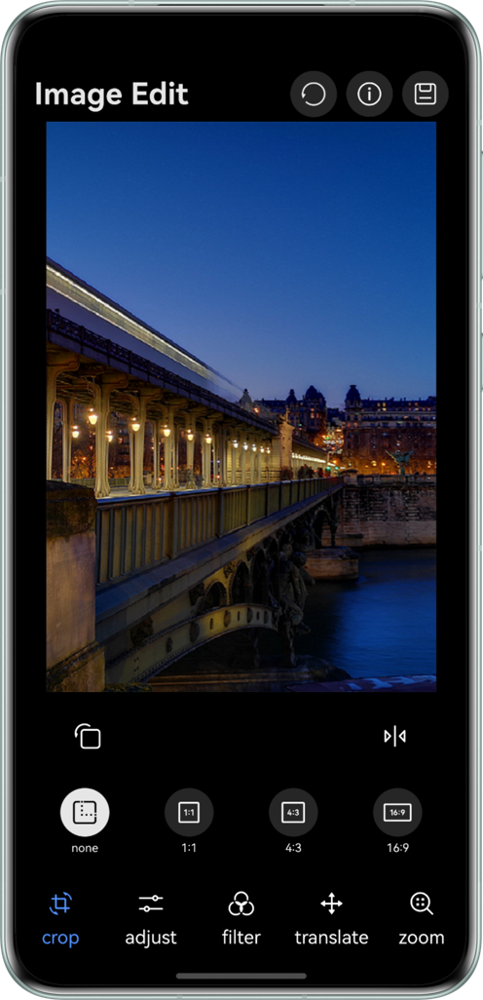
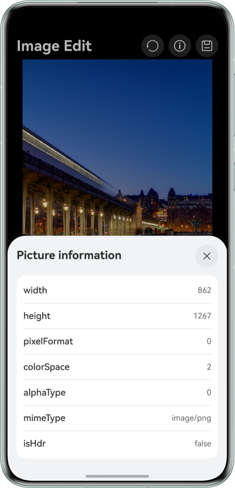
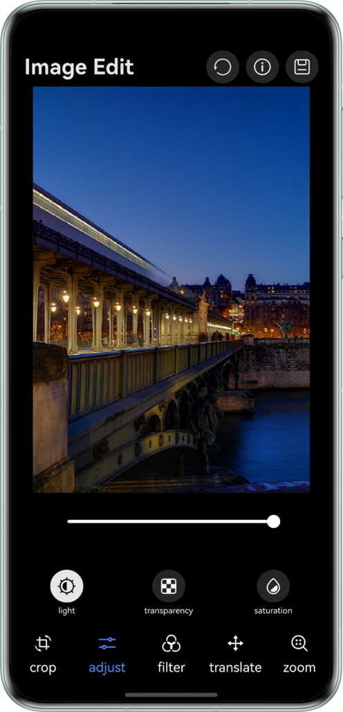
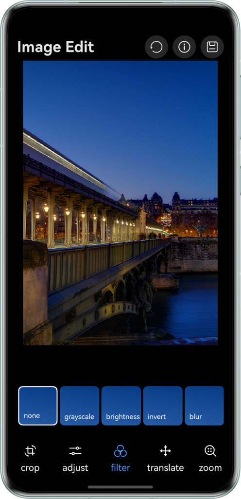
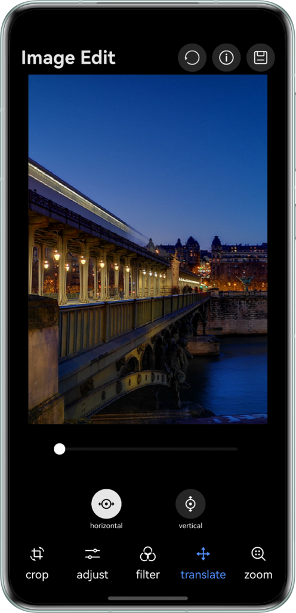
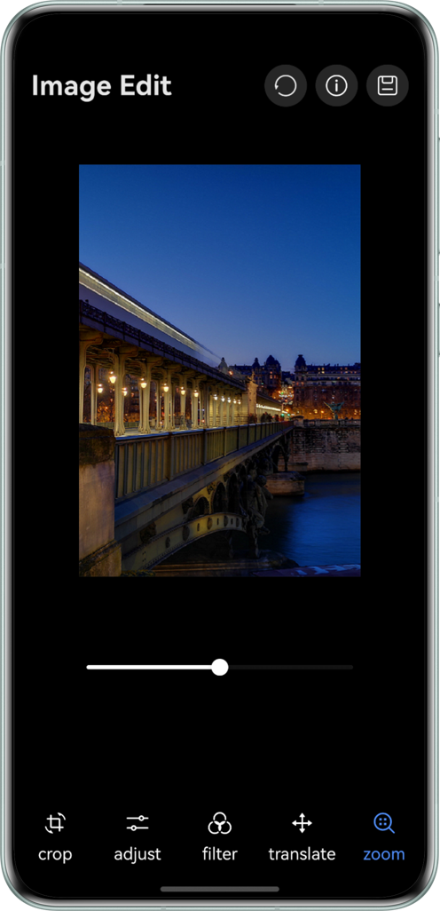

# Image Editing FunctionBased On Pixelmap Codec

## Project Overview
Convert images to PixelMap format through image decoding, and retrieve and display the decoded original image information. Implement image editing functions based on PixelMap, including geometric transtormations (cropping, rotation, translation, scaling, mirroring) and color adjustments (brightness, transparency, saturation). Atter editing, re-encode the image and save it to the gallery.

## Preview
| Crop                                                     | Information                                              | Adjustment                                                         |
|----------------------------------------------------------|----------------------------------------------------------|----------------------------------------------------------|
|  |  |  |

| Filter                                                   | Translate                                                | Zoom                                                     |
|----------------------------------------------------------|----------------------------------------------------------|----------------------------------------------------------|
|  |  |  |

## How to Use

1. Click the information button in the header to inspect the raw image metadata.
2. Use the bottom tab bar to switch between different editing functions:
   - **Crop**: Support for various aspect ratio cropping
   - **Adjust**: Adjust image brightness, transparency, and saturation
   - **Filter**: Apply various filter effects
   - **Translate**: Move the image horizontally and vertically
   - **Scale**: Zoom in or out of the image
3. Preview editing effects in real-time.
4. Tap the save button to save the edited image.

## Project Directory

```
├──ets
│  ├──common
│  │  └──constant
│  │     └──constant
│  │        └──CommonConstants.ts   // Constant
│  ├──entryability
│  │  └──EntryAbility.ets
│  ├──entrybackupability
│  │  └──EntryBackupAbility.ets
│  ├──pages
│  │  ├──PictureEdit.ets            // Pixel Data
│  │  └──PixelDataManager.ets       // Edit
│  ├──utils
│  │  ├──AdjustUtil.ets             // Adjust utils
│  │  ├──CropUtil.ets               // Crop utils
│  │  ├──DecodeUtil.ets             // Decode utils
│  │  ├──EncodeUtil.ets             // Encode utils
│  │  ├──LoggerUtil.ets             // Logger utils
│  │  └──OpacityUtil.ets            // Opacity utils
│  ├──view
│  │  ├──AdjustContentView.ets      // Adjust
│  │  ├──CropView.ets               // Crop
│  │  ├──TranslateView.ets          // Translate
│  │  ├──ZoomView.ets               // Zoom
│  │  └──ApplyFilterView.ets        // Apply Filter
│  ├──viewModel           
│  │  ├──IconListViewModel.ets      // icon Model
│  │  ├──MessageItem.ets            // Message
│  │  ├──OptionViewModel.ets        // Option model
│  │  └──RegionItem.ets             
│  └──viewModel
│     └──AdjustWork.ts              // Work         
└──resources
```
## How to Implement

1. Image decoding: Image decoding refers to decoding archived images in supported formats into a unified PixelMap for image display or image processing in applications or systems.
2. Image information: Get the decoded image information display.
3. Image editing: Use the decoded PixelMap image to edit the image, including cropping, rotation, color gamut adjustment, translation, zooming and other functions.
4. Image encoding: Image encoding refers to encoding PixelMap into archived images in different formats (currently only supports packaging into JPEG, WebP, and PNG formats) for subsequent processing, such as saving and transmission.

## Permissions

- Allow reading image or video files from the user's public directory：ohos.permission.WRITE_IMAGEVIDEO
- Allow the app to read and write media file information in the user's external storage：ohos.permission.WRITE_MEDIA

## Constraints

1. The sample is only supported on Huawei phones with standard systems.
2. HarmonyOS: HarmonyOS 5.1.1 Release or later.
3. DevEco Studio: DevEco Studio 5.1.1 Release or later.
4. HarmonyOS SDK: HarmonyOS 5.1.1 Release SDK or later.