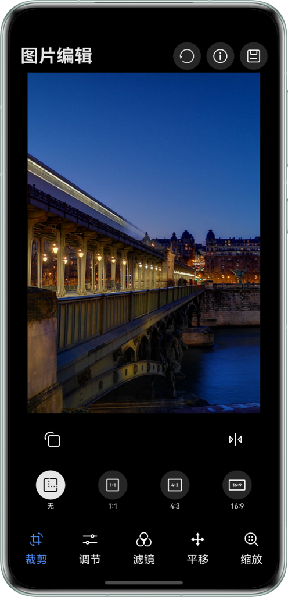
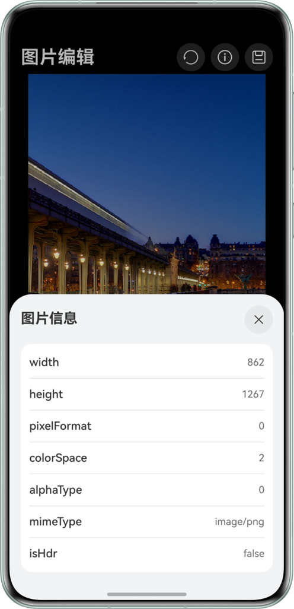
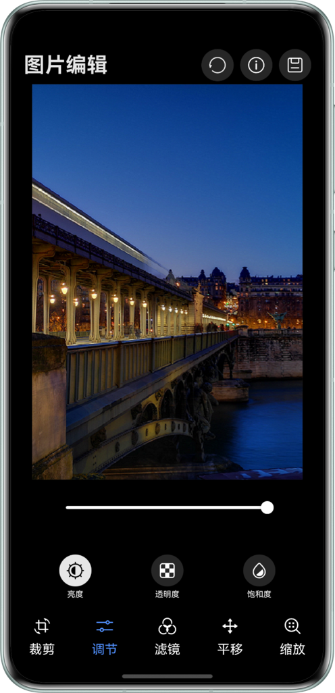
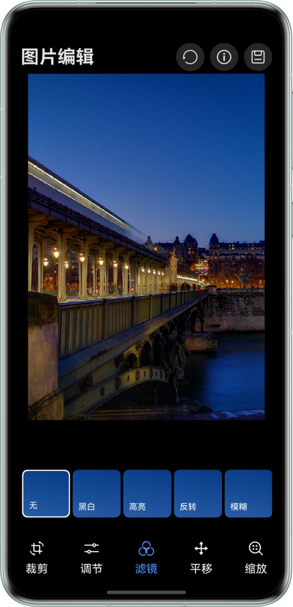
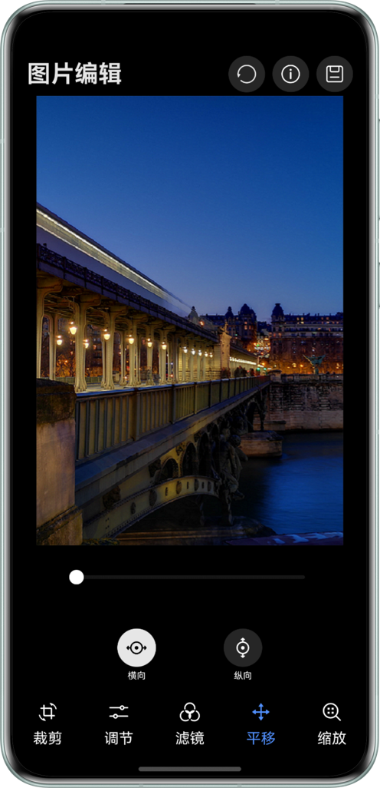
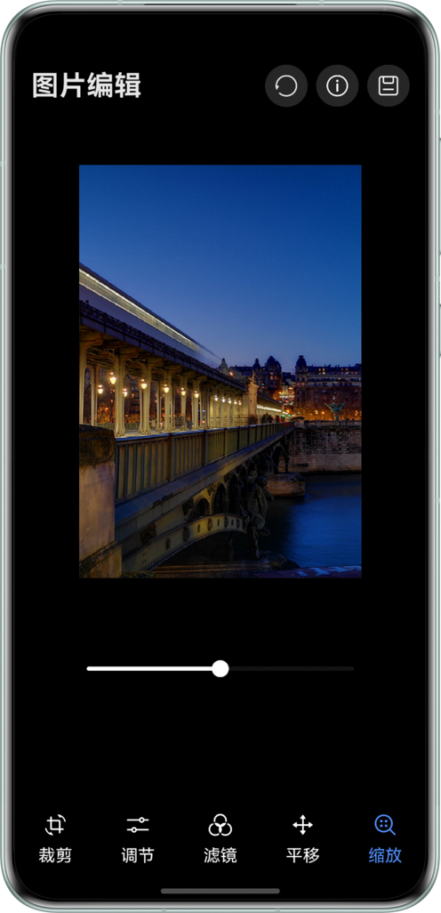

# 基于PixelMap编解码图片编辑功能

## 项目简介
通过图片解码将图片转换为PixelMap格式，获取并展示解码后的原图信息。基于PixelMap实现图片编辑功能，包括几何变换(裁剪、旋转、平移、缩放、镜像)和颜色调整(亮度、透明度、饱和度）等功能。完成编辑后，可将图片重新编码并保存至图库。

## 效果预览
| 裁剪                                                       | 图片信息                                                     | 调节                                                       |
|----------------------------------------------------------|----------------------------------------------------------|----------------------------------------------------------|
|  |  |  |

| 滤镜                                                       | 平移                                                       | 缩放                                                       |
|----------------------------------------------------------|----------------------------------------------------------|----------------------------------------------------------|
|  |  |  |

## 使用说明

1. 点击顶部信息按钮，查看原图信息。
2. 使用底部标签页切换不同的编辑功能：
   - **裁剪**：支持多种比例裁剪
   - **调节**：调整图片亮度、透明度、饱和度
   - **滤镜**：应用各种滤镜效果
   - **平移**：水平和垂直移动图片
   - **缩放**：放大或缩小图片
3. 实时预览编辑效果。
4. 点击保存按钮保存编辑后的图片。

## 工程目录

```
├──ets
│  ├──common
│  │  └──constant
│  │     └──constant
│  │        └──CommonConstants.ts   // 常量
│  ├──entryability
│  │  └──EntryAbility.ets
│  ├──entrybackupability
│  │  └──EntryBackupAbility.ets
│  ├──pages
│  │  ├──PictureEdit.ets            // 编辑
│  │  └──PixelDataManager.ets       // 实例
│  ├──utils
│  │  ├──AdjustUtil.ets             // 调节utils
│  │  ├──CropUtil.ets               // 裁剪utils
│  │  ├──DecodeUtil.ets             // 解码utils
│  │  ├──EncodeUtil.ets             // 编码utils
│  │  ├──LoggerUtil.ets             // 提示utils
│  │  └──OpacityUtil.ets            // 透明utils
│  ├──view
│  │  ├──AdjustContentView.ets      // 调节组件
│  │  ├──CropView.ets               // 裁剪组件
│  │  ├──TranslateView.ets          // 平移组件
│  │  ├──ZoomView.ets               // 缩放组件
│  │  └──ApplyFilterView.ets        // 滤镜组件
│  ├──viewModel           
│  │  ├──IconListViewModel.ets      // icon Model
│  │  ├──MessageItem.ets            // 消息
│  │  ├──OptionViewModel.ets        // 操作枚举
│  │  └──RegionItem.ets             
│  └──workers
│     └──AdjustWork.ts              // 工作线程         
└──resources
```

## 具体实现

1. 图片解码：图片解码指将所支持恪式的存档图片解码成统一的PixelMap，以便在应用或系统中进行图片显示或图片处理。
2. 图片信息：获取解码后的图片信息展示。
3. 图片编辑：使用解码的PixelMap图片编辑图片，实现包含裁剪、旋转、色域调节、平移、缩放等功能。
4. 图片编码：图片编码指将PixelMap编码成不同格式的存档图片（当前仅支持打包为JPEG、WebP和png格式），用于后续处理，如保存、传输等。

## 相关权限

- 允许读取用户公共目录的图片或视频文件：ohos.permission.WRITE_IMAGEVIDEO
- 允许应用读写用户外部存储中的媒体文件信息：ohos.permission.WRITE_MEDIA

## 约束与限制

1. 本示例仅支持标准系统上运行，支持设备：华为手机。
2. HarmonyOS系统：HarmonyOS 5.1.1 Release及以上。
3. DevEco Studio版本：DevEco Studio 5.1.1 Release及以上。
4. HarmonyOS SDK版本：HarmonyOS 5.1.1 Release SDK及以上。