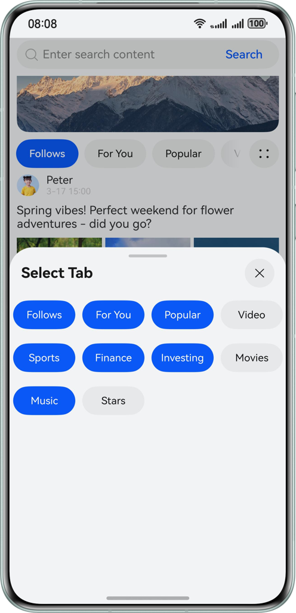

# PureTabs
### Overview
This sample demonstrates the common practices of developing the Tabs component under the ArkUI framework in HarmonyOS. It combines the following use cases to showcase a holistic effect by organizing the code using the MVVM pattern.
- Two-layer nesting tabs
- Sticky tabs on scroll
- Custom tabs at the bottom
- Slidable tabs on the top
- Dynamic tab management (adding or removing tab items)
- Tabs transition animations
### Preview
| Two-layer Nesting Tabs                    | Sticky Tabs on Scroll      | Dynamic Tab Management      | Slidable Tabs on the Top        |                         
|-------------------------------------------|----------------------------|-----------------------------|---------------------------------|
|  |  |  |  |
### Project Directory
```
├──entry/src/main/ets                       // Code area 
│  ├──common                                // 
│  │  ├──constant
│  │  │  └──Constants.ets                   // Constants 
│  │  └──utils
│  │     └──StringUtil.ets                  // String utility 
│  ├──entryability
│  │  └──EntryAbility.ets
│  ├──entrybackupability
│  │  └──EntryBackupAbility.ets
│  ├──model
│  │  ├──ContentItemModel.ets               // Content item data class 
│  │  ├──InTabsModel.ets                    // Displayed content list data class 
│  │  ├──SelectTabsModel.ets                // Select displayed tabs data class 
│  │  └──TabItemModel.ets                   // Tab item data class 
│  ├──pages
│  │  └──Index.ets                          // Page entry 
│  ├──view
│  │  ├──BannerComponent.ets                // Banner component 
│  │  ├──ContentItemComponent.ets           // Content item component 
│  │  ├──InTabsComponent.ets                // Inner tabs component 
│  │  ├──OtherTabComponent.ets              // Other outer tabs content components, displaying different background colors 
│  │  ├──OutTabsComponent.ets               // Outer tabs component 
│  │  ├──SearchBarComponent.ets             // Search bar component 
│  │  └──SelectTabsComponent.ets            // Component for adding or deleting inner tabs 
│  └──viewmodel
│     ├──ContentItemViewModel.ets           // Content item service data class 
│     ├──InTabsViewModel.ets                // Inner tabs service data class 
│     ├──SelectTabsViewModel.ets            // Service data class for adding or deleting tabs 
│     └──TabItemViewModel.ets               // Service data class of a single tab 
└──entry/src/main/resources                 // App resources
```
### How to Implement
- Two-layer nesting tabs
    - Both the outer and inner Tabs can be swiped to switch tabs. Swiping the inner Tabs to the end triggers the outer Tabs to swipe.
    - Listen to the sliding gesture on the last TabContent of the inner Tabs, transfer the variable to the outer Tabs of the parent component through @Link, and control the sliding of the outer Tabs through the TabController of the outer Tabs.
- Sticky tabs on scroll
    - Sliding components are embedded outside the Tabs parent component and inside the TabContent component of Tabs.
    - Set the sliding behavior attribute nestedScroll on the sliding component in TabContent so that the parent component moves first when the component slides up and the parent component moves first when the component slides down.
- Custom tabs at the bottom
    - Custom builder function modified by the @Builder decorator, which is transferred to the TabBar to implement customized styles.
    - Set the currentIndex attribute to record the currently selected tab page. In the TabBar construction function modified by @Builder, the value is used to determine whether the current tab page is selected to display different styles.
- Slidable tabs on the top
    - Set the attribute barMode (BarMode.Scrollable) of the Tabs component. When the tab page cannot be fully displayed, the tab page can be scrolled.
- Dynamic tab management (adding or removing tab items)
    - Use @Link to bidirectionally bind selectTabsViewModel to InTabsComponent and SelectTabsComponent.
    - SelectTabsComponent selects the tab items to be displayed. When exiting the modal, call selectTabsViewModel.updateSelectedTabs to update the tabs that can be displayed.
    - After the update, the value is transferred to InTabsComponent through the @Link mechanism to trigger UI update and display the newly selected tab.
- Tabs transition animations
    - Register the animation method customContentTransition (this.customContentTransition) on Tabs
    - Modify the size and transparency attributes of TabContent in the animation method, use @State to modify the attributes, and transfer the modified attributes to TabContent to implement animation.
### Required Permissions
In this sample, some images use network resources. Therefore, you need to apply for the system network permission. The configuration is as follows:

src/main/module.json5
```
{
  "module": {
    //...
    "requestPermissions": [
      {
        "name": "ohos.permission.INTERNET"
      }
    ]
  }
}
```
### Constraints
1. This sample is only supported on Huawei phones running standard systems.
2. The HarmonyOS version must be HarmonyOS 5.0.5 Release or later.
3. The DevEco Studio version must be DevEco Studio 5.0.5 Release or later.
4. The HarmonyOS SDK version must be HarmonyOS 5.0.5 Release SDK or later.
