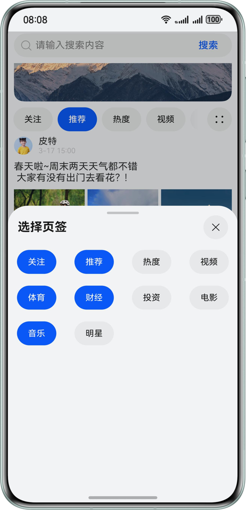

# Tabs组件应用场景
### 简介    
 本示例主要展示了HarmonyOS中ArkUI框架下的Tabs组件在日常开发中常用的场景实践，将各子场景结合设计出的一个综合场景，并使用MVVM模式组织代码，示例包含如下场景
- 实现双层嵌套Tabs
- 实现tabs滑动吸顶
- 实现底部自定义变化页签
- 实现顶部可滑动标签
- 实现增删现实页签项
- 实现Tabs切换动效
### 效果预览
| 双层Tabs嵌套，自定义页签样式                      | 页签上滑吸顶                                | 增删显示页签                          | 可滑动页签                             |                         
|---------------------------------------|---------------------------------------|--------------------------------------|---------------------------------------|
|  |  |  |  |
### 工程目录
```
├──entry/src/main/ets                       // 代码区
│  ├──common                                // 
│  │  ├──constant
│  │  │  └──Constants.ets                   // 常量类
│  │  └──utils
│  │     └──StringUtil.ets                  // 字符串工具类
│  ├──entryability
│  │  └──EntryAbility.ets
│  ├──entrybackupability
│  │  └──EntryBackupAbility.ets
│  ├──model
│  │  ├──ContentItemModel.ets               // 展示内容项数据类
│  │  ├──InTabsModel.ets                    // 展示内容列表数据类
│  │  ├──SelectTabsModel.ets                // 选择显示页签数据类
│  │  └──TabItemModel.ets                   // 页签项数据类
│  ├──pages
│  │  └──Index.ets                          // 页面入口
│  ├──view
│  │  ├──BannerComponent.ets                // 广告栏组件
│  │  ├──ContentItemComponent.ets           // 内容项组件
│  │  ├──InTabsComponent.ets                // 内层tabs组件
│  │  ├──OtherTabComponent.ets              // 其他外层tabs内容组件，展示不同背景颜色
│  │  ├──OutTabsComponent.ets               // 外层tabs组件
│  │  ├──SearchBarComponent.ets             // 搜索栏组件
│  │  └──SelectTabsComponent.ets            // 内层tabs增删控制组件
│  └──viewmodel
│     ├──ContentItemViewModel.ets           // 内容项业务数据类
│     ├──InTabsViewModel.ets                // 内层tabs业务数据类
│     ├──SelectTabsViewModel.ets            // 增删页签业务数据类
│     └──TabItemViewModel.ets               // 单个页签业务数据类
└──entry/src/main/resources                 // 应用资源目录
```
### 具体实现
- 实现双层嵌套Tabs
  - 外层Tabs和内层Tabs均可滑动切换页签，内层滑到尽头触发外层滑动
  - 在内层Tabs最后一个TabContent上监听滑动手势，通过@Link传递变量到父组件的外层Tabs，然后通过外层Tabs的TabController控制其滑动
- 实现Tabs滑动吸顶
  - Tabs父组件外及Tabs的TabContent组件内嵌套可滑动组件
  - 在TabContent内可滑动组件上设置滑动行为属性nestedScroll，使其往上滑动时，父组件先动，往下滑动时自己先动
- 实现底部自定义变化页签
  - @Builder装饰器修饰的自定义builder函数，传递给TabBar，实现自定义样式
  - 设置currentIndex属性，记录当前选择的页签，并且@Builder修饰的TabBar构建函数中利用其值来区分当前页签是否被选中，以呈现不同的样式
- 实现顶部可滑动标签
  - 设置Tabs组件属性barMode(BarMode.Scrollable)，页签显示不下的时候就可滑动
- 实现增删现实页签项
  - 利用@Link双向绑定selectTabsViewModel到InTabsComponent和SelectTabsComponent
  - SelectTabsComponent选中需要显示的页签项，在退出模态框时调用selectTabsViewModel.updateSelectedTabs,更新可显示页签
  - 更新后通过@Link的机制传递到InTabsComponent，触发UI刷新，显示新选择的页签
- 实现Tabs切换动效
  - 在Tabs上注册动画方法customContentTransition(this.customContentTransition)
  - 在动画方法中修改TabContent的尺寸属性和透明属性，并通过@State修饰后传递给TabContent，来实现动画
### 相关权限
本示例中部分图片使用了网络资源，因此本示例需要申请系统网络权限，配置如下

src/main/module.json5
```
{
  "module": {
    //...
    "requestPermissions": [
      {
        "name": "ohos.permission.INTERNET"
      }
    ]
  }
}
```
### 约束与限制

1.本示例仅支持标准系统上运行，支持设备：华为手机。

2.HarmonyOS系统：HarmonyOS 5.0.5 Release及以上。

3.DevEco Studio版本：DevEco Studio 5.0.5 Release及以上。

4.HarmonyOS SDK版本：HarmonyOS 5.0.5 Release SDK及以上。
