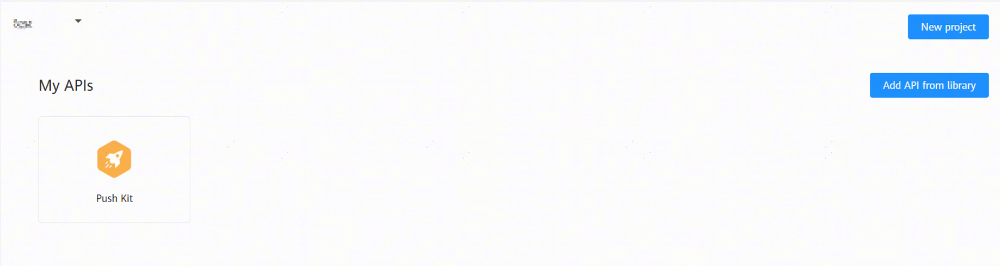
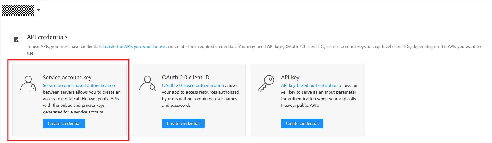
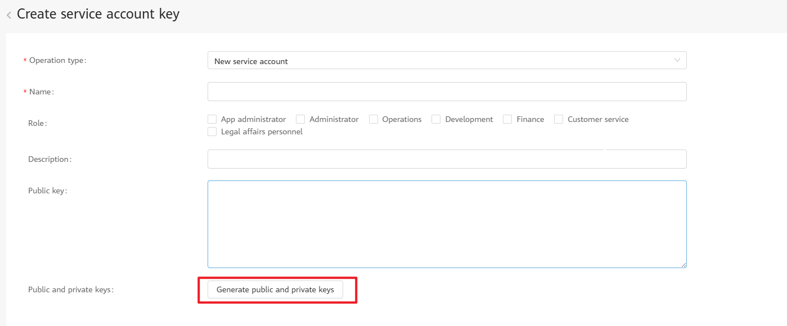

# Server-Side Demo for Sending Service Notifications by Push Kit

- This demo provides sample code for sending service notifications for atomic services based on Java.
- This demo matches the [service notification - Push Kit - client-side demo](https://gitee.com/harmonyos_samples/push-kit-sample-code-client-atomic-arkts) for sending service notifications by Push Kit. You can debug the client-side demo first to initiate an account-based subscription request and request user authorization. Then use this demo to push messages.
- If you have already developed the client-side code, you can directly use this demo to send messages.

## Supported Notification Types

- [Service notification](src/main/java/com/huawei/push/notification/NotificationSendExamples.java)
  - [Message parameters](https://developer.huawei.com/consumer/en/doc/harmonyos-references/push-api-service-noti#section18768181215219)
    - **thing**: The value can contain a maximum of 128 characters, including Chnese characters, English letters, digits, and special characters. This field cannot be left empty.
    - **time**: date or time range. This field cannot be left empty.
      Example:
      January 1, 2023 22:22
      January 1, 2023 22:22:00
      January 1, 2023 00:00 - January 2, 2023 23:59
      January 1, 2023 00:00:00 - January 2, 2023 23:59:59
      January 1, 2023 00:00-12:30
      January 1, 2023 00:00:00-12:30:00
      January 1, 2023
      January 1, 2023 - January 2, 2023
    - **phone_number**: phone number. The value contains digits and special characters, for example, **+86-025-85697456**. This field cannot be left empty.
    - **car_number**: license plate number. The value contains a maximum of eight characters. The first and last characters can be Chinese characters, and the other characters can be letters or digits, for example, **HK9028**. This field cannot be left empty.

  - Actions Triggered upon Message Tapping
    - [Opening the app home page and passing data upon message tapping](https://developer.huawei.com/consumer/en/doc/harmonyos-guides/push-send-alert#section1792616175914)
    - [Opening a specified in-app page and passing data upon message tapping](https://developer.huawei.com/consumer/en/doc/harmonyos-guides/push-send-alert#section8794131614597)
  

## Supported Java Versions

Java 8+

## Quick Start

### Download

Download the demo and open it in the IDE.

### Preparations

1. [Enable the service notification permission and select a subscription template](https://developer.huawei.com/consumer/en/doc/atomic-guides/push-as-service-noti).
2. Obtain the service account credential file.

- Sign in to HUAWEI Developers and go to [API Console](https://developer.huawei.com/consumer/cn/console/overview).
- Go to **HMS API Services** > **My APIs** and ensure that Push Kit has been enabled for your project. If Push Kit is not enabled, click: 
- Go to **My Credentials** > **API Credentials**, click **Create credential**, and then click **Service account key**: 
- Set mandatory parameters and click **Generate public and private keys**. Create and download a JSON file. The downloaded file is your service account credential file: 

3. Rename the downloaded file **service_account.json** and replace the [service account credential file](src/main/resources/service_account.json) in the project.
4. Make sure that the client has initiated an account-based subscription request.
- For details, please refer to [Initiating an Account-based Subscription Request](https://developer.huawei.com/consumer/en/doc/atomic-guides/push-as-request-sub).

### Running the Demo
Replace the following items : **toOpenId** (recipient), **msgId** (message ID), **templateId** (template ID for the subscription message), **appId** (app ID), and **templateParams** (template parameters) in the demo [example class](src/main/java/com/huawei/push/notification/NotificationSendExamples.java). Then run the main method to send a service notification. For details about how to obtain the parameter values, please refer to the [development guide](https://developer.huawei.com/consumer/en/doc/atomic-guides/push-as-send-sub-noti#section56014179170).
