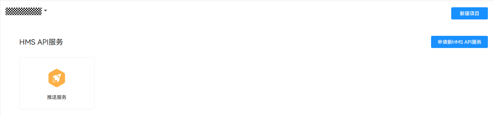
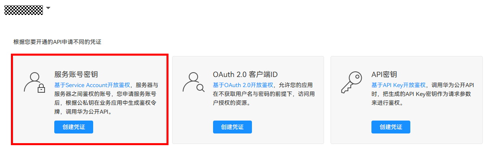
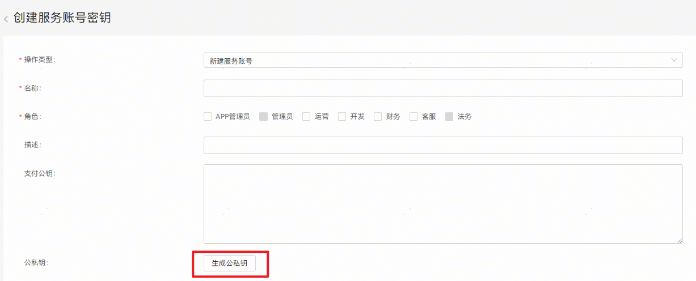

# Push Kit 服务通知 服务端 demo

- 本 demo 为面向 Java 的元服务通知示例代码。
- 本 demo 与 Push Kit 服务通知 端侧的[服务通知-推送服务-客户端](https://gitee.com/harmonyos_samples/push-kit-sample-code-client-atomic-arkts)demo 提供的服务对应，您可先调试端侧 demo,发起基于账号的订阅请求并通过用户授权,后再使用本 demo 发送消息。
- 若您已有自己的端侧代码，也可直接使用本 demo 发送通知消息；

## 支持发送的通知

- [服务通知](src/main/java/com/huawei/push/notification/NotificationSendExamples.java)
  - [消息参数](https://developer.huawei.com/consumer/cn/doc/harmonyos-references/push-api-service-noti#section18768181215219)
    - thing:可汉字,字母,数字或符号组合(128以内)。值不可为空。
    - time:代表日期或时间范围，值不可为空。
      样例：
      2023年1月1日 22:22
      2023年1月1日 22:22:00
      2023年1月1日 00:00~**2023年1月2日** 23:59
      2023年1月1日 00:00:00~2023年1月2日 23:59:59
      2023年1月1日 00:00~12:30
      2023年1月1日 00:00:00~12:30:00
      2023年1月1日
      2023年1月1日~2023年1月2日。
    - phone_number:代表电话号码。数字，符号，电话号码，如：+86-025-85697456。值不可为空。
    - car_number:代表车牌号。8位以内，第一位与最后一位可为汉字，其余为字母或数字，例如车牌号码：粤A8Z888挂。值不可为空。

  - 点击消息动作
    - [点击消息进入应用首页并传递数据](https://developer.huawei.com/consumer/cn/doc/harmonyos-guides/push-send-alert#section1792616175914)
    - [点击消息进入应用内页并传递数据](https://developer.huawei.com/consumer/cn/doc/harmonyos-guides/push-send-alert#section8794131614597)
  

## 支持的 Java 版本

Java 8+

## 快速开始

### 下载

下载此 demo 并在 IDE 中打开。

### 开发准备

1. 参考[开通服务通知并选用订阅模板](https://developer.huawei.com/consumer/cn/doc/atomic-guides/push-as-service-noti)，开通服务通知并选用订阅模板。
2. 获取 Service Account 凭据文件，具体步骤如下：

- 登录华为开发者联盟，进入[API Console](https://developer.huawei.com/consumer/cn/console/overview)。
- 在页面左侧的导航栏中，点击“我的API”，确保在项目名下已有推送服务，若无请点击右侧申请：
- 点击左侧导航栏中“API 服务->凭证”，在项目下点击”服务帐号密钥“下的”创建凭证“：
- 填写必填项，并点击创建公私钥。创建并下载 JSON，下载后的文件就是您的 Service Account 凭据文件：

3. 将下载好的文件重命名为“service_account.json”，并替换工程中的[Service Account 凭据文件](src/main/resources/service_account.json)。
4. 确认端侧已发起基于账号的订阅请求。
- 参考[发起基于账号的订阅请求](https://developer.huawei.com/consumer/cn/doc/atomic-guides/push-as-request-sub)

### 运行
替换demo[示例类](src/main/java/com/huawei/push/notification/NotificationSendExamples.java)中的目标接收者（用户） toOpenId、消息id msgId、订阅消息对应的模板ID templateId、应用的 appId、以及订阅消息模板中模板参数 templateParams， 然后运行其 main 方法发送服务通知。具体参数获取方式详情见[开发指导](https://developer.huawei.com/consumer/cn/doc/atomic-guides/push-as-send-sub-noti#section56014179170)
