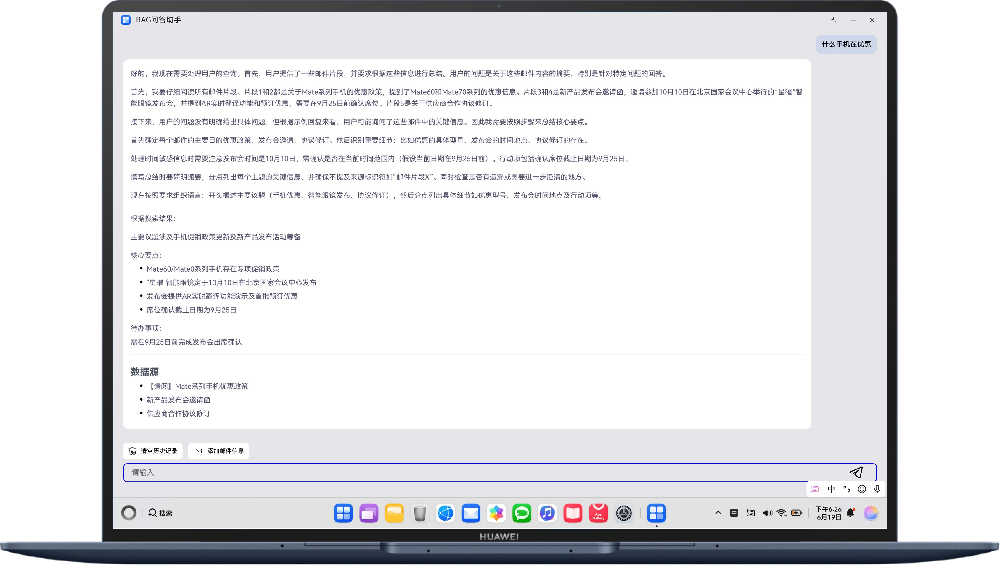

# 基于RAG实现智能问答系统

### 介绍
本示例利用ArkData向量数据库，和RAG的开发框架，针对邮件的信息格式，开发一个邮件信息提取总结问答助手。
通过接入LLM进行多次流式问询并对私域数据在端侧进行知识加工，在通过LLM进行知识问答的过程中附带准确相关的私域信息，帮助大模型生成更加精准的回答内容

## 效果预览
| 对话                                            | 
|-----------------------------------------------|
|  | 

## 使用说明
### ChatLLM apikey生成与配置
1. 进入并登录网址ModelArts - Console (https://console.huaweicloud.com/modelarts/?locale=zh-cn&region=cn-southwest-2#/model-studio/homepage)，
   在顶部导航栏选择对应区域，在左侧菜单中选择API Key管理，点击右上角创建API key，生成Key。 生成的key值只在弹窗中出现一次，请立刻保存后再关闭弹窗。
2. 在  LLMHttpUtils.ets 中进行key的配置，粘贴到Authorization属性中，"Authorization": "Bearer 生成的key值“
3. 在左侧菜单中选择在线推理，在商用服务列表中开通商用服务Qwen3-235B-A22B-32K。
4. 在右上角费用中心-总览 管理页面进行服务充值。

### 编译安装
使用DevEco Studio打开工程，并进行编译安装。

### 触发知识加工
> 日志过滤knowledge，如果有相关日志且未报错，说明知识加工已启动，不再新增knowledge日志，则说明加工结束，问答需要在加工结束后进行，加工流程约十分钟左右。如果未触发或者加工报错，则重启Demo（不用点击清理重建按钮），查看日志。

### 应用使用
1. 系统已经内置部分邮件，包括手机优惠政策、搬迁等信息，具体见resource->rawfile->sourceData.json，提问相关内容系统给出回答。
2. 点击右下角添加信息按钮，输入邮件信息并确认，进行提问后可以得到与知识库相关的回答。

## 工程目录

```
├──entry/src/main/ets/
│  ├──common
│  │   └──utils                           // 工具
│  │     └──LLMHttpUtils.ets              // 大模型工具
│  ├──entryability
│  │   └──EntryAbility.ets                // Ability的生命周期回调内容
│  ├──entrybackupability
│  │   └──EntryBackupAbility.ets          // EntryBackupAbility的生命周期回调内容
│  ├──pages                
│  │   └──Index.ets                       //  主页，邮件插入弹窗
│  ├──view                
│  │   └──CustomDialog.ets                //  主页，邮件插入弹窗
│  └──viewmodel
│      ├──Config.ets                      // 知识加工、rag配置设置
│      ├──MyChatLlm.ets                   // 模型回调函数、信息解析
│      ├──SessionDB.ets                   // 历史记录数据库操作
│      └──SetUp.ets                       // 邮件信息数据库操作
├──resource
└──module.json5
```

## 具体实现
1. 使用@ohos.data.relationalStore数据库能力向知识库写入源文件。
2. 链接大模型，构建rag.ChatLLM
3. 配置RAG会话框架，并开启会话

## 相关权限
需要网络权限：ohos.permission.INTERNET

## 依赖
不涉及

### 约束与限制
1. 本示例仅支持标准系统上运行，支持设备：PC/2in1。
2. HarmonyOS系统：HarmonyOS 6.0.0 Beta1及以上。
3. DevEco Studio版本：DevEco Studio 6.0.0 Beta1及以上。
4. HarmonyOS SDK版本：HarmonyOS 6.0.0 Beta1 SDK及以上。
5. 需要在华为云上开通账号和模型能力