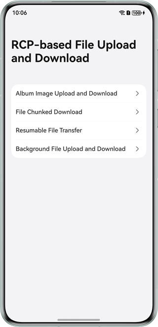

## RCP-based File Upload and Download

### Overview

Based on the Remote Communication Kit, this sample uses methods such as **post**, **fetch**, and **downloadToFile** to implement functions such as file upload and download, chunked file download, resumable transfer, and background file upload and download. This sample provides guidance for you to upload and download files using RCP in various scenarios.

### Preview



How to Use
1. Environment configuration: Configure the local file server according to [File server configuration](./service/README.md).
2. Uploading and downloading photos in the album: The photo list on the file server is displayed. Select a file and tap Download. After the file is downloaded, you can view the file in the album. Tap Upload to open the album. Select an image and upload it. The list is updated after the upload is successful.
3. Resumable file transfer: Select a file and tap Download. The button changes to Pause. Tap Download again to resume the download.
4. The interaction logic of other pages is the same as that of item 1 in this list.

### Project Directory

```
├──entry/src/main/ets/
│  ├──components
│  │  ├──CustomList.ets                             // Custom list component
│  │  ├──ProgressButton.ets                         // Progress bar button component
│  │  └──SelectionList.ets                          // Selection list component
│  ├──entryability
│  │  └──EntryAbility.ets                           // Entry ability
│  ├──constants
│  │  └──Constants.ets                              // Constants
│  ├──pages
│  │  ├──AlbumImageTrasfer.ets                      // Page for uploading and downloading photos in the album
│  │  ├──BackgroundFileTransfer.ets                 // Page for uploading and downloading background files
│  │  ├──ChunkedFileTransfer.ets                    // Page for downloading chunked files
│  │  ├──Index.ets                                  // Home page
│  │  └──ResumableFileTransfer.ets                  // Resumable file transfer page
│  ├──service
│  │  ├──Env.ets                                    // Environment configuration file of the server
│  │  ├──FileRequest.ets                            // Interface module for requesting file upload and download
│  │  ├──Formatter.ets                              // Data formatter of the server and client
│  │  ├──Interceptor.ets                            // Request interception
│  │  └──Model.ets                                  // Definition of the data types on the server and client
│  └──utils
│     ├──CommonUtil.ets                             // Common utility
│     ├──LocalFileUtil.ets                          // Local file utility
│     └──Logger.ets                                 // Logger
└──entry/src/main/resources                         // Static resources of the app
```

### How to Implement

1. Use the [Remote Communication Kit](https://developer.huawei.com/consumer/cn/doc/harmonyos-references/remote-communication-rcp) capabilities.

### Permissions

- **ohos.permission.INTERNET**: allows an app to access the network during upload and download.
- **ohos.permission.GET_NETWORK_INFO**: allows an app to obtain network information.
- **ohos.permission.KEEP_BACKGROUND_RUNNING**: allows a service ability to keep running in the background.

### Dependencies

[File server configuration](./service/README.md)

### Constraints

1. The sample is only supported on Huawei phones with standard systems.

2. The HarmonyOS version must be HarmonyOS 5.0.5 Release or later.

3. The DevEco Studio version must be DevEco Studio 5.0.5 Release or later.

4. The HarmonyOS SDK version must be HarmonyOS 5.0.5 Release SDK or later.