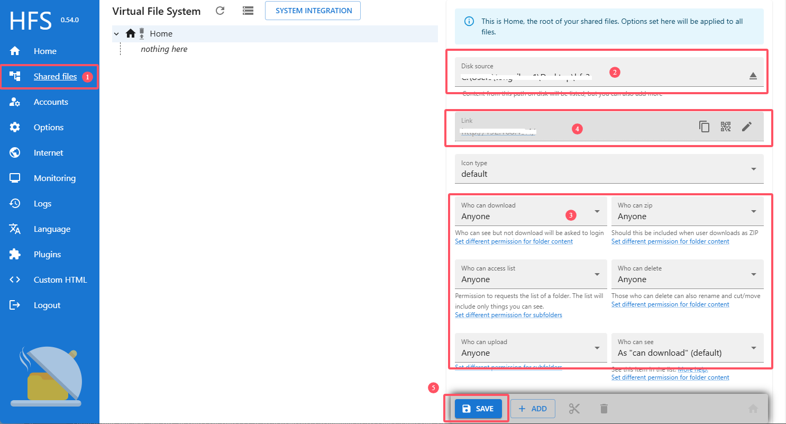

## 文件服务器使用说明

### 服务器配置：

1.测试设备和电脑连接同一个局域网。

2.电脑解压本目录下hfs压缩包，打开`hfs.exe`可执行文件。

3.hfs管理页面配置(http://localhost/~/admin), 执行hfs.exe文件浏览器自动弹出：

1. 选择左侧Shared files菜单
2. disk source中绑定本地文件存储的文件夹
3. 设置所有权限为Anyone
4点击保存save按钮

4.设置[Env.ets](../entry/src/main/ets/service/Env.ets)文件中的BASE_URL为上图中序号4处链接。

5、按照顺序操作1-4步骤后，即可运行测试上传下载任务。

## 相关依赖

[基于RCP的文件上传下载](..)应用依赖本服务。