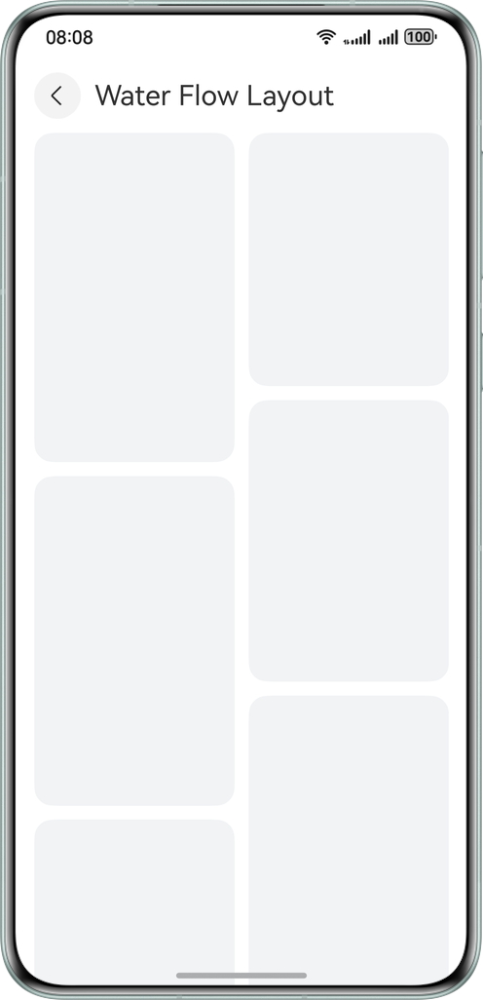
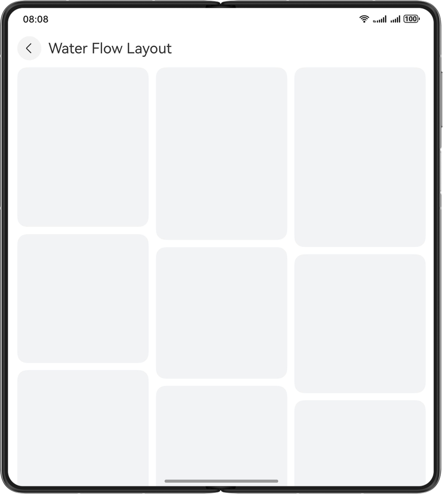
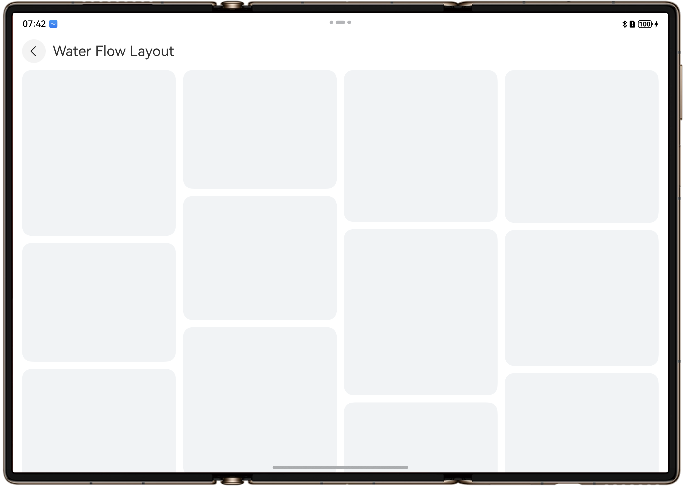
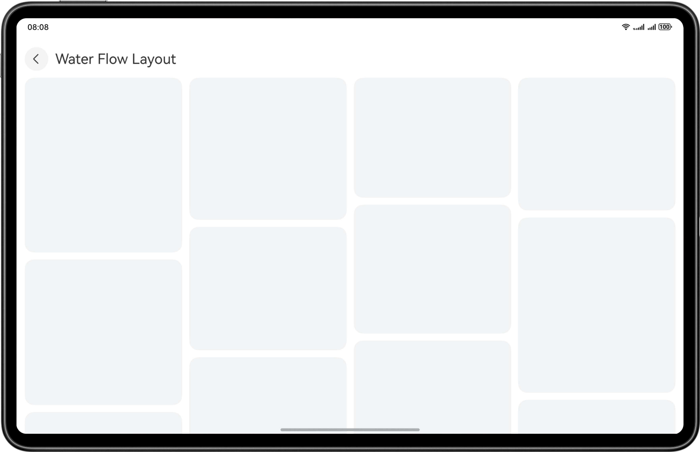

# Responsive Layout Based on One-Time Development for Multi-device Deployment

## Overview

This sample demonstrates how to use the responsive capability of one-time development for multi-device deployment provided by HarmonyOS to implement common responsive layouts on multiple devices (smartphones, large-sized foldables, wide foldables, trifold devices, and tablets).

## Preview

Running effect on smartphones



Running effect on large-sized foldable phones



Running effect on triple-screen foldable phones



Running effect on tablets



## How to Use

You can click different list items on the home page to display the effect of responsive layout pages on multiple devices, including: list layout, waterfall layout, carousel layout, grid layout, sidebar layout, two-column layout, triple-column layout, orientation layout, bottom/side navigation layout, and indentation layout.

Project Directory
```
├──entry/src/main/ets/ 
│  ├──entryability 
│  │  └──EntryAbility.ets 
│  ├──entrybackupability 
│  │  └──EntryBackupAbility.ets 
│  ├──pages 
│  │  ├──DoubleColumnLayout.ets          // Single/Dual-column page 
│  │  ├──GridLayout.ets                  // Grid page 
│  │  ├──IndentedLayout.ets              // Indentation layout page 
│  │  ├──Index.ets                       // Home page 
│  │  ├──ListLayout.ets                  // List layout page 
│  │  ├──MoveLayout.ets                  // Orientation layout page 
│  │  ├──SidebarLayout.ets               // Sidebar layout page 
│  │  ├──SwiperLayout.ets                // Carousel layout page 
│  │  ├──TabsLayout.ets                  // Bottom/Side navigation page 
│  │  ├──TripleColumnLayout.ets          // Triple-column layout page 
│  │  └──WaterFlowLayout.ets             // Waterfall layout page 
│  ├──utils 
│  │  ├──WidthBreakpointType.ets         // Utility for managing breakpoint types 
│  │  └──WindowUtil.ets                  // Window utility 
│  └──views 
│     ├──DoubleColumnView.ets            // Single/Dual-column view 
│     ├──GridView.ets                    // Grid view 
│     ├──IndentedView.ets                // Indentation layout view 
│     ├──ListView.ets                    // List layout view 
│     ├──MoveView.ets                    // Orientation layout view 
│     ├──NavigationBarView.ets           // Split-view layout navigation bar view 
│     ├──NavigationContentView.ets       // Split-view layout content view 
│     ├──SidebarView.ets                 // Sidebar view 
│     ├──SwiperView.ets                  // Carousel layout view 
│     ├──TabsView.ets                    // Bottom/Side navigation view 
│     ├──TripleColumnView.ets            // Triple-column view 
│     └──WaterFlowView.ets               // Waterfall layout view 
└──entry/src/main/resource               // Static resources
```

## How to Implement
1.	Use the **List** component and breakpoints to implement the list layout.
2.	Use the **WaterFlow** component and breakpoints to implement the waterfall layout.
3.	Use the **Swiper** component and breakpoints to implement the carousel layout.
4.	Use the **Grid** component and breakpoints to implement the grid layout.
5.	Use the **SideBarContainer** component and breakpoints to implement the sidebar.
6.	Use the **Navigation** component and breakpoints to implement single/dual-column layout.
7.	Use the **SideBarContainer** component, **Navigation** component, and breakpoints to implement triple-column layout.
8.	Use the **Tabs** component and breakpoints to implement bottom/side navigation.
9.	Use the **GridRow**/**GridCol** component, breakpoints, and grid to implement the orientation layout.
10.	Use the **GridRow**/**GridCol** component, breakpoints, and grid to implement the indentation layout.

## Required Permissions

N/A.

## Dependencies

N/A.

## Constraints

1. This sample is only supported on Huawei phones running standard systems.
2. The HarmonyOS version must be HarmonyOS 5.0.5 Release or later.
3. The DevEco Studio version must be DevEco Studio 5.0.5 Release or later.
4. The HarmonyOS SDK version must be HarmonyOS 5.0.5 Release SDK or later.

