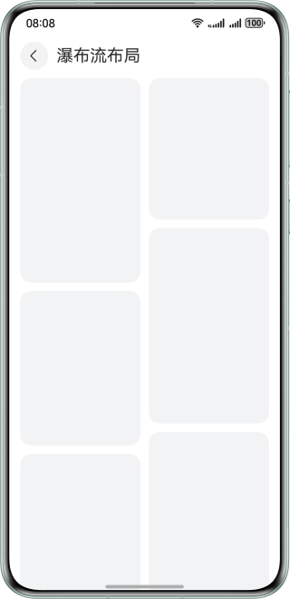
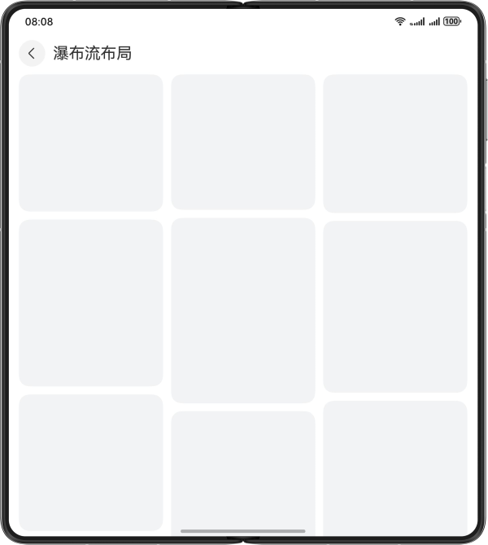
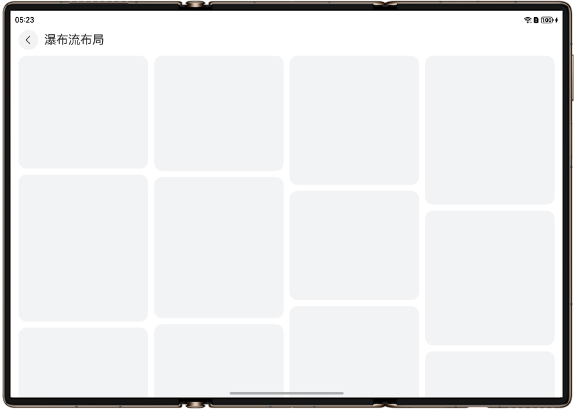
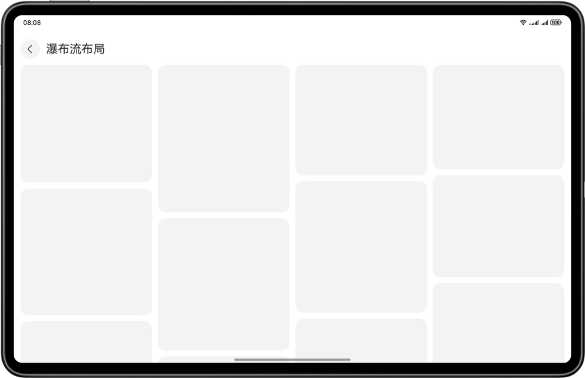

# 基于一多能力实现响应式布局

## 介绍

本示例展示了如何使用HarmonyOS提供一多响应式能力，在多设备（手机、大折叠、阔折叠、三折叠、平板）上实现常见的响应式布局。

## 效果展示

手机运行效果图：



大折叠运行效果图：



三折叠运行效果图：



平板运行效果图：



## 使用说明

应用可以点击首页不同的列表项，展示在多设备上的响应式布局页面效果，包括：列表布局、瀑布流布局、轮播布局、宫格布局、侧边栏、二分栏、三份栏、挪移布局、底部/侧边导航和缩进布局。

## 工程目录

```
├──entry/src/main/ets/
│  ├──entryability
│  │  └──EntryAbility.ets
│  ├──entrybackupability
│  │  └──EntryBackupAbility.ets
│  ├──pages
│  │  ├──DoubleColumnLayout.ets          // 单双栏页
│  │  ├──GridLayout.ets                  // 网格页
│  │  ├──IndentedLayout.ets              // 缩进布局页
│  │  ├──Index.ets                       // 主页
│  │  ├──ListLayout.ets                  // 列表布局页
│  │  ├──MoveLayout.ets                  // 挪移布局页
│  │  ├──SidebarLayout.ets               // 侧边栏页
│  │  ├──SwiperLayout.ets                // 轮播布局页
│  │  ├──TabsLayout.ets                  // 底部/侧边导航页
│  │  ├──TripleColumnLayout.ets          // 三分栏页
│  │  └──WaterFlowLayout.ets             // 瀑布流布局页
│  ├──utils
│  │  ├──WidthBreakpointType.ets         // 一多断点工具类
│  │  └──WindowUtil.ets                  // 窗口工具类
│  └──views
│     ├──DoubleColumnView.ets            // 单双栏视图
│     ├──GridView.ets                    // 网格视图
│     ├──IndentedView.ets                // 缩进布局视图
│     ├──ListView.ets                    // 列表布局视图
│     ├──MoveView.ets                    // 挪移布局视图
│     ├──NavigationBarView.ets           // 分栏布局导航栏视图
│     ├──NavigationContentView.ets       // 分栏布局内容区视图
│     ├──SidebarView.ets                 // 侧边栏视图
│     ├──SwiperView.ets                  // 轮播布局视图
│     ├──TabsView.ets                    // 底部/侧边导航视图
│     ├──TripleColumnView.ets            // 三分栏视图
│     └──WaterFlowView.ets               // 瀑布流布局视图
└──entry/src/main/resource               // 应用静态资源目录
```

## 实现思路

1. 使用List组件+断点实现列表布局。
2. 使用WaterFlow组件+断点实现瀑布流布局。
3. 使用Swiper组件+断点实现轮播布局。
4. 使用Grid组件+断点实现网格布局。
5. 使用SideBarContainer组件+断点实现侧边栏。
6. 使用Navigation组件+断点实现单/双栏。
7. 使用SideBarContainer组件+Navigation组件+断点实现三分栏。
8. 使用Tabs组件+断点实现底部/侧边导航。 
9. 使用GridRow/GridCol组件+断点+栅格实现挪移布局。 
10. 使用GridRow/GridCol组件+断点+栅格实现缩进布局。

## 相关权限

不涉及。

## 依赖

不涉及。

## 约束与限制

1. 本示例仅支持标准系统上运行，支持设备：华为手机。
2. HarmonyOS系统：HarmonyOS 5.0.5 Release及以上。
3. DevEco Studio版本：DevEco Studio 5.0.5 Release及以上。
4. HarmonyOS SDK版本：HarmonyOS 5.0.5 Release SDK及以上。
