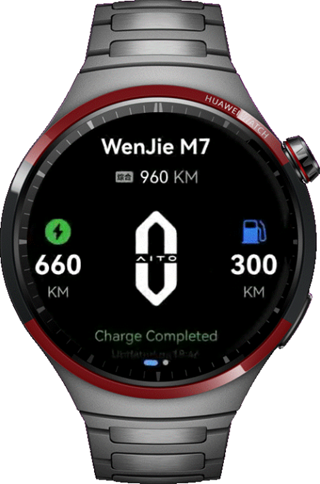
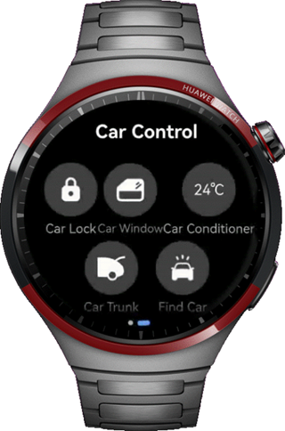

# Car Control Application on Smart Watches

### Overview

This sample demonstrates a remote car control application on the smart watch by using the Swiper and TextPicker components, aiming to help developers learn the layout modes and unique features of smart watches.

### Preview
1. Car Information Page<br>

2. Car Control Page <br>


#### How to Use

1. The home page contains the car information page and car control page. You can swipe up or down to switch between the pages.
2. The car control page contains five buttons: Car Lock, Car Window, Car Conditioner, Car Trunk, and Find Car.
3. After touching the Car Lock button, the safe code page appears. Entering 123456 will unlock the car and return to the car control page, indicating that the password is correct and the car is unlocked. If the input is not 123456, a pop-up appears to notify the user of the incorrect password. The password is cleared, and will not redirect to the car control page.
4. After touching the Car Window button, the button background alternates between blue and gray, indicating that the window is open or closed.
5. After touching the Car Conditioner button, the air conditioner control page is displayed. Swipe to select the temperature and touch the button to turn on the air conditioner. The safe code page is displayed. After the input is successful, it will return to the air conditioner control page, indicating that the air conditioner is turned on.
6. After touching the Car Trunk button, the trunk control page is displayed. Swipe up to the top, the safe code page is displayed. After the input is successful, it will return to the car control page, indicating that the trunk is opened.
7. After touching the Find Car button, the finding page is displayed. After clicking the two car-finding buttons, a dialog box is displayed, indicating that the car-finding function is enabled.


### Project Directory
```
├──entry/src/main/ets                                  // Code area 
│  ├──commons                                   
│  │  └──constants           
│  │     └──CommonConstants.ets                        // Common constants 
│  ├──entryability   
│  │  └──EntryAbility.ets  
│  ├──entrybackupability   
│  │  └──EntryBackupAbility.ets 
│  ├──model   
│  │  └──Dot.ets                                       // Password input point entity class 
│  ├──pages   
│  │  └──Index.ets                                     // Home page 
│  └──view   
│     ├──CarControlView.ets                            // Car control view class 
│     ├──CarInformationView.ets                        // Car information view class 
│     ├──ConditionerPageView.ets                       // Air conditioner control page 
│     ├──FindCarPageView.ets                           // Car finding page 
│     ├──SafeCodePageView.ets                          // Safe code page 
│     └──TrunkPageView.ets                             // Trunk control page 
└──entry/src/main/resources                            // Application resources

```

### Required Permissions

N/A.

### Dependencies

N/A.

### Constraints

1. This sample is only supported on Huawei phones and Huawei smart wearables running standard systems.
2. The HarmonyOS version must be HarmonyOS 5.1.0 Release or later.
3. The DevEco Studio version must be DevEco Studio 5.1.0 Release or later.
4. The HarmonyOS SDK version must be HarmonyOS 5.1.0 Release SDK or later.
