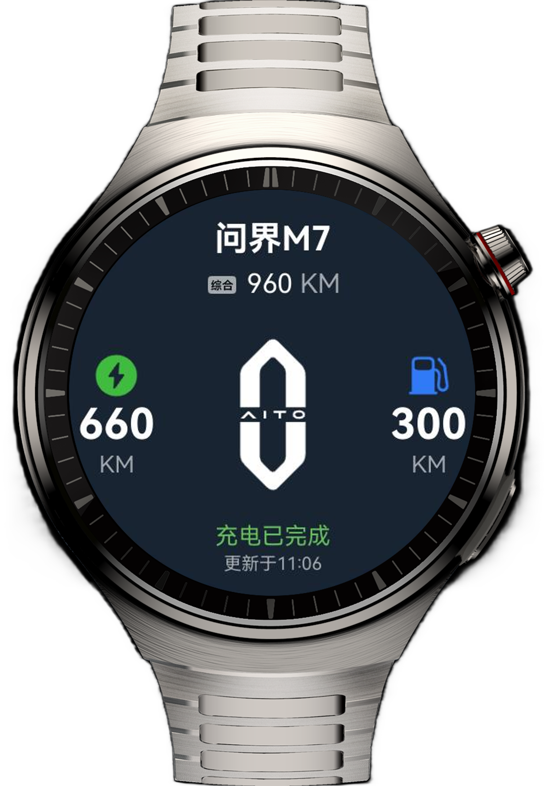
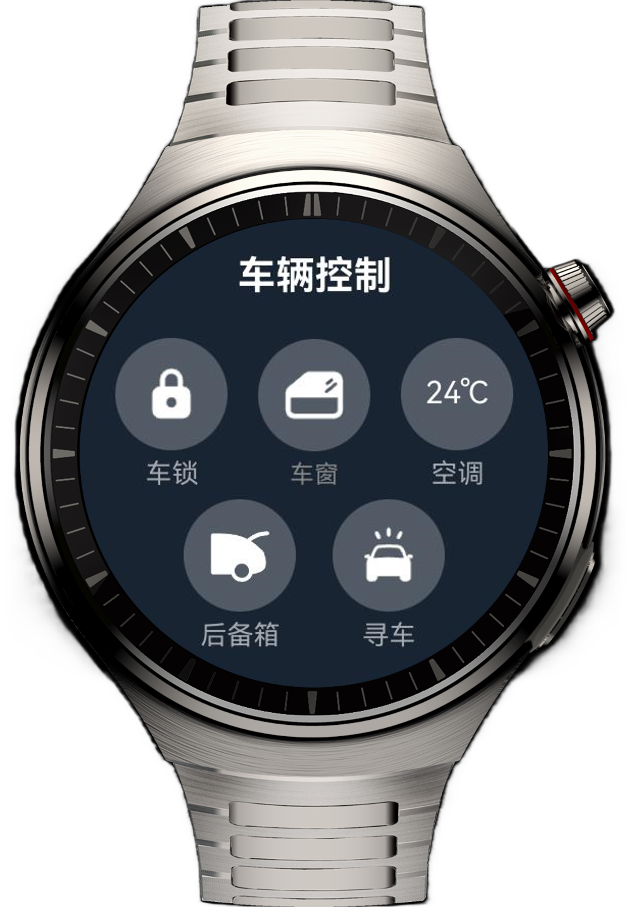

# 实现智能手表上的车控应用

### 介绍

本实例旨在通过完成智能手表上远程车控应用的实现，通过Swiper组件、TextPicker组件等的使用，帮助开发者学习智能手表设备的布局特点以及布局方式。

### 效果预览
1. 车辆信息页 <br>

2. 车辆控制页 <br>


#### 使用说明：

1. 首页包含车辆信息页和车辆控制页，可以通过上下滑动切换视图。
2. 车辆控制页包含五个按钮，车锁、车窗、空调、后备箱、寻车。
3. 车锁按钮点击后跳转安全码页面，输入123456即可成功，并返回车辆控制页，表示密码正确，车锁打开；输入不为123456，弹窗告知用户密码错误，密码清空，不进行跳转。
4. 车窗按钮点击后，按钮会在蓝和灰背景间切换，表示车窗的开与关。
5. 空调按钮点击后，跳转至空调控制页，滑动选取温度，点击开启空调，会跳转安全码页，输入成功后返回空调控制页，表示开启成功。
6. 后备箱按钮点击后，会跳转后备箱控制页，上划滑动条至顶部，跳转安全码页，输入密码跳转回车辆控制页，表示后备箱打开。
7. 寻车按钮点击后，会跳转寻车页，点击两个寻车按钮，会在一个加载动效后，弹窗提示寻车已开启。


### 工程目录
```
├──entry/src/main/ets                                  // 代码区
│  ├──commons                                  
│  │  └──constants          
│  │     └──CommonConstants.ets                        // 常量类
│  ├──entryability  
│  │  └──EntryAbility.ets 
│  ├──entrybackupability  
│  │  └──EntryBackupAbility.ets
│  ├──model  
│  │  └──Dot.ets                                       // 密码输入点实体类
│  ├──pages  
│  │  └──Index.ets                                     // 首页
│  └──view  
│     ├──CarControlView.ets                            // 车辆控制视图类
│     ├──CarInformationView.ets                        // 车辆信息视图类
│     ├──ConditionerPageView.ets                       // 空调控制页
│     ├──FindCarPageView.ets                           // 寻车页
│     ├──SafeCodePageView.ets                          // 安全码页                        
│     └──TrunkPageView.ets                             // 后备箱控制页   
└──entry/src/main/resources                            // 应用资源目录

```

### 相关权限

不涉及。

### 依赖

不涉及。

### 约束与限制

1. 本示例仅支持标准系统上运行，支持设备：智能手表。

2. HarmonyOS系统：HarmonyOS 5.1.0 Release及以上。

3. DevEco Studio版本：DevEco Studio 5.1.0 Release及以上。

4. HarmonyOS SDK版本：HarmonyOS 5.1.0 Release SDK及以上。
