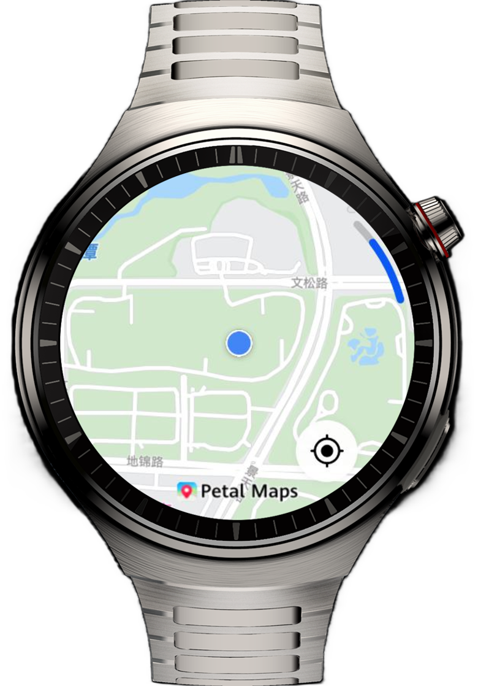

# Map Application on Smart Watches

## Overview

This sample uses the basic capabilities of Map Kit to implement the map viewing and location functionalities on smart watches, providing guidance for developers to adapt maps on wearables.

## Preview



## How to Use

1.	Go to the home page and grant access to the location.
2.	Touch the locating button to move the map view to the current location.

## Project Directory

```
├──entry/src/main/ets                     // Code area 
│  ├──common   
│  │  └──util                  
│  │     └──PermissionUtil.ets            // Permission utility class 
│  ├──entryability 
│  │  └──EntryAbility.ets                 // Entry point class 
│  ├──entrybackupability 
│  │  └──EntryBackupAbility.ets 
│  └──pages 
│     └──Index.ets                        // Home page 
└──entry/src/main/resources               // Static resources
```

## Constraints
1.	This sample is only supported on Huawei smart wearables running standard systems.
2.	The HarmonyOS version must be HarmonyOS 5.1.0 Release or later.
3.	The DevEco Studio version must be DevEco Studio 5.1.0 Release or later.
4.	The HarmonyOS SDK version must be HarmonyOS 5.1.0 Release SDK or later.

