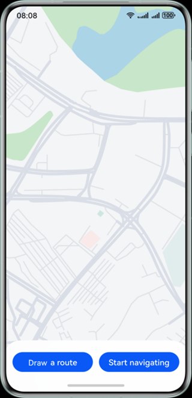
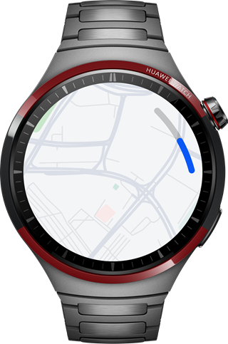
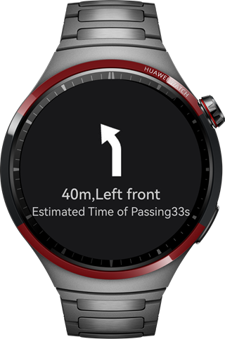

# Cooperative Navigation Application Based on WearEngine

## Overview

This sample is based on WearEngine, Map Kit, Location Kit, and Sensor Kit. It implements a map navigation application for collaborative operations between a smartphone and a smart watch through core APIs such as **deviceClient.getConnectedDevices()** and **p2pClient.sendMessage()**. This sample provides a complete implementation solution for cross-device communication and map navigation, which can be used as a reference for developing similar applications.

## Preview

Running effect on mobile phones



Map screen of the watch



Navigation screen of the watch




## How to Use

1.  After the application is authorized, the phone/watch displays the map.
2. You can touch the map either on a phone or a watch to generate a destination marker. The destination selected on the phone will be synced to the watch, and the operations on the watch will also be synced to the phone.
3.  After the destination is determined, touch the **Draw a route** button on the mobile phone, and it will display the route.。
4. After touching the **Start navigating** button on the mobile phone, the watch will switch to the navigation screen and start walking navigation following the route. (Navigation is real navigation, but is irrelevant to your location. The mobile phone sends navigation information periodically through **SetTimeOut**.)
5. After the navigation is complete, the watch will vibrate and a pop-up window will be displayed, indicating that you have reached your destination. The watch will then return to the map screen.

## Project Directory

```
└───SmartWatchMapNavigation                                         
    ├───commons                                                   // commons layer 
    │   ├───Communication/src/main/ets/common                     // Communication module 
    │   │   ├───model                                             // model 
    │   │   │   ├───CommunicationInformation.ets                  // Communication information entity class 
    │   │   │   └───RouteInfomation.ets                           // Route information entity class 
    │   │   └───utils                                             // Utility 
    │   │       └───CommunicationUtils.ets                        // Communication utility 
    │   ├───map/src/main/ets                                      // Map module 
    │   │   ├───common                                            //  
    │   │   │   └───utils                                         // Utility 
    │   │   │       └───DrawRouteUtils.ets                        // Utility for drawing routes on the map 
    │   │   └───view                                              // View 
    │   │       └───MapView.ets                                   // Map view 
    │   └───vibrator/src/main/ets/common                          // Vibrator module 
    │       └───VibratorUtil.ets                                  // Vibrator utility 
    └───products                                                  // Product customization layer 
        ├───phone/src/main/ets                                    // Mobile phone module 
        │   ├───entryability                             
        │   │   └───EntryAbility.ets                     
        │   ├───entrybackupability                       
        │   │   └───EntryBackupAbility.ets               
        │   └───pages                                    
        │       └───Index.ets                                      // Home page 
        ├───phone/src/main/resources  
        ├───wearable/src/main/ets                                  // Watch module 
        │   ├───pages
        │   │   └───Index.ets                                      // Home page   
        │   ├───view                                               
        │   │   └───NavigationPageView.ets                         // Routing page view
        │   ├───wearableability                                       
        │   │   └───WearableAbility.ets                               
        │   └───wearablebackupability                                 
        │       └───WearableBackupAbility.ets    
        └───wearable/src/main/resources                            // Resource
```

## How to Implement

1. The map is displayed through the API provided by Map Kit. When the application is launched, authorization is obtained in **EntryAbility**, and the current location is acquired via Location Kit. This current location is passed in when the map is loaded to ensure that the map displays the current location.
2. The generation of destination markers by clicking on the map and the drawing of navigation routes depend on Map Kit.
3. The synchronization of destinations between mobile phones and watches relies on the APIs provided by **WearEngine** for communication. The destination location is transmitted to the peer end through communication, and the peer end refreshes the destination marker after receiving it.
4. After clicking to start navigation, the mobile phone will send a signal to activate navigation. Once the watch receives this signal, it will switch to the navigation page. The mobile phone will send the navigation information to the watch through **SetTimeOut**. After receiving the navigation information, the watch will refresh the navigation page.
5. After the navigation is complete, the watch will vibrate and a pop-up window will be displayed, indicating that you have reached your destination.

## Required Permissions

1. For **wearEngine** permissions, you need to apply for **wearEngine** permission approval for the application on AGC, configure manual signing, and set the **client_id** in **module.json5**. For details, you can search on the HUAWEI Developers website.
2. **ohos.permission.LOCATION** and **ohos.permission.APPROXIMATELY_LOCATION**: Obtain the location service permission.
3. **ohos.permission.VIBRATE**: Vibration sensor service permission.

## Dependencies

N/A.

## Constraints

1. This sample is only supported on Huawei phones and Huawei smart watches running standard systems.

2. The HarmonyOS version must be HarmonyOS 5.1.0 Release or later.

3. The DevEco Studio version must be DevEco Studio 5.1.0 Release or later.

4. The HarmonyOS SDK version must be HarmonyOS 5.1.0 Release SDK or later.