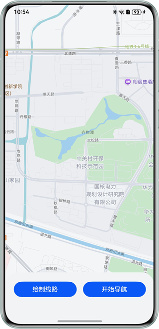
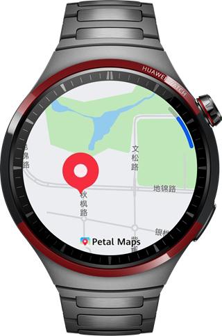
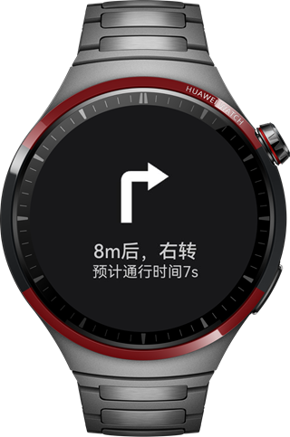

# 基于WearEngine实现协同导航应用

## 介绍

本示例基于WearEngine、Map Kit、Location Kit及Sensor Kit，通过deviceClient.getConnectedDevices()、p2pClient.sendMessage()等核心接口，实现了一个手机与智能手表协同操作的地图导航应用。该示例为开发者提供了跨设备通信与地图导航功能的完整实现方案，可作为开发同类应用的参考范例。

## 效果展示

手机运行效果图：



手表地图页：



手表导航页：




## 使用说明

1. 手机手表运行应用授权后，展示地图。
2. 手机手表均可通过点击地图，点击后地图生成标记，表示目的地。对目的地的选择，手机操作后会同步至手表，手表操作也会同步至手机。
3. 确定目的地后，手机点击绘制路线按钮，手机会展示路线。
4. 手机点击开始导航按钮后，手表将进行路由跳转，进入导航页，根据导航路线进行步行导航。（导航为真实导航，但与自身位置无关，手机会通过SetTimeOut定时发送导航信息）。
5. 导航结束后，手表进行震动提醒，弹窗显示到达目的地，手表返回地图页。

## 工程目录

```
└───SmartWatchMapNavigation                                        
    ├───commons                                                   // commons层
    │   ├───Communication/src/main/ets/common                     // 互联通信模块
    │   │   ├───model                                             // model
    │   │   │   ├───CommunicationInformation.ets                  // 互联通信消息实体类
    │   │   │   └───RouteInfomation.ets                           // 路线信息实体类
    │   │   └───utils                                             // 工具类
    │   │       └───CommunicationUtils.ets                        // 互联通信工具类
    │   ├───map/src/main/ets                                      // 地图模块
    │   │   ├───common                                            // 
    │   │   │   └───utils                                         // 工具
    │   │   │       └───DrawRouteUtils.ets                        // 地图绘制路线工具类
    │   │   └───view                                              // 视图
    │   │       └───MapView.ets                                   // 地图视图类
    │   └───vibrator/src/main/ets/common                          // 震动模块
    │       └───VibratorUtil.ets                                  // 震动工具类
    └───products                                                  // 产品定制层
        ├───phone/src/main/ets                                    // 手机模块
        │   ├───entryability                            
        │   │   └───EntryAbility.ets                    
        │   ├───entrybackupability                      
        │   │   └───EntryBackupAbility.ets              
        │   └───pages                                   
        │       └───Index.ets                                      // 首页
        ├───phone/src/main/resources 
        ├───wearable/src/main/ets                                  // 手表模块
        │   ├───pages
        │   │   └───Index.ets                                      // 首页   
        │   ├───view                                               
        │   │   └───NavigationPageView.ets                         // 路由页视图类 
        │   ├───wearableability                                       
        │   │   └───WearableAbility.ets                               
        │   └───wearablebackupability                                 
        │       └───WearableBackupAbility.ets                      
        └───wearable/src/main/resources                            // 资源

```

## 实现思路

1. 地图通过Map Kit提供的接口展示，在应用开启时在EntryAbility中获取授权，并通过Location Kit获取当前位置，并在地图加载时传入当前定位以保证地图展示当前位置。
2. 地图点击生成目的地标记以及导航路线绘制依赖Map Kit。
3. 目的地双端同步，依赖WearEngine提供的接口进行通信，将目的地位置通过通信传递给对端，对端获取到后刷新目的地标注。
4. 点击开启导航后，手机侧传递一个开启导航的信号，手表接收到后跳转至导航页，手机通过SetTimeOut将导航信息分次发送给手表，手表接收到后刷新导航页的导航信息。
5. 手表导航结束后，通过震动传感器产生震动，弹窗告知用户目的地已到达。

## 相关权限

1. wearEngine权限，需要在AGC上为应用审批WearEngine权限，配置手动签名以及module.json5中设置client_id，具体可在开发者联盟官网中搜索申请接入WearEngine服务。
2. ohos.permission.LOCATION、ohos.permission.APPROXIMATELY_LOCATION，获取定位服务权限。
3. ohos.permission.VIBRATE 震动传感器服务权限。

## 依赖

不涉及。

## 约束与限制

1.本示例仅支持标准系统上运行，支持设备：华为手机、华为智能手表。

2.HarmonyOS系统：HarmonyOS 5.1.0 Release及以上。

3.DevEco Studio版本：DevEco Studio 5.1.0 Release及以上。

4.HarmonyOS SDK版本：HarmonyOS 5.1.0 Release SDK及以上。