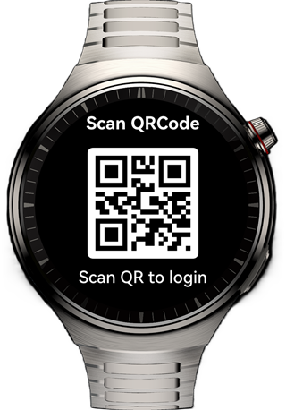
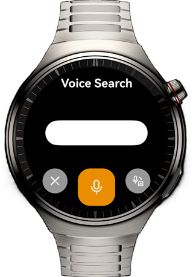
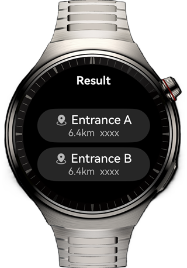
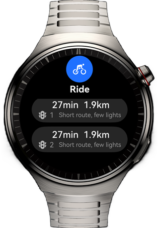
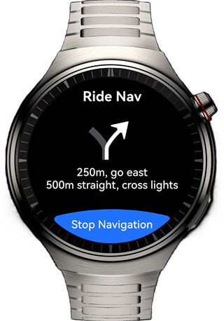

# Cycling Navigation Application on Smart Watches

## Overview

This sample implements a cycling navigation application on the smart watch and completes the page redirection through the **Navigation** component, helping you learn about the layout modes and unique features of smart watches.

## Preview

| QR Code Page                                            | Voice Search Page                                       | Search Result Page                                      | Route Selection Page                                    | Route Navigation Page                                   |
| ------------------------------------------------------- | ------------------------------------------------------- | ------------------------------------------------------- | ------------------------------------------------------- | ------------------------------------------------------- |
|  |  |  |  |  |


## How to Use

1. The home page contains a QR code. You can touch the QR code to simulate the scenario where a mobile phone scans the QR code for sign-in. After that, the voice search page is displayed.
2. You can touch the microphone button to simulate a voice input scenario. After you touch the button, the search result page is displayed.
3. The search result can be displayed by sliding. When you touch an item in the list, the route selection page is displayed.
4. The route selection page is a long list. When you touch an item in the list, the route navigation page is displayed.
5. The content on the route navigation page is fixed. After you touch the stop button, it returns to the voice search page.


## Project Directory
```
├──entry/src/main/ets                                  // Code area 
│  ├──commons                                   
│  │  └──constants           
│  │     └──CommonConstants.ets                        // Common constants 
│  ├──entryability   
│  │  └──EntryAbility.ets  
│  ├──entrybackupability   
│  │  └──EntryBackupAbility.ets 
│  ├──model   
│  │  ├──LocationInfo.ets                              // Location information entity class 
│  │  └──RouteInfo.ets                                 // Route information entity class 
│  ├──pages                      
│  │  └──Index.ets                                     // Home page 
│  └──view   
│     ├──NavigationPageView.ets                        // Navigation page view 
│     ├──ResultsPageView.ets                           // Search results page view 
│     ├──RoutePageView.ets                             // Route selection page view 
│     └──SearchPageView.ets                            // Voice search page view 
└──entry/src/main/resources                            // Application resources
```

## Required Permissions

N/A.

## Dependencies

N/A.

## Constraints

1. This sample is only supported on Huawei smart watches running standard systems.

2. The HarmonyOS version must be HarmonyOS 5.1.0 Release or later.

3. The DevEco Studio version must be DevEco Studio 5.1.0 Release or later.

4. The HarmonyOS SDK version must be HarmonyOS 5.1.0 Release SDK or later.