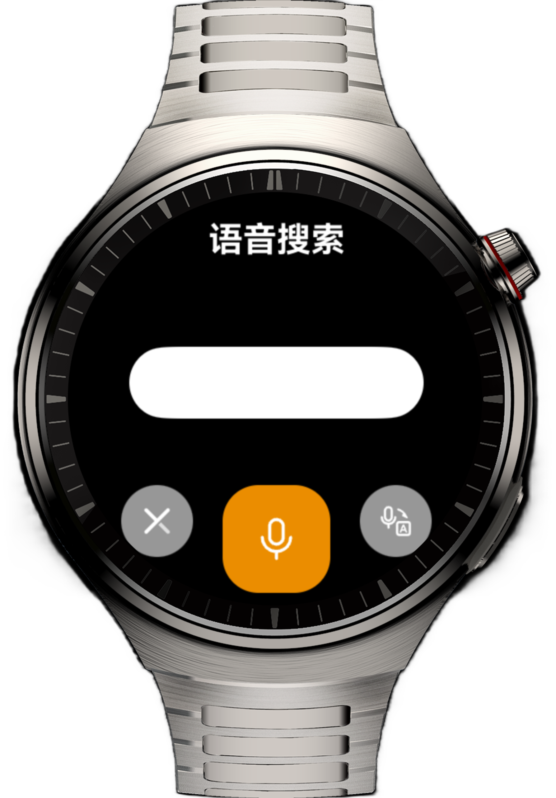
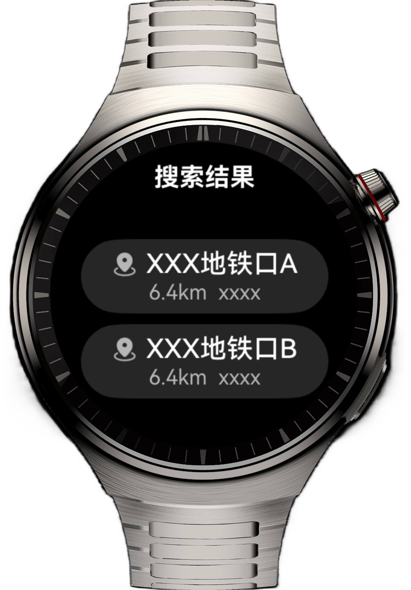
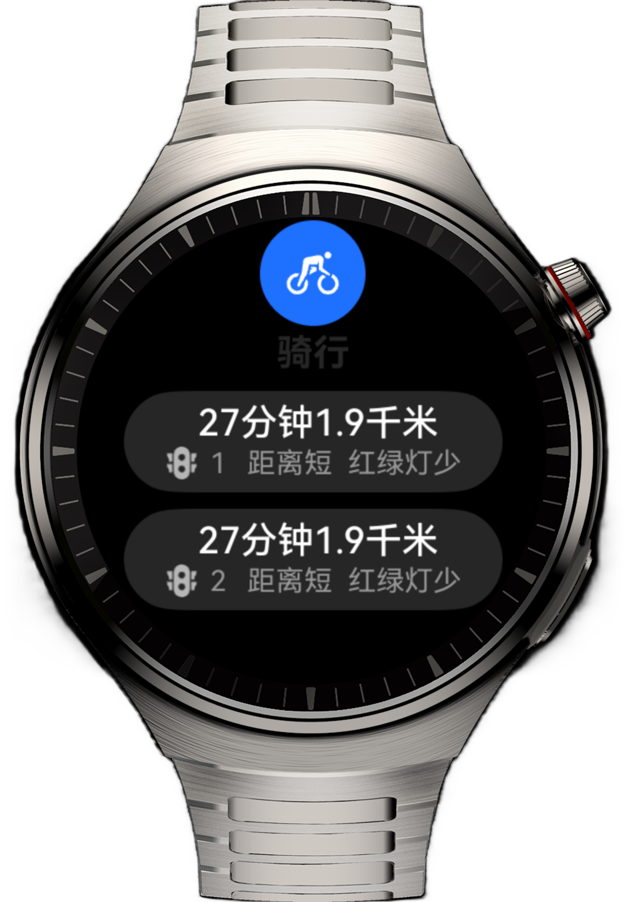
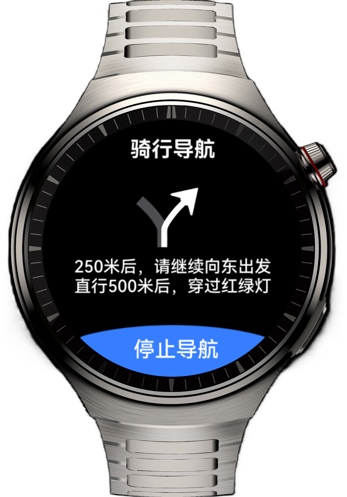

# 实现智能手表上的骑行导航应用

## 介绍

本实例旨在通过智能表骑行导航类应用页面的实现，通过Navigation组件完成智能手表设备的页面跳转，帮助开发者学习智能表设备的布局特点以及布局方式。

## 效果预览

| 二维码                                                  | 语音搜索页                                                | 搜索结果页                                                | 路线选择页                                                | 路线导航页                                                |
|------------------------------------------------------|------------------------------------------------------|------------------------------------------------------|------------------------------------------------------|------------------------------------------------------|
|  |  |  |  |  |


## 使用说明：

1. 首页包含一个二维码，通过点击二维码模拟手机扫码登录的场景，点击后跳转至语音搜索页。
2. 通过点击麦克风按钮模拟语音输入的场景，点击后直接跳转至搜索结果页。
3. 搜索结果可以滑动展示，列表项点击后跳转至路线选择页。
4. 路线选择页主要内容为长列表，列表项点击后跳转至路线导航页。
5. 路线导航页内容固定，点击停止导航后跳转回语音搜索页。


## 工程目录
```
├──entry/src/main/ets                                  // 代码区
│  ├──commons                                  
│  │  └──constants          
│  │     └──CommonConstants.ets                        // 常量类
│  ├──entryability  
│  │  └──EntryAbility.ets 
│  ├──entrybackupability  
│  │  └──EntryBackupAbility.ets
│  ├──model  
│  │  ├──LocationInfo.ets                              // 位置信息实体类
│  │  └──RouteInfo.ets                                 // 路线信息实体类
│  ├──pages                     
│  │  └──Index.ets                                     // 首页
│  └──view  
│     ├──NavigationPageView.ets                        // 路线导航页视图类
│     ├──ResultsPageView.ets                           // 搜索结果页视图类
│     ├──RoutePageView.ets                             // 路线选择页视图类
│     └──SearchPageView.ets                            // 语音搜索页视图类   
└──entry/src/main/resources                            // 应用资源目录
```

## 相关权限

不涉及。

## 依赖

不涉及。

## 约束与限制

1. 本示例仅支持标准系统上运行，支持设备：智能手表。

2. HarmonyOS系统：HarmonyOS 5.1.0 Release及以上。

3. DevEco Studio版本：DevEco Studio 5.1.0 Release及以上。

4. HarmonyOS SDK版本：HarmonyOS 5.1.0 Release SDK及以上。
