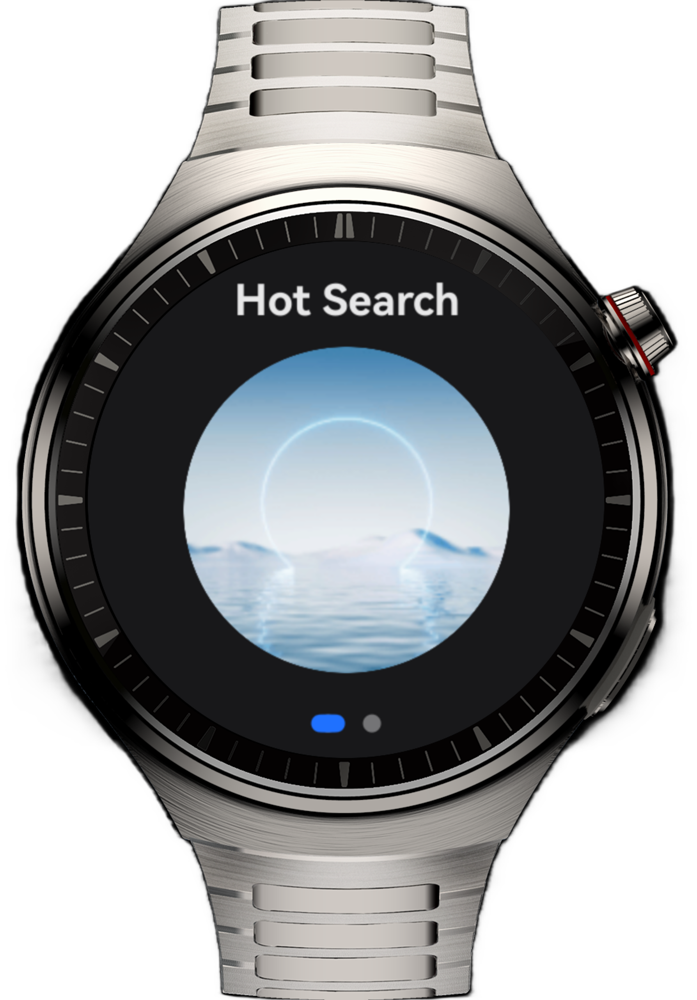
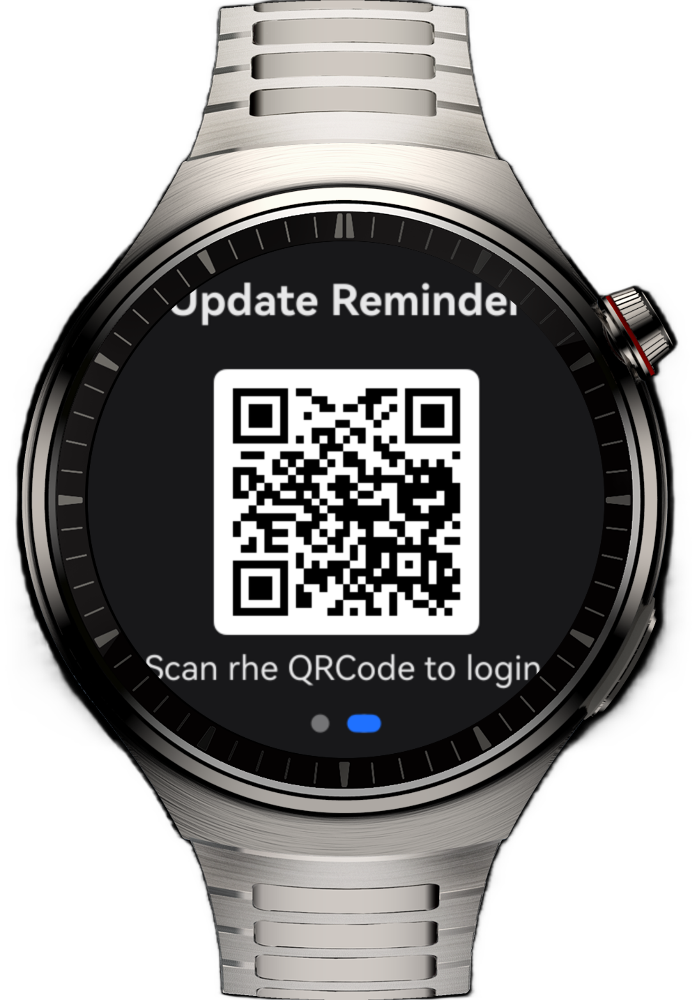

# Short Video Application on Smart Watches

## Overview

This sample demonstrates a short video application on a smart watch. The application allows users to view video recommendations, play videos, and display QR codes which can be scanned using mobile phones.

## Preview

| Hot Search Recommendation Page                           | Update Reminder Page                                                   | Video Playback Page                                                  |
|----------------------------------------------------------|---------------------------------------------------------|--------------------------------------------------------|
|  |  |  |

## How to Use

1. On the home page, swipe up or down to view the recommendation list. Swipe left or right to switch between the hot search recommendation and update reminder pages.
2. Touch any image on the hot search recommendation page to enter the video playback page.
3. Use the pause/play button to toggle the video's play state. Touch the zoom in/out button to resize the video. Drag the progress bar to adjust the playback position.

## Project Directory
```
├──entry/src/main/ets                     // Code area 
│  ├──common 
│  │  ├──constants      
│  │  │  └──CommonConstants.ets           // Constant class 
│  │  └──util                  
│  │     └──ScreenUtil.ets                // Screen utility 
│  ├──entryability 
│  │  └──EntryAbility.ets                 // Entry point class 
│  ├──entrybackupability 
│  │  └──EntryBackupAbility.ets 
│  ├──pages 
│  │  └──Index.ets                        // Home page 
│  └──view 
│     ├──HotSearchView.ets                // Hot search recommendation page 
│     ├──UpdateReminderView.ets           // Update reminder page 
│     └──VideoView.ets                    // Video playback page 
└──entry/src/main/resources               // Static resources
```

## Constraints

1. This sample is only supported on Huawei smart wearables running standard systems.
2. The HarmonyOS version must be HarmonyOS 5.1.0 Release or later.
3. The DevEco Studio version must be DevEco Studio 5.1.0 Release or later.
4. The HarmonyOS SDK version must be HarmonyOS 5.1.0 Release SDK or later.
