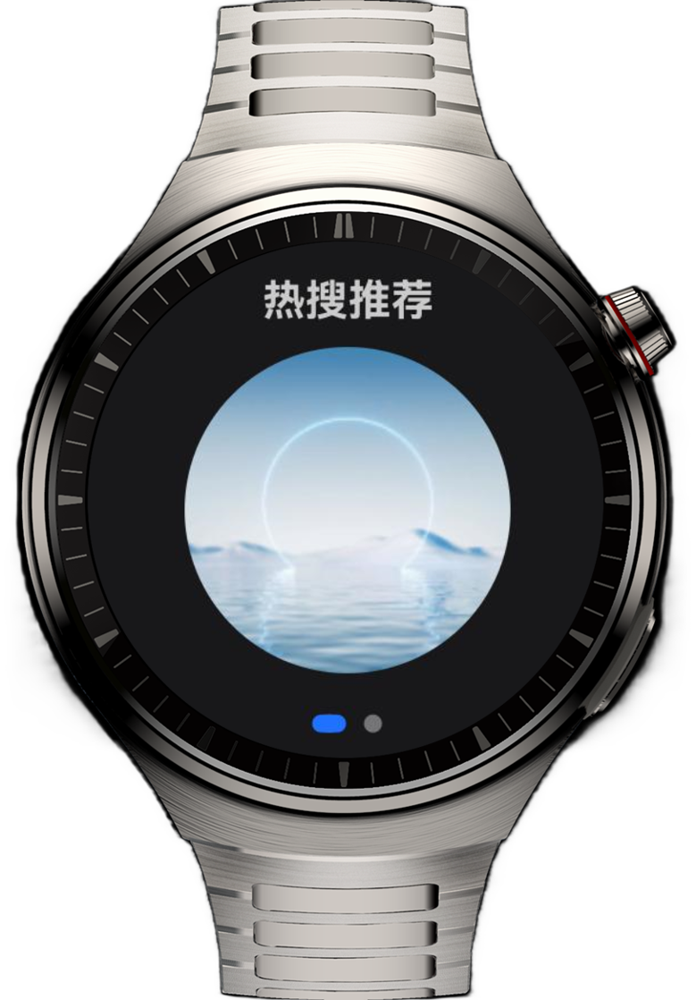
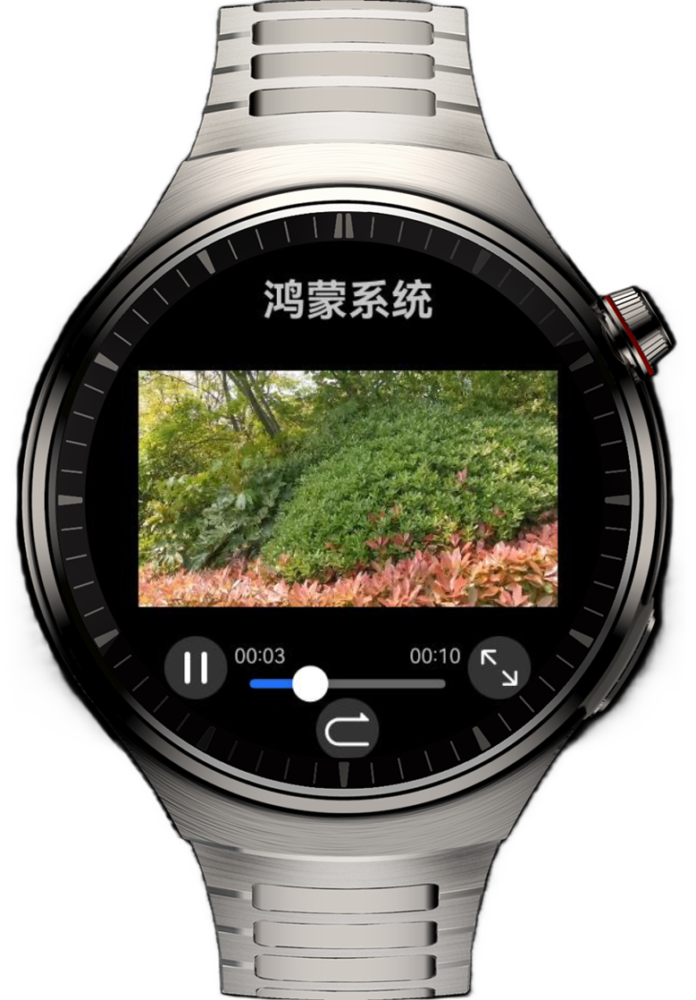

# 实现智能手表上的短视频应用

## 简介

本示例实现了一款智能手表上的短视频应用，可在应用页面内查看视频推荐列表、播放视频，并展示二维码页面，支持使用手机扫码。

## 效果预览

| 热搜推荐页                                                 | 更新提醒页                                                   | 视频播放页                                                  |
|-------------------------------------------------------|---------------------------------------------------------|--------------------------------------------------------|
|  |  |  |

## 使用说明

1. 进入主页，上下滑动页面查看推荐列表；左右滑动切换“热搜推荐”、“更新提醒”视图。
2. 点击“热搜推荐”中任意图片，进入视频播放页面。
3. 点击暂停/播放按钮控制视频播放状态；点击放大/缩小按钮改变视频大小；拖动进度条更改视频进度。

## 工程目录
```
├──entry/src/main/ets                     // 代码区
│  ├──common
│  │  ├──constants     
│  │  │  └──CommonConstants.ets           // 常量类         
│  │  └──util                 
│  │     └──ScreenUtil.ets                // 屏幕工具类  
│  ├──entryability
│  │  └──EntryAbility.ets                 // 程序入口类
│  ├──entrybackupability
│  │  └──EntryBackupAbility.ets
│  ├──pages
│  │  └──Index.ets                        // 首页
│  └──view
│     ├──HotSearchView.ets                // 热搜推荐页
│     ├──UpdateReminderView.ets           // 更新提醒页
│     └──VideoView.ets                    // 视频播放页
└──entry/src/main/resources               // 应用静态资源目录
```

## 约束与限制

1. 本示例仅支持标准系统上运行，支持设备：华为智能穿戴。
2. HarmonyOS系统：HarmonyOS 5.1.0 Release及以上。
3. DevEco Studio版本：DevEco Studio 5.1.0 Release及以上。
4. HarmonyOS SDK版本：HarmonyOS 5.1.0 Release SDK及以上。