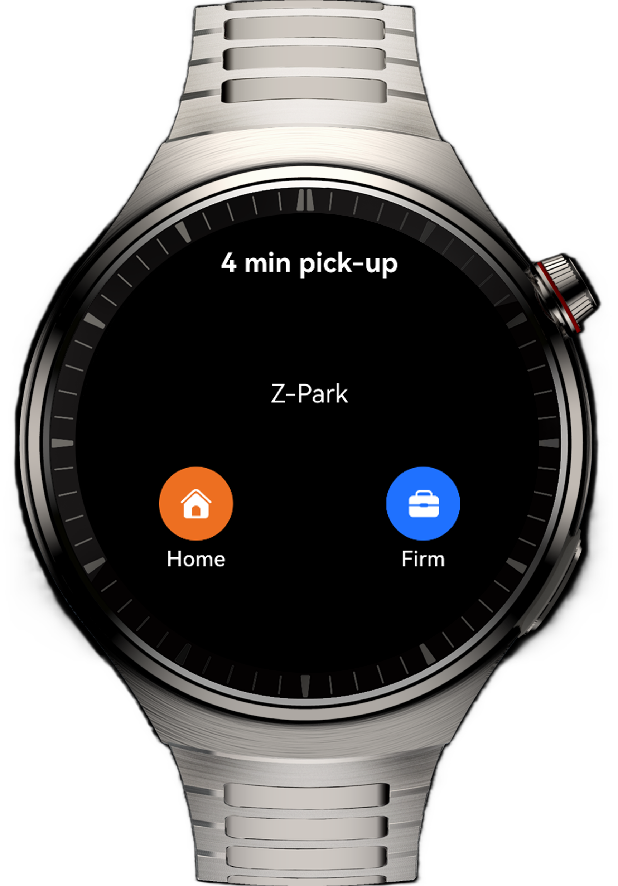

# Ride-Hailing Application on Smart Watches

## Overview

This sample demonstrates a ride-hailing application on a smart watch. It displays ride-hailing progress and messages on the application page. Based on the **Navigation** and **Timer** components, it realizes scheduled redirection between pages.

## Preview
| Home Page                                                  |
|------------------------------------------------------------|
|  |

## How to Use

1. Go to the home page and touch the **Home** or **Firm** button to start the ride-hailing process. Each page stays for 3 seconds before automatically jumping to the next page, until it reaches the ride end page.

2. Touch the **Cancel** button on the car-finding page, the **Cancel** button on the driver coming page and the driver arrival page, or the **OK** button on the trip completion page to return to the home page.

3. Touch the **Terminate** button on the destination page to go to the trip completion page.

## Features
### Principles

+ In the **onShown()** API of the driver coming page, driver arrival page, and destination page, a 3-second timer is set using the **setTimeout()** API. After the timer expires, the page content is automatically refreshed or the next page is displayed. In the **onHidden()** API, the timer is deleted using the **clearTimeout()** API.

+ On the card-finding page, the **TextTimer** component is used to display the timing information in text and implement the scheduled redirection functionality. The timer is enabled in the **onShown()** API and triggered by the **onTimer()** API of **TextTimer**. The next page is displayed after 3 seconds. The timer is suspended in the **onHidden()** API.

## Project Directory

```
├──entry/src/main/ets                     // Code area
│  ├──common
│  │  └──utils                            
│  │     └──WindowManager.ets             // Window management class
│  ├──entryability
│  │  └──EntryAbility.ets                 // Entry point class
│  ├──entrybackupability
│  │  └──EntryBackupAbility.ets           
│  ├──pages
│  │  └──Index.ets                        // Home page
│  └──view
│     ├──FindCar.ets                      // Car-finding page
│     ├──OnTheWay.ets                     // Go to the destination page
│     ├──PayTheBill.ets                   // Trip completion page
│     └──WaitingAndSuccess.ets            // Driver coming page and driver arrival page
└──entry/src/main/resources               // Static resources
```

## Required Permissions

N/A.

## Constraints

1. This sample is only supported on Huawei smart wearables running standard systems.

2. The HarmonyOS version must be HarmonyOS 5.1.0 Release or later.

3. The DevEco Studio version must be DevEco Studio 5.1.0 Release or later.

4. The HarmonyOS SDK version must be HarmonyOS 5.1.0 Release SDK or later.