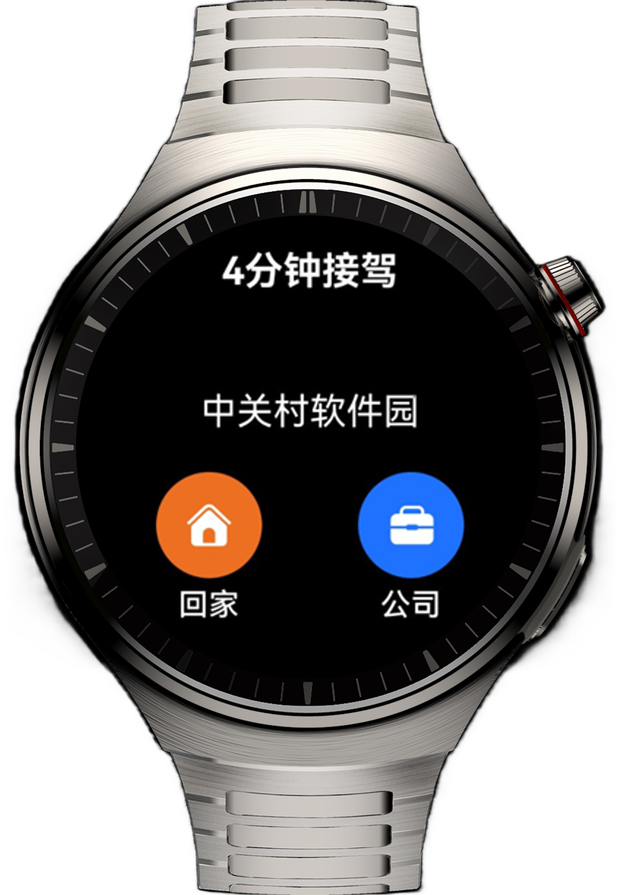

# 实现智能手表上的打车应用

## 项目简介

本示例实现了一款智能手表上的打车应用，可在应用页面上显示打车进度和提示信息，并基于组件导航(Navigation)和定时器能力(Timer)，实现页面之间的定时跳转。

## 效果预览
| 首页                                                        |
|-----------------------------------------------------------|
|  |

## 使用说明

1. 进入主页，点击"回家"或"公司"按钮进去打车流程，每个页面停留3s后自动跳转至下一页面，直到跳转至行程结束页。

2. 在找车页点击"取消打车"按钮、在司机赶来页和司机到达页点击"取消行程"按钮、在行程结束页点击"我知道了"按钮，跳转回首页。

3. 在前往目的地页点击"结束行程"按钮，跳转至行程结束页。

## 功能特性
### 技术原理

+ 在司机赶来页、司机到达页和前往目的地页的页面显示接口onShown()中，通过setTimeout()接口设置一个3s的定时器，并在定时器到期后自动刷新页面内容或跳转至下一页面；在页面隐藏接口onHidden()中，通过clearTimeout()接口删除定时器。

+ 在找车页通过TextTimer组件实现文本显示计时信息和定时跳转功能。在页面的显示接口onShown()中开启计时，并通过TextTimer的onTimer()接口触发3s后跳转至下一页面；在页面隐藏接口onHidden()中暂停定时。

## 工程目录

```
├──entry/src/main/ets                     // 代码区
│  ├──common
│  │  └──utils                            
│  │     └──WindowManager.ets             // 窗口管理类
│  ├──entryability
│  │  └──EntryAbility.ets                 // 程序入口类
│  ├──entrybackupability
│  │  └──EntryBackupAbility.ets           
│  ├──pages
│  │  └──Index.ets                        // 主页面
│  └──view
│     ├──FindCar.ets                      // 找车页
│     ├──OnTheWay.ets                     // 前往目的地页
│     ├──PayTheBill.ets                   // 行程结束页
│     └──WaitingAndSuccess.ets            // 司机赶来页和司机到达页
└──entry/src/main/resources               // 应用静态资源目录
```

## 相关权限

不涉及。

## 约束与限制

1.本示例仅支持标准系统上运行，支持设备：华为智能穿戴。

2.HarmonyOS系统：HarmonyOS 5.1.0 Release及以上。

3.DevEco Studio版本：DevEco Studio 5.1.0 Release及以上。

4.HarmonyOS SDK版本：HarmonyOS 5.1.0 Release SDK及以上。