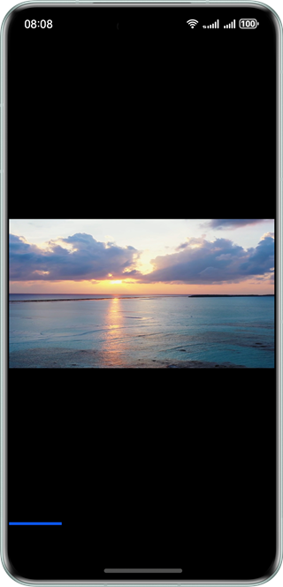

# Smooth Switching of Short Videos

### Overview

This sample introduces how to implement smooth switching of short videos by using **LazyForEach** and component reuse, which achieve high performance.

### Preview



### How to Use

1. In this sample, you need to access the network video direct link to obtain the video resource. To do this, you can change the value of **VIDEO_SOURCE** in **entry/src/main/ets/common/CommonConstants.ets** to the direct link of the video to play. This sample also provides the local video and local server solutions to simulate the network video access. For details, see section "Setting Up a Server."

2. After the app is installed and opened, the app will play a video linked to the resource. You can swipe up or down to switch between short videos.

### Setting Up a Server

1. This sample provides a Python script for you to quickly set up a server. The Python environment must be available on the local host, and the Flask framework must be installed. You can use pip to install Flask by running the following command on the terminal:

   ```
   pip install flask
   ```

2. Change **VIDEO_PATH** in **video_server.py** to the path of the video to play.

3. Change the **VIDEO_SOURCE** in **entry/src/main/ets/common/CommonConstants.ets** to the IP address of the PC as prompted.

4. Ensure that the playback device and the PC where the server is set up are in the same LAN. In the **server** folder, use the terminal to run the script:

   ```
   python video_server.py
   ```

5. The script starts a Flask server that listens for port 5000 by default.

### Project Directory

```
├──entry/src/main/ets
│  ├──common
│  │  ├──utils
│  │  │  └──CommonUtils.ets             // Common utilities
│  │  └──CommonConstants.ets            // Common constants
│  ├──entryability
│  │  └──EntryAbility.ets               // Entry ability
│  ├──entrybackupability
│  │  └──EntryBackupAbility.ets
│  ├──model
│  │  ├──AVDataSource.ets               // Video data source
│  │  └──AVPlayereState.ets             // Video state
│  ├──pages
│  │  └──Index.ets                      // Home page
│  └──view
│     └──VideoPlayView.ets              // Video playback component
└──entry/src/main/resources             // Static resources of the app
```

### How to Implement

1. The video playback framework AVPlayer and the **Swiper** view container are used to perform switching between short videos in a carousel.

2. **XComponent** of the surface type is used to dynamically render video streams.

3. **LazyForEach** is used for lazy data loading, in which the **cachedCount** attribute is set to specify the number of cached records. In addition, the component reuse capability is used to achieve high performance.

4. During cold startup, an AVPlayer is created and data is initialized to the prepared phase. In a video carousel, a player is asynchronously created each time to prepare for the next video playback.

### Permissions

- ohos.permission.INTERNET

### Dependencies

- N/A

### Constraints

1. The sample is only supported on Huawei phones with standard systems.

2. The HarmonyOS version must be HarmonyOS 5.0.5 Release or later.

3. The DevEco Studio version must be DevEco Studio 5.0.5 Release or later.

4. The HarmonyOS SDK version must be HarmonyOS 5.0.5 Release SDK or later.