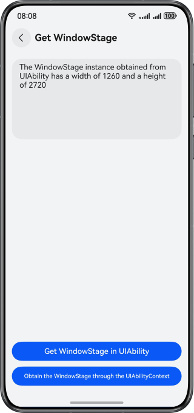

# Obtaining the Application Context

### Overview

This sample describes how to obtain the **UIAbilityContext**, **ApplicationContext**, and **WindowStage** instances in the HAP, HAR, and HSP environments.

### Preview

| UIAbilityContext                             | ApplicationContext                           | WindowStage                                 |
|----------------------------------------------|----------------------------------------------|---------------------------------------------|
|  |  |  |

### Project Directory

```
├──entry
│  ├──src/main/ets/
│  │  ├──common
│  │  │  └──Logger.ets                       // Logger
│  │  ├──entryability
│  │  │  └──EntryAbility.ets                 // Entry ability
│  │  ├──entrybackupability
│  │  │  └──EntryBackupAbility.ets           // Data backup and restoration
│  │  ├──pages
│  │  │  ├──GetApplicationContextDemo.ets    // Obtaining the ApplicationContext code demo
│  │  │  ├──GetUIAbilityContextDemo.ets      // Obtaining the UIAbilityContext code demo
│  │  │  ├──GetWindowStageDemo.ets           // Obtaining the WindowStage code demo
│  │  │  └──Index.ets                        // App entry
│  │  └──workers
│  │     └──MyWorker.ets                     // Worker child thread
│  └──src/main/resources                     // Static resources
├──har                                       // HAR module
│  ├──Index.ets                              // Entry file, which exposes the module methods
│  ├──src/main/ets/components/mainpage
│  │  └──MainPage.ets                        // Main page
│  └──src/main/resources                     // Static resources of the app
└──hsp                                       // HSP module
├──Index.ets                              // Entry file, which exposes the module methods
├──src/main/ets/components/mainpage
│  └──Index.ets                           // Home page
└──src/main/resources                     // Static resources of the app
```

### Permissions

N/A

### Dependencies

N/A

### Constraints

1. The sample is only supported on Huawei phones with standard systems.
2. The HarmonyOS version must be HarmonyOS 5.0.5 Release or later.
3. The DevEco Studio version must be DevEco Studio 5.0.5 Release or later.
4. The HarmonyOS SDK version must be HarmonyOS 5.0.5 Release SDK or later.