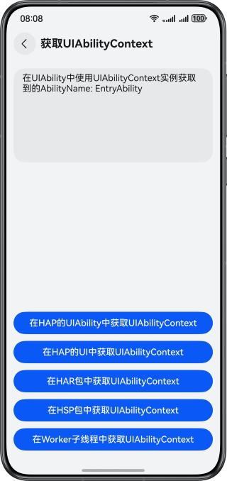
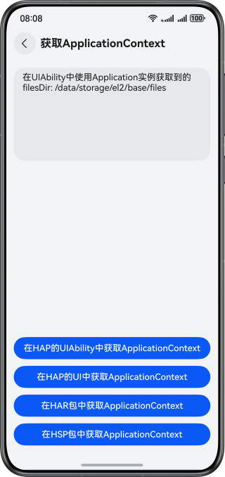
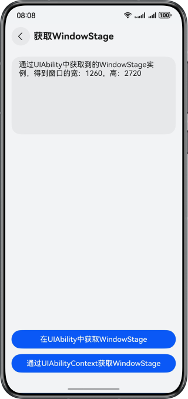

# 实现获取应用上下文功能

### 介绍

本示例详细展示了如何在不同类型的HarmonyOS应用包（HAP、HAR、HSP）环境中获取关键的应用上下文实例，具体包括UIAbilityContext、ApplicationContext和WindowStage实例。通过这些实例，开发者可以在各种应用模块中实现对用户界面、全局应用状态以及窗口管理的精细控制。

### 效果预览

| 获取UIAbilityContext                        | 获取ApplicationContext                      | 获取WindowStage                            |
|-------------------------------------------|-------------------------------------------|------------------------------------------|
|  |  |  |

### 目录结构

```
├──entry
│  ├──src/main/ets/
│  │  ├──common
│  │  │  └──Logger.ets                       // 日志打印工具类
│  │  ├──entryability
│  │  │  └──EntryAbility.ets                 // 程序入口类
│  │  ├──entrybackupability
│  │  │  └──EntryBackupAbility.ets           // 数据备份恢复类
│  │  ├──pages
│  │  │  ├──GetApplicationContextDemo.ets    // 获取ApplicationContext代码示例
│  │  │  ├──GetUIAbilityContextDemo.ets      // 获取UIAbilityContext代码示例
│  │  │  ├──GetWindowStageDemo.ets           // 获取WindowStage代码示例
│  │  │  └──Index.ets                        // 应用入口页
│  │  └──workers
│  │     └──MyWorker.ets                     // Worker子线程类
│  └──src/main/resources                     // 应用静态资源目录
├──har                                       // har模块
│  ├──Index.ets                              // 入口文件，对外暴露模块方法
│  ├──src/main/ets/components/mainpage                                
│  │  └──MainPgge.ets                        // 模块业务页面        
│  └──src/main/resources                     // 应用静态资源目录
└──hsp                                       // hsp模块
   ├──Index.ets                              // 入口文件，对外暴露模块方法
   ├──src/main/ets/components/mainpage                              
   │  └──Index.ets                           // 模块业务页面         
   └──src/main/resources                     // 应用静态资源目录
```

### 相关权限

不涉及。

### 依赖

不涉及。

### 约束与限制

1. 本示例仅支持标准系统上运行，支持设备：华为手机。
2. HarmonyOS系统：HarmonyOS 5.0.5 Release及以上。
3. DevEco Studio版本：DevEco Studio 5.0.5 Release及以上。
4. HarmonyOS SDK版本：HarmonyOS 5.0.5 Release SDK及以上。