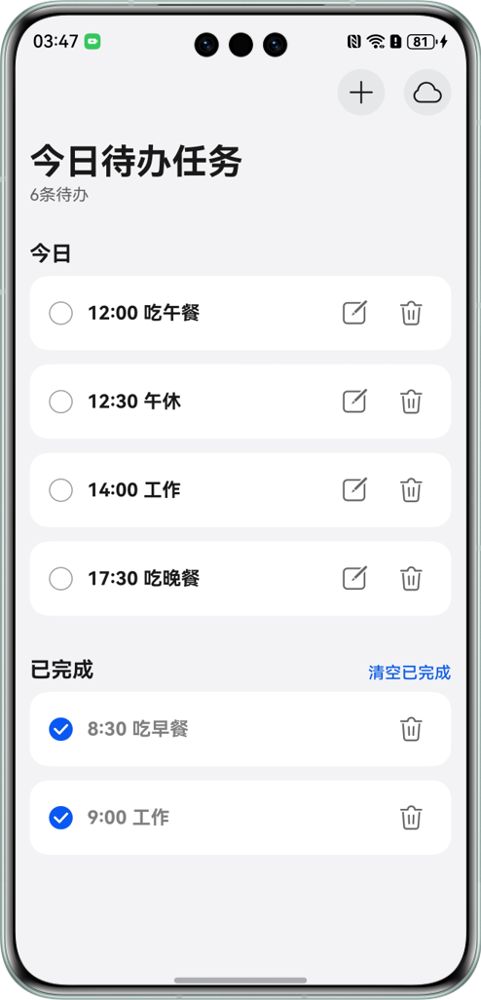

# 基于StateStore实现全局状态管理最佳实践

## 简介

本示例展示了使用StateStore状态管理库实现全局状态管理，覆盖场景：

- UI与状态数据解耦
- 子线程进行状态对象更新
- 状态更新日志埋点

解决开发者在使用ArkUI状态管理时UI组件和数据操作逻辑高度耦合的问题

## 效果预览



## 工程目录

```text
├──entry/src/main/ets                       // 代码区
├──components                               // UI组件
│   ├──AddSheetBuilder.ets                  // 添加todo弹窗
│   ├──AsyncProgress.ets                    // 同步进度条
│   ├──IconContainer.ets                    // Icon容器
│   └──TodoItem.ets                         // todoItem组件
├──entryability
│   └──EntryAbility.ets
├──middleware                               // 中间件
│   └──LoggerMiddleware.ets                 // 日志监控中间件
├──model                                    // 数据模型
│   └──TodoListModel.ets                    // todo列表数据
├──pages                                    // 页面
│   └──Index.ets                            // 主页
├──store                                    // store仓库
│   ├──TodoListActions.ets                  // action事件管理对象
│   ├──TodoListReducer.ets                  // reducer逻辑处理函数
│   └──TodoListStore.ets                    // todoListStore定义
└──utils                                    // 工具函数
    ├──RdbUtil.ets                          // rdb工具
    ├──Sleep.ets                            // sleep函数
    └──TaskpoolUtil.ets                     // 子线程工具                                  
```

# StateStore简介

StateStore作为ArkUI状态与UI解耦的解决方案，支持全局维护状态，优雅地解决状态共享的问题。

StateStore库提供共享模块StateStore单例，支持根据唯一标识创建store存储对象，管理应用的全局状态，通过事件分发更新状态。依赖系统@Observed和@ObservedV2对数据改变监听的能力，驱动UI刷新。

目的是让开发者在开发过程中实现状态与UI解耦，多个组件可以方便地共享和更新全局状态，将状态管理逻辑从组件逻辑中分离出来，简化维护。

# 特性
+ 状态与UI解耦，支持数据全局化操作
+ 简化子线程并行化操作
+ 支持对数据逻辑执行预处理和后处理

# 依赖系统版本

- HarmonyOS 5.0.0 Release及以上

  > 手机版本：5.0.0.102以上

# 下载安装
## 使用ohpm安装依赖
```shell
ohpm install @hadss/state_store
```
> 或者按需在模块中配置运行时依赖，修改oh-package.json5
```json5
{
  "dependencies": {
    "@hadss/state_store": "^1.0.0-rc.2"
  }
}
```

# StateStore框架使用说明

[查看说明](https://gitee.com/hadss/StateStore/blob/master/README.md)

# StateStore接口和属性列表

[查看详情](https://gitee.com/hadss/StateStore/blob/master/docs/Reference.md)

# FAQ

[查看详情](https://gitee.com/hadss/StateStore/blob/master/docs/FAQ.md)

# 原理介绍

本解决方案的思路参考[redux](https://redux.js.org/api/store)和[vuex](https://vuex.vuejs.org/guide/actions.html)的全局状态管理的实现。具体原理可以学习redux和vuex，对理解本库的实现和使用有帮助。

# 约束与限制
+ 本示例仅支持标准系统上运行，支持设备：华为手机。
+ HarmonyOS系统：HarmonyOS 5.0.0 Release及以上。
+ DevEco Studio版本：DevEco Studio 5.0.0 Release及以上。
+ HarmonyOS SDK版本：HarmonyOS 5.0.0 Release SDK及以上。

# 开源协议

本项目基于 [Apache License 2.0](./LICENSE) ，请自由地享受和参与开源。