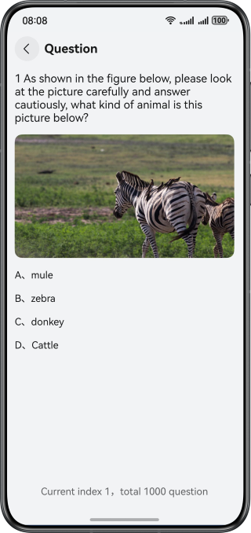
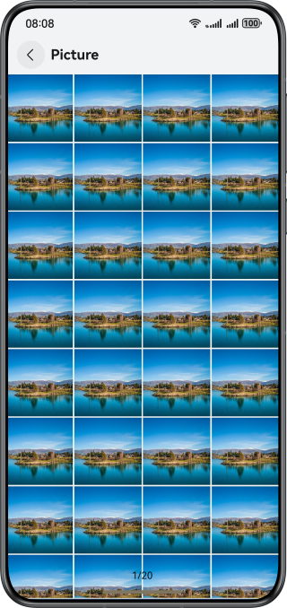

# Performance Optimization for Loading the Swiper Component

### Overview

This sample uses lazy loading and pre-loading to implement the **Swiper** component, which provides smooth swiping when multiple images are loaded.

### Preview

| Question page                                    | Image page                                      |
|--------------------------------------------------|-------------------------------------------------|
|  |  |

### Project Directory

```
├──entry/src/main/ets/
│  ├──common
│  │  ├──ImageUtils.ets                   // Image processing utilities
│  │  ├──MyDataSource.ets                 // Data source utility for lazy loading
│  │  └──Logger.ets                       // Logger
│  ├──entryability
│  │  └──EntryAbility.ets                 // Entry ability
│  ├──entrybackupability
│  │  └──EntryBackupAbility.ets           // Data backup and restoration
│  ├──model
│  │  ├──Question.ets                     // Question
│  │  └──SwiperData.ets                   // Image
│  └──pages
│     ├──Index.ets                        // Application entry
│     ├──LazyForEachSwiper.ets            // Swiper lazy loading page (question)
│     └──PreloadDataSwiper.ets            // Swiper preloading page (image)
└──entry/src/main/resources               // Static resources of the app

```

### How to Use

1. Tap the button for loading Swiper by LazyForEach on the home page to access the question page, on which you can swipe left or right smoothly.
2. Tap the button for loading Swiper by data preloading on the home page to access the image page, on which you can swipe left or right smoothly.

### How to Implement

1. Swiper lazy loading is implemented using **LazyForEach**.
2. Swiper data is preloaded using the **onAnimationStart** method.

### Permissions

* **ohos.permission.INTERNET**: allows an app to access the Internet.

### Dependencies

N/A

### Constraints

1. The sample is only supported on Huawei phones with standard systems.
2. The HarmonyOS version must be HarmonyOS 5.0.5 Release or later.
3. The DevEco Studio version must be DevEco Studio 5.0.5 Release or later.
4. The HarmonyOS SDK version must be HarmonyOS 5.0.5 Release SDK or later.