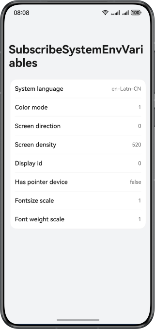

# Subscribing to System Environment Variable Changes

### Overview

This sample describes how to obtain and subscribe to the changes of system environment variables, such as the system language, system dark/light mode, and screen pixel density.

### Preview



How to Use
1. Go to Settings > System > Language & region, switch the system language, and switch back to the app. The value of System language changes.
2. Go to Settings > Display & brightness > Text & display size, drag the font size and width progress bars, and switch back to the app. The values of Font size scale ratio and Font width scale ratio change.
3. Rotate the device screen. The value of Screen orientation changes.
4. Swipe down from the menu bar to enable the dark mode. The value of Dark mode changes.

### Project Directory

```
├──entry/src/main/ets/
│  ├──common
│  │  └──Logger.ets                       // Logger
│  ├──entryability
│  │  └──EntryAbility.ets                 // Entry ability
│  ├──entrybackupability
│  │  └──EntryBackupAbility.ets           // Data backup and restoration
│  └──pages
│     └──Index.ets                        // App entry
└──entry/src/main/resources               // Static resources of the app
```

### How to Implement

* Declare the **orientation** attribute in **module.json5** and set the attribute value to **auto_rotation** so that the app can rotate with the screen orientation.
* Add the **configuration** tag to the **app.json5** file so that the app font size can change with the system. For details, see [configuration tag](https://developer.huawei.com/consumer/en/doc/harmonyos-guides/app-configuration-file#configuration%E6%A0%87%E7%AD%BE).
* Add the [onConfigurationUpdate()](https://developer.huawei.com/consumer/en/doc/harmonyos-references/js-apis-app-ability-ability#abilityonconfigurationupdate) callback to **EntryAbility.ets**. This is used to subscribe to the changes of system environment variables such as the dark/light mode, system language, and text resizing.
* Use the [display.on('change')](https://developer.huawei.com/consumer/en/doc/harmonyos-references/js-apis-display-V5#displayonaddremovechange) method in **Index.ets**. This is used to subscribe to the landscape/portrait mode change.

### Permissions

N/A

### Dependencies

N/A

### Constraints

1. The sample is only supported on Huawei phones with standard systems.
2. The HarmonyOS version must be HarmonyOS 5.0.5 Release or later.
3. The DevEco Studio version must be DevEco Studio 5.0.5 Release or later.
4. The HarmonyOS SDK version must be HarmonyOS 5.0.5 Release SDK or later.