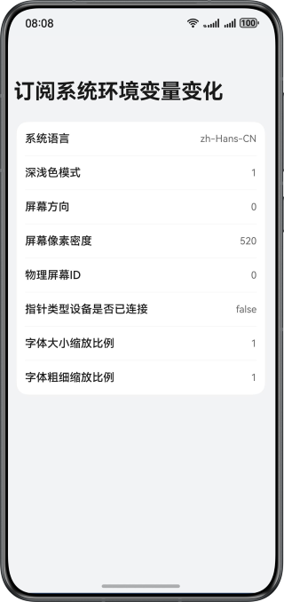

# 实现订阅系统环境变量变化能力

### 介绍

本示例详细介绍了如何获取和订阅系统环境变量的变化，包括系统语言、深浅色模式以及屏幕像素密度等关键设置。通过监听这些系统属性的变动，应用可以即时响应并调整自身的显示和行为，以提升用户体验。

### 效果预览



使用说明
1. 进入系统设置->系统->语言和地区，切换系统语言，切回到应用，应用列表项“系统语言”的值发生改变。
2. 进入系统设置->显示和亮度->字体大小和界面缩放，分别拖动字体大小字体粗细进度条，然后切回到应用，应用列表项“字体大小缩放比例”和“字体粗细缩放比例”发生改变。
3. 旋转设备屏幕，应用随设备旋转，应用列表项“屏幕方向”的值发生改变。
4. 下拉系统菜单栏，开启深色模式，应用列表项“深浅色模式”的值发生改变。

### 目录结构

```
├──entry/src/main/ets/
│  ├──common
│  │  └──Logger.ets                       // 日志打印工具类
│  ├──entryability
│  │  └──EntryAbility.ets                 // 程序入口类
│  ├──entrybackupability
│  │  └──EntryBackupAbility.ets           // 数据备份恢复类
│  └──pages
│     └──Index.ets                        // 应用入口页
└──entry/src/main/resources               // 应用静态资源目录
```

### 具体实现

* 在module.json5中声明添加orientation属性，取值为auto_rotation，使应用可以随屏幕方向旋转。
* 在app.json5中添加configuration标签，使应用字体大小可以跟随系统变更，具体实现可以参考：[configuration标签](https://developer.huawei.com/consumer/cn/doc/harmonyos-guides/app-configuration-file#configuration%E6%A0%87%E7%AD%BE)。
* 在EntryAbility.ets添加[onConfigurationUpdate()](https://developer.huawei.com/consumer/cn/doc/harmonyos-references/js-apis-app-ability-ability#abilityonconfigurationupdate)回调方法，用于订阅深浅色模式、系统语言、文本大小缩放等系统环境变量的变化。
* 在Index.ets使用[display.on('change')](https://developer.huawei.com/consumer/cn/doc/harmonyos-references/js-apis-display#displayonaddremovechange)方法，订阅横竖屏切换变化。

### 相关权限

不涉及。

### 依赖

不涉及。

### 约束与限制

1. 本示例仅支持标准系统上运行，支持设备：华为手机。
2. HarmonyOS系统：HarmonyOS 5.0.5 Release及以上。
3. DevEco Studio版本：DevEco Studio 5.0.5 Release及以上。
4. HarmonyOS SDK版本：HarmonyOS 5.0.5 Release SDK及以上。


