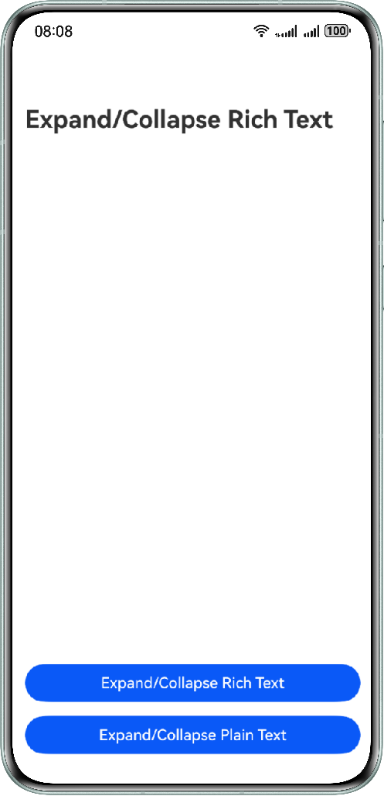

# Rich Text Expand and Collapse

### Overview

This sample demonstrates use cases such as blog posts and comments in a list. When displaying text content that spans multiple lines, it is often necessary to provide expanding/collapsing functionalities.

### Preview

| Home Page                                   | Expand Button for Rich Text Display            | Collapse Button for Rich Text Display        | Collapse Button for Plain Text Display       | Expand Button for Plain Text Display          |
|----------------------------------------|-------------------------------------------------|-----------------------------------------------|-----------------------------------------------|-------------------------------------------------|
|  |  |  |  |  |

How to Use

1. Open the application and tap the Expand/Collapse Rich Text button on the home page. The rich text display page is displayed. Tap the expand button to expand the list and tap the collapse button to collapse the list.
2. Open the application and tap the Expand/Collapse Plain Text button on the home page. The plain text display page is displayed. Tap the expand button to expand the list and tap the collapse button to collapse the list.

### Project Directory

```
├──ets
│  ├──entryability
│  │  └──EntryAbility.ets
│  ├──entrybackupability
│  │  └──EntryBackupAbility.ets
│  ├──pages
│  │  ├──index .ets              // Home page.
│  │  ├──RichTextExpand .ets     // Rich text scenario.
│  │  ├──TextExpand.ets          // Plain text scenario.
│  ├──utils
│  │  ├──Models .ets             // Data model.
│  │  ├──TextUtils .ets          // Text processing utility.
│  └──view
│     ├──ItemPart.ets            // List data display component in the plain text scenario.
│     ├──RichItemPart.ets        // List data display component in the rich text scenario.
│     ├──RichTextExpandView.ets  // Encapsulated rich text expansion and folding.
│     ├──TextExpandView.ets      // Encapsulated plain text expansion and folding.
└──resources
```

### How to Implement

1. Use [MeasureText](https://developer.huawei.com/consumer/en/doc/harmonyos-references/js-components-canvas-canvasrenderingcontext2d#measuretext) to pre-typeset the text content and measure and calculate the position of the folding and unfolding button to implement the expanding/collapsing functionalities.
2. Use [ParagraphBuilder](https://developer.huawei.com/consumer/en/doc/harmonyos-references/js-apis-graphics-text#paragraphbuilder) to typeset paragraphs and calculate the truncation position based on the typesetting content to implement the expanding/collapsing functionalities.

### Required Permissions

N/A.

### Dependencies

N/A.

### Constraints

1. This sample is only supported on Huawei phones running standard systems.

2. HarmonyOS: HarmonyOS 5.1.1 Release or later.

3. DevEco Studio: DevEco Studio 5.1.1 Release or later.

4. HarmonyOS SDK: HarmonyOS 5.1.1 Release SDK or later.


