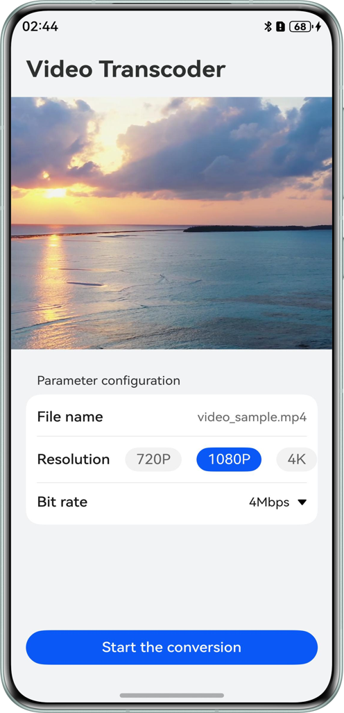
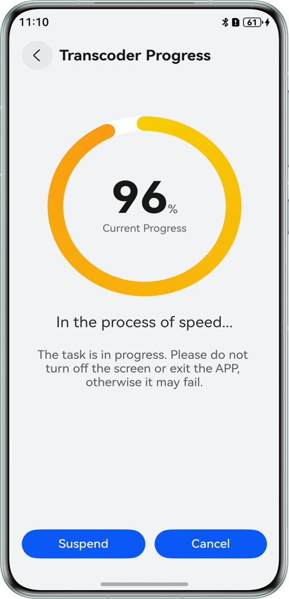
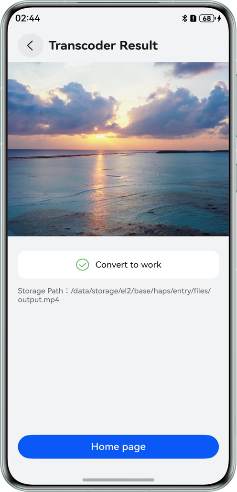

## Use AVTranscoder to Transcode Videos (ArkTS)

### Overview

This sample demonstrates how to use the AVTranscoder to implement video transcoding, covering the process of starting, pausing, resuming, and exiting transcoding.

### Preview

| HomePage                                                   | TranscodingPage                                                     | TranscoderedPage                                                   |
|------------------------------------------------------------|---------------------------------------------------------------------|--------------------------------------------------------------------|
|  |  |  |

How to use：
1. Open the application. The home page allows users to select the parameter configurations required for video transcoding. Then, tap Start Transcoding to navigate to the video transcoding page.
2. On the video transcoding page, users can view the transcoding progress. Tapping Pause suspends the process, while tapping Resume resumes the transcoding. Selecting Cancel opens a confirmation popup to cancel the transcoding. Once complete, tapping Finish redirects the user to the transcoding completion page.
3. On the transcoding completion page, users can view the video after transcoding. Tapping Home Page takes them back to the home page.

### Project Directory

```
├──ets
│  ├──entryability
│  │  └──EntryAbility.ets
│  ├──pages
│  │  ├──index .ets                    // Home page.
│  │  ├──TranscoderFinishPage.ets      // Video transcoding completion page.
│  │  └──VideoTranscoderPage.ets       // Video transcoding progress page.
│  └──utils
│     └──AVTranscoderManager.ets       // Video transcoding management class.
└──resources
   └──rawfile
      └──video_sample.mp4              // Transcoded video.
```

### How to Implement

1. Use the [AVTranscoder](https://developer.huawei.com/consumer/en/doc/harmonyos-guides/media-kit-intro#avtranscoder) video transcoding management class to first create an instance via createAVTranscoder(). Then, register transcoding event listeners, and finally call relevant APIs to complete the process of starting, pausing, resuming, and exiting transcoding.
2. After the [AVTranscoder](https://developer.huawei.com/consumer/en/doc/harmonyos-guides/media-kit-intro#avtranscoder) is used for transcoding, the output path is usually the sandbox path of the application. You need to concatenate the full path (e.g., files// Application bundle name/Output directory) before using the [Video](https://developer.huawei.com/consumer/en/doc/harmonyos-references/ts-media-components-video) component to play the video. For information on obtaining the application bundle name, see [How do I obtain the bundle name of the current HAP?](https://developer.huawei.com/consumer/en/doc/harmonyos-faqs/faqs-package-structure-26)

### Required Permissions

N/A

### Dependencies

N/A

### Constraints

1.This sample is only supported on Huawei phones running standard systems.

2.The HarmonyOS version must be HarmonyOS 5.0.5 Release or later.

3.The DevEco Studio version must be DevEco Studio 5.0.5 Release or later.

4.The HarmonyOS SDK version must be HarmonyOS 5.0.5 Release SDK or later.

