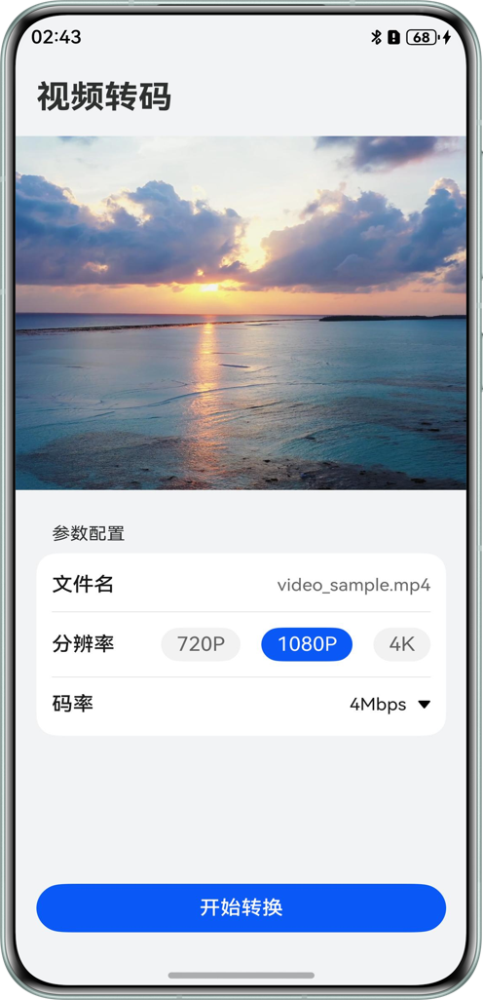
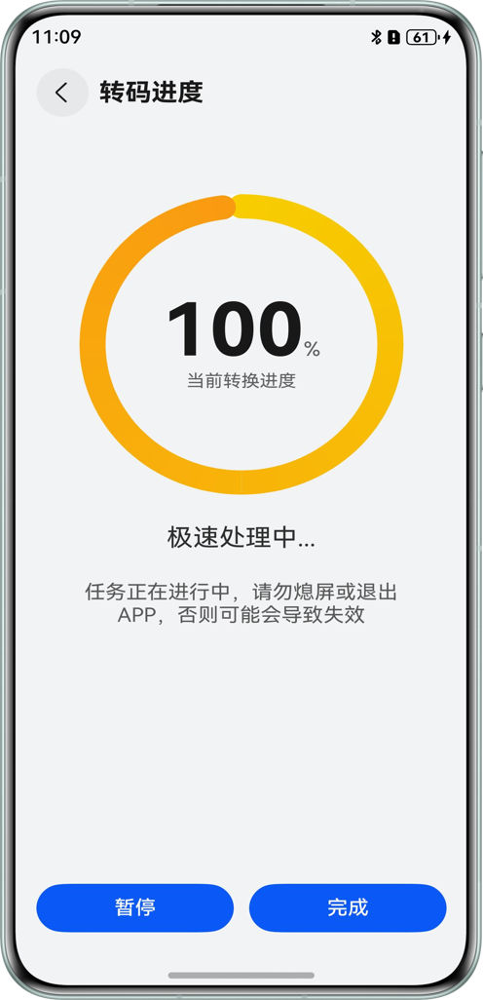
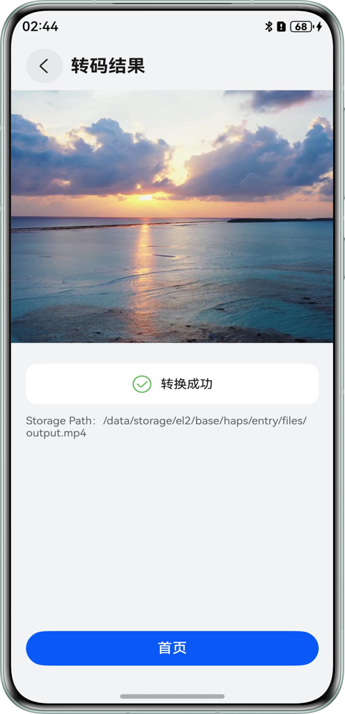

## 使用AVTranscoder实现视频转码(ArkTS)

### 介绍

本示例将以“开始转码-暂停转码-恢复转码-转码完成”的一次流程向开发者讲解AVTranscoder视频转码相关功能。

### 效果预览

| 首页                                                      | 视频转码页                                                            | 转码完成页                                                           |
|---------------------------------------------------------|------------------------------------------------------------------|-----------------------------------------------------------------|
|  |  |  |

使用说明：
1. 打开应用，首页支持选择视频转码所需的参数配置，选择完成后，点击开始转码按钮，跳转到视频转码页面。
2. 视频转码页面可以看到视频转码的进度，点击暂停按钮，暂停转码，点击恢复按钮，恢复转码；点击取消按钮，弹窗提醒是否取消转码；转码完成后，点击完成按钮，跳转到转码完成页面。
3. 转码完成页面可以观看转码完成后的视频，点击首页按钮，返回到首页。

### 工程目录


```
├──ets
│  ├──entryability
│  │  └──EntryAbility.ets
│  ├──pages
│  │  ├──index .ets                    // 主页
│  │  ├──TranscoderFinishPage.ets      // 视频转码完成页面
│  │  └──VideoTranscoderPage.ets       // 视频转码进度页面
│  └──utils
│     └──AVTranscoderManager.ets       // 视频转码管理类
└──resources
   └──rawfile
      └──video_sample.mp4              // 转码视频
```

### 具体实现

1. 使用[AVTranscoder](https://developer.huawei.com/consumer/cn/doc/harmonyos-references/arkts-apis-media-avtranscoder)
视频转码管理类，先通过createAVTranscoder()
构建一个AVTranscoder实例，然后注册转码监听事件，最后调用相关接口实现“开始转码-暂停转码-恢复转码-转码完成”的流程。
2. 通过[AVTranscoder](https://developer.huawei.com/consumer/cn/doc/harmonyos-references/arkts-apis-media-avtranscoder)
转码后，输出路径通常为应用沙箱内的路径，需要拼接出完整路径（如：files//应用包名/输出路径）后，
通过[Video](https://developer.huawei.com/consumer/cn/doc/harmonyos-references/ts-media-components-video)
组件实现视频播放，获取应用包名请参考[如何获取当前HAP的BundleName](https://developer.huawei.com/consumer/cn/doc/harmonyos-faqs/faqs-package-structure-26)

### 相关权限

不涉及。

### 依赖

不涉及。

### 约束与限制

1.本示例仅支持标准系统上运行，支持设备：华为手机。

2.HarmonyOS系统：HarmonyOS 5.0.5 Release及以上。

3.DevEco Studio版本：DevEco Studio 5.0.5 Release及以上。

4.HarmonyOS SDK版本：HarmonyOS 5.0.5 Release SDK及以上。

