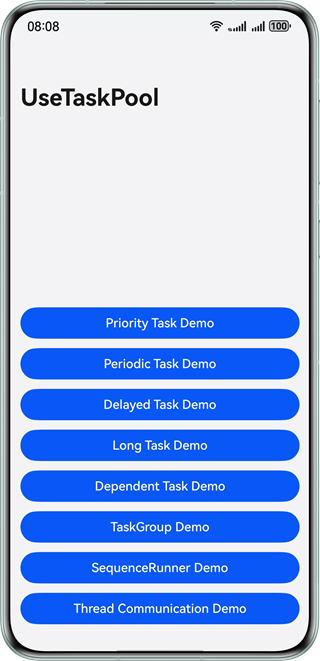

# TaskPool Usage Examples

### Overview

This sample describes how to use TaskPool as well as its capabilities and features.

### Preview

| Home page                                                              |
|------------------------------------------------------------------------|
|  |

### How to Use

On the home page, there are eight buttons, which correspond to different TaskPool usage examples. Tap a button to go to the corresponding usage example page. On the displayed page, key thread execution information is displayed in the first text box, and the thread and task information in the TaskPool is displayed in the second text box.
- Priority tasks: Tap the Create Task button to create respectively 100 high-, medium-, and low-priority tasks. Tap the Execute Task button so that the TaskPool executes these tasks and prints information such as the task execution thread and time. Observe the scheduling of priority tasks in the TaskPool. Tap the Cancel Task button to cancel these tasks.
- Periodic tasks: Tap the Create Task button to create a periodic task. Tap the Execute Task button so that the TaskPool executes the task and prints information such as the task execution thread and time. Observe the periodic execution status of the periodic task. Tap the Cancel Task button to cancel the task.
- Delayed tasks: Tap the Create Task button to create a delayed task. Tap the Execute Task button so that the TaskPool executes the task after a certain period of time and prints information such as the thread and time for submitting and executing the task. Observe the execution status of the delayed task. Tap the Cancel Task button to cancel the task.
- Long tasks: Tap Create Task to create a long task. Tap the Execute Task button so that the TaskPool executes the task and prints information such as the thread and time for executing and ending the task. Observe the execution status of the long task. Tap the Cancel Task button to cancel the task.
- Dependent tasks: Tap the Create Task button to create two dependent tasks. Tap the Execute Task button so that the TaskPool executes the two tasks and prints information such as the thread and time for submitting and executing the tasks. Observe the execution status of the dependent tasks. Tap the Cancel Task button to cancel these tasks.
- TaskGroup: Tap the Create Task button to create a task group containing 10 tasks. Tap the Execute Task button so that the TaskPool executes the task group and prints information such as the thread and time for executing the tasks. Observe the execution status of the task group. Tap the Cancel Task button to cancel the task group.
- SequenceRunner: Tap the Create Task button to create 10 tasks that are executed in serial mode. Tap the Execute Task button so that the TaskPool executes these tasks and prints information such as the thread and time for executing the tasks. Observe the execution status of the serial tasks. Tap the Cancel Task button to cancel these tasks.
- Thread communication: Tap the corresponding button on the page to display the communication between the TaskPool and the host thread, between the Worker and the host thread, and between the TaskPool and the Worker. The information such as the thread and time for sending and receiving messages is displayed. Observe the communication between threads.

### Project Directory

```
├──entry/src/main/ets
│  ├──common                          // Common modules
│  │  ├──utils                        // Common utilities
│  │  │  ├──DateTimeUtils.ets         // Date and time utility
│  │  │  └──ThreadMethods.ets         // Common methods of thread tasks
│  │  └──CommonConstants              // Common constants
│  ├──entryability                    // App entry
│  │  └──EntryAbility.ets
│  ├──entrybackupability
│  │  └──EntryBackupAbility.ets
│  ├──pages
│  │  └──Index.ets                    // Home page of the app
│  ├──view
│  │  ├──DelayedTasks.ets             // Delayed tasks page component
│  │  ├──DependentTasks.ets           // Dependent tasks page component
│  │  ├──LongTasks.ets                // Long tasks page component
│  │  ├──PeriodicTasks.ets            // Periodic tasks page component
│  │  ├──PriorityTasks.ets            // Priority tasks page component
│  │  ├──SequenceRunner.ets           // Serial tasks page component
│  │  ├──ShowInfoComponent.ets        // Thread information display component
│  │  ├──TaskGroup.ets                // Task group page component
│  │  └──ThreadCommunication.ets      // Thread communication page component
│  ├──viewmodel
│  │  ├──ComponentModifier.ets        // Common component modifier
│  │  ├──GlobalBuilderContext.ets     // Route information
│  │  └──ThreadInfos.ets              // Thread data
│  └──workers
│     └──Worker.ets                   // Worker thread
├──resources                          // Static resources of the app
│  ├──base                            // Resource files in this directory are assigned unique IDs.
│  │  ├──element                      // Fonts and colors
│  │  ├──media                        // Images
│  │  └──profile                      // Home page of the app entry
│  ├──en_US                           // Resources in this directory are preferentially matched when the device language is American English.
│  ├──rawfile                         // Resource files of the app
│  └──zh_CN                           // Resources in this directory are preferentially matched when the device language is simplified Chinese.
└──module.json5                       // Module configuration
```

### Permissions

- N/A

### Dependencies

- N/A

### Constraints

1. The sample is only supported on Huawei phones with standard systems.

2. The HarmonyOS version must be HarmonyOS 5.0.5 Release or later.

3. The DevEco Studio version must be DevEco Studio 5.0.5 Release or later.

4. The HarmonyOS SDK version must be HarmonyOS 5.0.5 Release SDK or later.