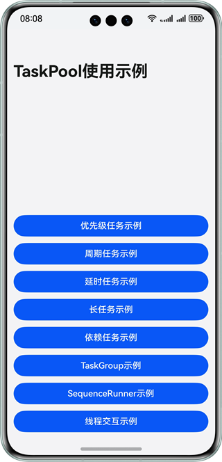

# 基于TaskPool实现多线程任务

### 介绍

本示例基于TaskPool的能力与特性，实现不同场景的多线程任务的功能，例如优先级任务，周期任务，延时任务以及任务组等场景。基于本示例，可以快速学习TaskPool的使用方法和能力，帮助应用开发计算任务大，并行任务多的功能场景。

### 效果预览

| 应用主界面                                                            |
|------------------------------------------------------------------|
|  | 

### 使用说明

点击进入页面后，页面有八个按钮，分别对应不同的TaskPool能力的使用示例，点击跳转到不同类型任务的使用示例页面，各页面内有相应的功能按钮；线程执行的关键信息会在各示例页面的第一个文本框内打印出来；TaskPool内部的线程以及任务信息会打印在第二个文本框内。
- 优先级任务示例：首先点击‘创建任务’按钮，会创建高、中、低三种优先级任务各100个；然后点击‘执行任务’按钮，TaskPool会执行这些任务，并打印任务执行的线程、时间等信息，可以观察TaskPool对优先级任务的调度。运行过程中点击‘取消任务’按钮可以取消这些任务。
- 周期任务示例：首先点击‘创建任务’按钮，会创建1个周期任务；然后点击‘执行任务’按钮，TaskPool会执行该任务，并打印任务执行的线程、时间等信息，可以观察周期任务周期执行的情况。运行过程中点击‘取消任务’按钮可以取消该任务。
- 延时任务示例：首先点击‘创建任务’按钮，会创建1个延时任务；然后点击‘执行任务’按钮，TaskPool会在延时一定时间后执行该任务，并打印任务提交和执行的线程、时间等信息，可以观察延时任务的执行情况。运行过程中点击‘取消任务’按钮可以取消该任务。
- 长任务示例：首先点击‘创建任务’按钮，会创建1个长任务；然后点击‘执行任务’按钮，TaskPool会执行该任务，并打印任务执行和结束的线程、时间等信息，可以观察长任务的执行情况。运行过程中点击‘取消任务’按钮可以取消该任务。
- 依赖任务示例：首先点击‘创建任务’按钮，会创建2个有依赖关系的任务；然后点击‘执行任务’按钮，TaskPool会执行这两个任务，并打印任务提交和执行的线程、时间等信息，可以观察依赖任务的执行情况。运行过程中点击‘取消任务’按钮可以取消任务。
- TaskGroup示例：首先点击‘创建任务’按钮，会创建1个包含10个任务的任务组；然后点击‘执行任务’按钮，TaskPool会执行该任务组，并打印任务执行的线程、时间等信息，可以观察任务组的执行情况。运行过程中点击‘取消任务’按钮可以取消该任务组。
- SequenceRunner示例：首先点击‘创建任务’按钮，会创建10个串行执行的任务；然后点击‘执行任务’按钮，TaskPool会执行这些任务，并打印任务执行的线程、时间等信息，可以观察串行任务的执行情况。运行过程中点击‘取消任务’按钮可以取消这些任务。
- 线程交互示例：该页面的三个按钮分别展示了TaskPool与宿主线程，Worker与宿主线程，TaskPool与Worker之间的通信，点击后会打印发送消息和接收消息的线程、时间等信息，可以观察线程间通信的情况。

### 工程目录

```       
├──entry/src/main/ets                
│  ├──common                          // 公共模块
│  │  ├──utils                        // 共用的工具类
│  │  │  ├──DateTimeUtils.ets         // 时间工具类
│  │  │  └──ThreadMethods.ets         // 线程任务公共方法
│  │  └──CommonConstants              // 公共常量类
│  ├──entryability                    // 应用的入口
│  │  └──EntryAbility.ets            
│  ├──entrybackupability            
│  │  └──EntryBackupAbility.ets          
│  ├──pages            
│  │  └──Index.ets                    // 应用主页面            
│  ├──view 
│  │  ├──DelayedTasks.ets             // 延迟任务页面组件
│  │  ├──DependentTasks.ets           // 依赖任务页面组件
│  │  ├──LongTasks.ets                // 长任务页面组件
│  │  ├──PeriodicTasks.ets            // 周期任务页面组件
│  │  ├──PriorityTasks.ets            // 优先级任务页面组件
│  │  ├──SequenceRunner.ets           // 串行任务页面组件
│  │  ├──ShowInfoComponent.ets        // 线程信息展示组件
│  │  ├──TaskGroup.ets                // 任务组页面组件
│  │  └──ThreadCommunication.ets      // 线程交互页面组件
│  ├──viewmodel
│  │  ├──ComponentModifier.ets        // 公共组件样式
│  │  ├──GlobalBuilderContext.ets     // 路由信息类  
│  │  └──ThreadInfos.ets              // 线程数据类                
│  └──workers                         
│     └──Worker.ets                   // Worker线程文件
├──resources                          // 用于存放应用所用到的资源文件
│  ├──base                            // 该目录下的资源文件会被赋予唯一的ID
│  │  ├──element                      // 用于存放字体和颜色 
│  │  ├──media                        // 用于存放图片
│  │  └──profile                      // 应用入口首页
│  ├──en_US                           // 设备语言是美式英文时，优先匹配此目录下资源
│  ├──rawfile                         // 应用资源文件
│  └──zh_CN                           // 设备语言是简体中文时，优先匹配此目录下资源
└──module.json5                       // 模块配置信息
```

### 相关权限

- 不涉及

### 依赖

- 不涉及

### 约束与限制

1. 本示例仅支持标准系统上运行，支持设备：华为手机;

2. HarmonyOS系统：HarmonyOS 5.0.5 Release及以上;

3. DevEco Studio版本：DevEco Studio 5.0.5 Release及以上;

4. HarmonyOS SDK版本：HarmonyOS 5.0.5 Release SDK及以上。    