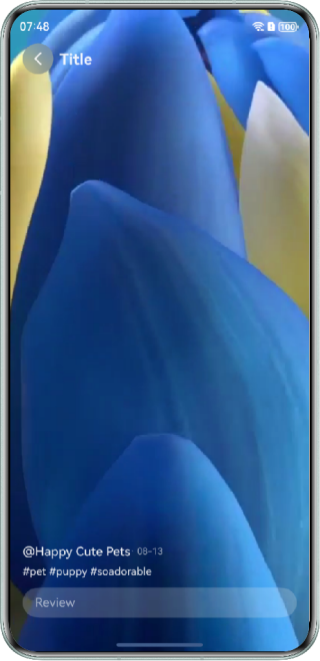
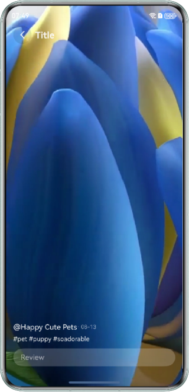
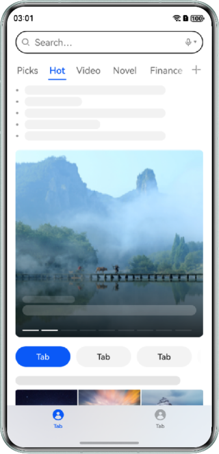

# Efficient Use of HWC-based Low-Power Design

### Introduction
Hardware Composer (HWC), a hardware-assisted system, delivers higher processing efficiency and lower power consumption than the general-purpose computing unit in the multi-layer overlay scenario. However, its hardware capabilities can be fully utilized only when certain conditions are met. This sample demonstrates how to adjust the visual effect design by removing the blur effect or modifying the transparency of the self-rendering layer through three typical scenarios of multi-layer overlay between the Video or Web component and the UI, to expand the effective scope of HWC for lower power consumption in application scenarios.

### Preview
| Video Component with Blur Overlay                | Video Component without Blur Overlay                    | Web Component with Blur Overlay                | Web Component without Blur Overlay          | Video Layer with Transparency                  | Opaque Video Layer               |
|--------------------------------------------------|--------------------------------------------|------------------------------------------------|---------------------------------------------|-------------------------------------------------|--------------------------------------------|
|  |  |  |  |  |  |

### How to Use
1. Click the Video component with blur overlay button to enter the scenario page, the video is automatically played.
2. Click the Video component without blur overlay button to enter the scenario page, the video is automatically played.
3. Click the Web component with blur overlay button to enter the scenario page, the Web page can be swiped up or down.
4. Click the Web component without blur overlay button to enter the scenario page, the Web page can be swiped up or down.
5. Click the video layer with transparency button to enter the scenario page, the video is automatically played.
6. Click the opaque video layer button to enter the scenario page, the video is automatically played.

### Project Directory
```
entry/src/main/ets 
├── entryability 
│   ├── EntryAbility.ets                // Entry ability lifecycle callbacks 
│   └── EntryBackupAbility.ets          // Application data backup and restore abilities 
├── pages 
│   ├── Index.ets                       // View layer - main page 
│   ├── VideoWithBlur.ets               // View layer - Video component with blur overlay 
│   ├── NormalVideo.ets                 // View layer - Video component without blur overlay 
│   ├── WebWithBlur.ets                 // View layer - Web component with blur overlay 
│   ├── NormalWeb.ets                   // View layer - Web component without blur overlay 
│   ├── TransparentVideo.ets            // View layer - video layer with transparency 
│   └── OpaqueVideo.ets                 // View layer - opaque video layer 
└── entry/src/main/resources            // Application static resources
```

### How to Implement

**Video Component with Blur Overlay：**

Use backdropBlur to set the background blur effect for the Image component above the Video component. The following is the sample code：

```typescript
Image($r('app.media.chevron_left'))
  .padding(12)
  .width(40)
  .height(40)
  .borderRadius('50%')
  .fillColor('rgba(255, 255, 255, 0.9)')
  .backgroundColor('rgba(0, 0, 0, 0.1)')
  .backdropBlur(40) // Set this component background blur
  .backgroundBlurStyle(BlurStyle.BACKGROUND_REGULAR)
  .onClick(() => {
    this.pathStack.pop();
  })
```

**Video Component without Blur Overlay：**

Do not set the blur effect for the Image component above the Video component. The following is the sample code：
```typescript
Image($r('app.media.chevron_left'))
  .padding(12)
  .width(40)
  .height(40)
  .borderRadius('50%')
  .fillColor('rgba(255, 255, 255, 0.9)')
  .backgroundColor('rgba(0, 0, 0, 0.1)')
  .onClick(() => {
    this.pathStack.pop();
  })
```

**Web Component with Blur Overlay：**

Use TabContent of the Tabs component to wrap the Web component. Set barOverlap of the Tabs component to true, so that the bottom TabBar is blurred and overlaid on TabContent. The following is the sample code：
```typescript
Tabs({ barPosition: BarPosition.End, index: 0, controller: this.controller }) {
  TabContent() {
    Web({ src: $rawfile('test.html'), controller: this.webController })
  }
  // ...
}
.height('100%')
.width('100%')
.barOverlap(true) // Set TabBar to be blurred and overlay on top of TabContent
.barBackgroundColor('rgba(241, 243, 245, 0.3)')
```

**Web Component without Blur Overlay：**

Use TabContent of the Tabs component to wrap the Web component. Set the barOverlap property of the Tabs component to true to overlay the bottom TabBar on TabContent, and change the value of barBackgroundBlurStyle to BLurStyle.MONE to remove the blur effect of TabBar. The following is the sample code：
```typescript
Tabs({ barPosition: BarPosition.End, index: 0, controller: this.controller }) {
  TabContent() {
    Web({ src: $rawfile('test.html'), controller: this.webController })
  }
  // ...
}
.height('100%')
.width('100%')
.barOverlap(true) // Set TabBar to be blurred and overlay on top of TabContent
.barBackgroundBlurStyle(BlurStyle.NONE) // Set TabBar to be not blurry
.barBackgroundColor('rgba(241, 243, 245, 1)')
```

**Video Layer with Transparency：**

Overlay the Video component on the Image component and set opacity to 0.7, allowing partial visibility of the underlying Image component through the semitransparent Video overlay. The following is the sample code：
```typescript
Video({
  src: $r('app.media.test_video')
})
  .height('100%')
  .width('100%')
  .loop(true)
  .autoPlay(true)
  .controls(false)
  .alignRules({
    top: { anchor: '__container__', align: VerticalAlign.Top },
    middle: { anchor: '__container__', align: HorizontalAlign.Center }
  })
  .opacity(0.7) // Set the transparency of the video layer
```

**Opaque Video Layer：**

Overlay the Video component on the Image component and set opacity to 1 to make the video completely opaque. The following is the sample code：
```typescript
Video({
  src: $r('app.media.test_video')
})
  .height('100%')
  .width('100%')
  .loop(true)
  .autoPlay(true)
  .controls(false)
  .alignRules({
    top: { anchor: '__container__', align: VerticalAlign.Top },
    middle: { anchor: '__container__', align: HorizontalAlign.Center }
  })
  .opacity(1) // Set the video layer to be fully opaque
```

### Required Permissions

N/A

### Dependencies

N/A

### Constraints

1. This sample is only supported on Huawei phones with standard systems.
2. The HarmonyOS version must be HarmonyOS 5.0.5 Release or later.
3. The DevEco Studio version must be DevEco Studio 5.0.5 Release or later.
4. The HarmonyOS SDK version must be HarmonyOS 5.0.5 Release SDK or later.
