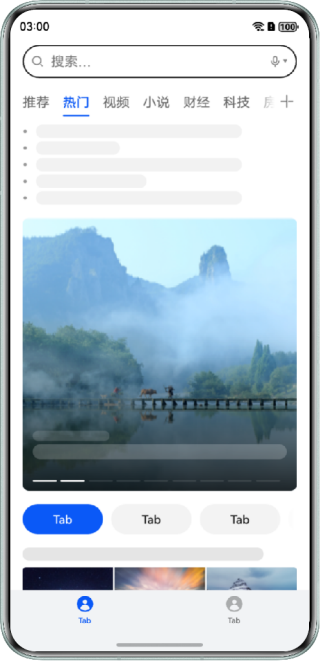

# 高效利用HWC的低功耗设计

### 介绍
Hardware Composer（下文简称HWC）专用硬件辅助系统相对于通用计算单元，在图层叠加场景具有更高的处理效率和更低的能耗，但是需要满足一定条件才能充分发挥其硬件能力。本示例列举了视频或Web页与UI图层叠加的三种典型场景，展示通过去除模糊效果或调整自渲染图层透明度等方式调整视效设计，扩大HWC的生效范围，降低应用场景功耗。

### 效果预览
| Video组件叠加模糊控件                                 | Video组件上方控件无模糊                             | Web组件叠加模糊控件                                 | Web组件上方控件无模糊                             | 视频图层设置透明度                                       | 视频图层不透明                                    |
|-----------------------------------------------|--------------------------------------------|---------------------------------------------|------------------------------------------|-------------------------------------------------|--------------------------------------------|
|  |  |  |  |  |  |

### 使用说明
1. 点击Video组件叠加模糊控件按钮进入场景页面，视频自动播放。
2. 点击Video组件上方控件无模糊按钮进入场景页面，视频自动播放。
3. 点击Web组件叠加模糊控件按钮进入场景页面，上下滑动Web页面。
4. 点击Web组件上方控件无模糊按钮进入场景页面，上下滑动Web页面。
5. 点击视频图层设置透明度按钮进入场景页面，视频自动播放。
6. 点击视频图层不透明按钮进入场景页面，视频自动播放。

### 工程目录
```
entry/src/main/ets
├── entryability
│   ├── EntryAbility.ets                // Ability的生命周期回调内容
│   └── EntryBackupAbility.ets          // 应用数据备份恢复类
├── pages
│   ├── Index.ets                       // 视图层-主页面
│   ├── VideoWithBlur.ets               // 视图层-Video组件叠加模糊控件场景页面
│   ├── NormalVideo.ets                 // 视图层-Video组件上方控件无模糊场景页面
│   ├── WebWithBlur.ets                 // 视图层-Web组件叠加模糊控件场景页面
│   ├── NormalWeb.ets                   // 视图层-Web组件上方控件无模糊场景页面
│   ├── TransparentVideo.ets            // 视图层-视频图层设置透明度场景页面
│   └── OpaqueVideo.ets                 // 视图层-视频图层不透明场景页面
└── entry/src/main/resources            // 应用静态资源目录
```

### 具体实现

**Video组件叠加模糊控件场景：**

Video组件上方的Image组件使用backdropBlur设置了背景模糊。具体代码如下：

```typescript
Image($r('app.media.chevron_left'))
  .padding(12)
  .width(40)
  .height(40)
  .borderRadius('50%')
  .fillColor('rgba(255, 255, 255, 0.9)')
  .backgroundColor('rgba(0, 0, 0, 0.1)')
  .backdropBlur(40) // Set this component background blur
  .backgroundBlurStyle(BlurStyle.BACKGROUND_REGULAR)
  .onClick(() => {
    this.pathStack.pop();
  })
```

**Video组件上方控件无模糊场景：**

Video组件上方的Image组件不设置模糊效果。具体代码如下：
```typescript
Image($r('app.media.chevron_left'))
  .padding(12)
  .width(40)
  .height(40)
  .borderRadius('50%')
  .fillColor('rgba(255, 255, 255, 0.9)')
  .backgroundColor('rgba(0, 0, 0, 0.1)')
  .onClick(() => {
    this.pathStack.pop();
  })
```

**Web组件叠加模糊控件场景：**

Tabs组件的TabContent包裹Web组件。Tabs组件设置属性barOverlap为true时可以使底部TabBar模糊并叠加在TabContent之上。具体代码如下：
```typescript
Tabs({ barPosition: BarPosition.End, index: 0, controller: this.controller }) {
  TabContent() {
    Web({ src: $rawfile('test.html'), controller: this.webController })
  }
  // ...
}
.height('100%')
.width('100%')
.barOverlap(true) // Set TabBar to be blurred and overlay on top of TabContent
.barBackgroundColor('rgba(241, 243, 245, 0.3)')
```

**Web组件上方控件无模糊场景：**

Tabs组件的TabContent包裹Web组件。Tabs组件设置属性barOverlap为true使底部TabBar叠加在TabContent之上，并且修改barBackgroundBlurStyle的值为BLurStyle.MONE去除TabBar的模糊效果。具体代码如下：
```typescript
Tabs({ barPosition: BarPosition.End, index: 0, controller: this.controller }) {
  TabContent() {
    Web({ src: $rawfile('test.html'), controller: this.webController })
  }
  // ...
}
.height('100%')
.width('100%')
.barOverlap(true) // Set TabBar to be blurred and overlay on top of TabContent
.barBackgroundBlurStyle(BlurStyle.NONE) // Set TabBar to be not blurry
.barBackgroundColor('rgba(241, 243, 245, 1)')
```

**视频图层设置透明度场景：**

Video组件叠加在Image组件上方，并且设置opacity为0.7使视频半透明，可以一定程度透视底部的Image组件。具体代码如下：
```typescript
Video({
  src: $r('app.media.test_video')
})
  .height('100%')
  .width('100%')
  .loop(true)
  .autoPlay(true)
  .controls(false)
  .alignRules({
    top: { anchor: '__container__', align: VerticalAlign.Top },
    middle: { anchor: '__container__', align: HorizontalAlign.Center }
  })
  .opacity(0.7) // Set the transparency of the video layer
```

**视频图层不透明场景：**

Video组件叠加在Image组件上方，并且opacity属性设置为1使视频完全不透明。具体代码如下：
```typescript
Video({
  src: $r('app.media.test_video')
})
  .height('100%')
  .width('100%')
  .loop(true)
  .autoPlay(true)
  .controls(false)
  .alignRules({
    top: { anchor: '__container__', align: VerticalAlign.Top },
    middle: { anchor: '__container__', align: HorizontalAlign.Center }
  })
  .opacity(1) // Set the video layer to be fully opaque
```

### 相关权限 

不涉及。 

### 依赖

不涉及。 

### 约束与限制

1. 本示例仅支持标准系统上运行，支持设备：华为手机。
 
2. HarmonyOS系统：HarmonyOS 5.0.5 Release及以上。 

3. DevEco Studio版本：DevEco Studio 5.0.5 Release及以上。 

4. HarmonyOS SDK版本：HarmonyOS 5.0.5 Release SDK及以上。