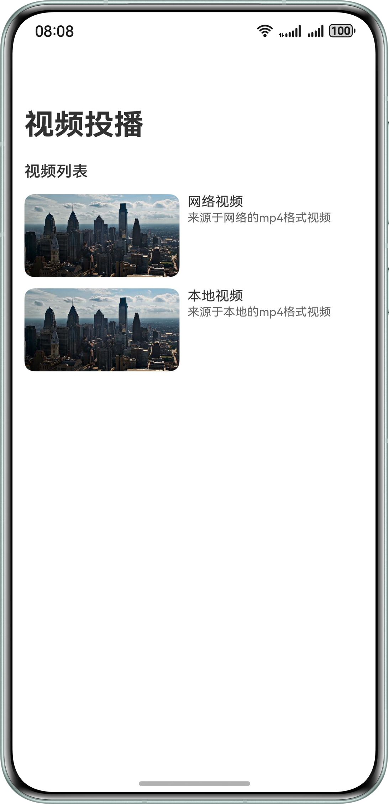
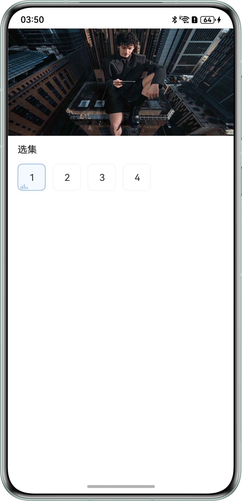
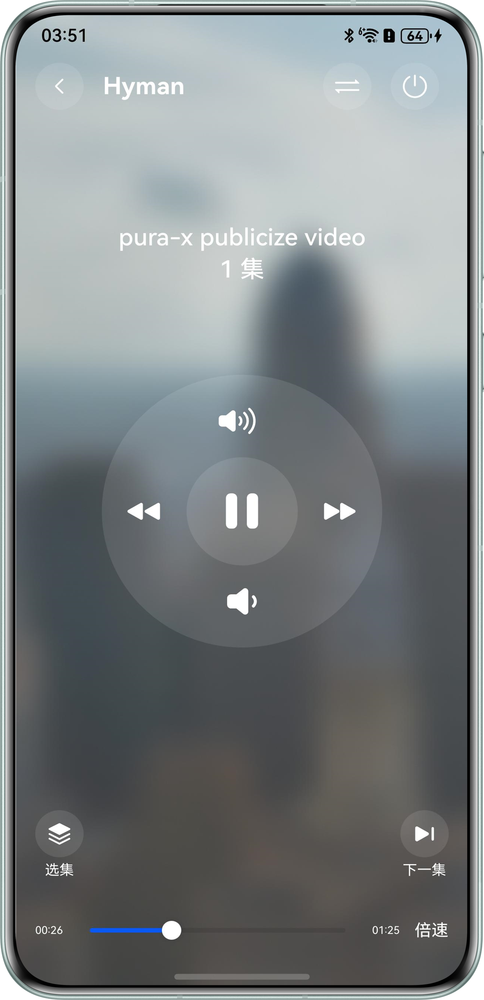

# 实现视频投播功能

### 介绍

本实例基于播控中心和系统投播实现完整的视频投播功能，包含投播和播控基础控制：设备切换、集数切换、音量增减、进度切换。

### 效果图预览
| 视频选择                                          | 本端播放                                          | 遥控器控制                                         |
|-----------------------------------------------|-----------------------------------------------|-----------------------------------------------|
|  |  |  |
**使用说明**

1. 本端设备播放视频，进度/音量/集数控制。
2. 播控中心控制本端设备，进度/音量/集数。
3. 建立投播，本端控制远端设备进度/音量/集数。

### 工程结构&模块类型

```
├───entry/src/main/ets
│   ├───common                              
│   │   ├───contants                        
│   │   │   └───CommonConstants.ets         // 常量
│   │   └───utils                           
│   │       ├───BackgroundTaskManager.ets   // 后台任务工具类
│   │       ├───ImageUtil.ets               // 图片处理工具类
│   │       └───TimeConvert.ets             // 时间转换工具类
│   ├───controller                          
│   │   ├───VideoCastController.ets         // 投播控制器
│   │   ├───VideoPlayerController.ets       // 本地播放控制器
│   │   └───VideoSessionController.ets      // 播控中心控制器
│   ├───entryability                        
│   │   └───EntryAbility.ets                // Ability的生命周期回调内容
│   ├───entrybackupability                  
│   │   └───EntryBackupAbility.ets          // Ability的生命周期回调内容
│   ├───model                               
│   │   └───VideoData.ets                   // 视频数据
│   ├───pages                               
│   │   ├───Index.ets                       // 首页
│   │   ├───RemoteControlPage.ets           // 远端控制遥控器页
│   │   └───VideoPlayPage.ets               // 本地播放页
│   └───view                                
│       ├───AVCastingControllerView.ets     // 远端控制器组件
│       ├───AVPlayerControllerView.ets      // 本地播放控制器组件
│       ├───CommonView.ets                  // 公共组件
│       ├───VideoCastHeadView.ets           // 远端控制播放头部组件
│       ├───VideoCastingView.ets            // 远端控制播放组件
│       └───VideoPlayingView.ets            // 本地控制播放组件
└───entry/src/main/resources                        
```

### 模块依赖

**不涉及**

### 约束与限制

详细信息可参考[投播组件开发约束与限制](https://developer.huawei.com/consumer/cn/doc/harmonyos-guides/distributed-playback-guide#section1557419538816)。

1.设备限制  
本端设备：手机设备。   
远端设备：PC/2in1设备。

2.使用限制  
双端设备打开蓝牙和WIFI，并可访问网络。
  
3.HarmonyOS系统：HarmonyOS 5.0.5 Release及以上。

4.DevEco Studio版本：DevEco Studio 5.0.5 Release及以上。

5.HarmonyOS SDK版本：HarmonyOS 5.0.5 Release SDK及以上。