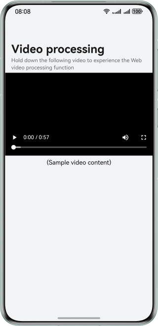

# Processing Videos Based on the Web Component

### Overview

Based on the **onContextMenuShow()** method and **Web** component download capability, this sample provides users with comprehensive functions such as full-screen playback, video URL copy, video playback with the browser, and video download. This enriches user experience by enhancing content accessibility and convenience for sharing.

### Preview

The figure shows the effect on a smartphone.



**Note**: The video URL in this sample is for demonstration only, which allows only limited download times. You can use your own video URL as required.

### Project Directory

```
├──entry/src/main/ets                                   // Code area
│  ├──common
│  |  └──Constants.ets                                  // Constants
│  ├──entryability
│  |  └──EntryAbility.ets
│  ├──entrybackupability
│  |  └──EntryBackupAbility.ets
│  ├──pages
│  |  └──Index.ets                                      // Entry page
│  ├──utils
│  |  ├──CustomFunction.ets                             // Custom functions
│  |  └──WebDownloadManager.ets                         // Web download manager
│  └──view
│     ├──CustomPopupMenu.ets                            // Custom pop-up menu
│     └──DownloadControlView.ets                        // Download UI view
└──entry/src/main/resources                             // App resource directory
```

### How to Implement
* Full-screen playback requires the **onFullScreenEnter()** event. During full-screen playback, **setPreferredOrientation()** is used to set the landscape mode. In the **onFullScreenExit()** callback: To turn the screen back to portrait mode, the back gesture must be compatible to exit the full-screen playback.
* Video URL copy through long-pressing the screen uses the **onContextMenuShow()** method of the **Web** component. In this method, the **event** parameter of the event callback can be used to obtain the attributes of the long press item. For the video, the video URL can be obtained through the **event.param.getSourceUrl()** method. After the video URL is obtained, it is set to the clipboard through **pasteboard.getSystemPasteboard().setData()**.
* Video playback with the browser uses the **event.param.getSourceUrl()** method to obtain the video URL. And then the browser is started and the video URL is transferred so that the video can be played in the browser.
* Video download through long pressing the screen uses **event.param.getSourceUrl()** to obtain the video URL, uses the **WebDownloadDelegate** class to listen for the download process and status, and triggers the download through **WebviewController** associated with the **Web** component. After the download is complete, the file is saved to the common directory.

### Permissions

* **ohos.permission.INTERNET**: network access permission.

### Constraints

1. The sample is only supported on Huawei phones with standard systems.
2. The HarmonyOS version must be HarmonyOS 5.0.5 Release or later.
3. The DevEco Studio version must be DevEco Studio 5.0.5 Release or later.
4. The HarmonyOS SDK version must be HarmonyOS 5.0.5 Release SDK or later.