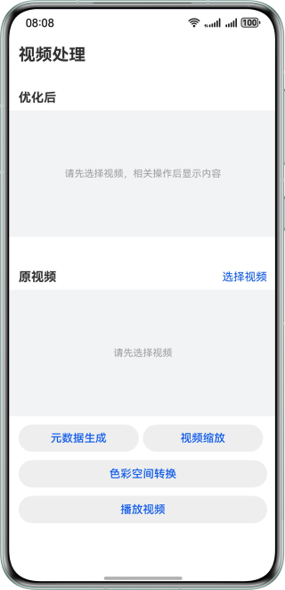

# 使用VideoProcessing对视频处理

### 介绍

本场景解决方案主要面向视频编辑相关开发人员，指导开发者使用VideoProcessing对视频进行缩放增强，动态元数据生成，色彩空间转换的操作。

### 效果预览



### 使用说明

1. 点击选择视频，选择需要处理的视频。
2. 点击视频缩放，弹出视频缩放增强等级弹窗，选择对应增强等级对视频进行增强。
3. 点击元数据生成，弹出元数据生成弹窗，选择元数据格式，生成相应元数据信息的视频。
4. 点击色彩空间转换，弹出色彩空间转换弹窗，根据色彩空间格式，生成相应色彩空间的视频。
5. 点击播放视频按钮，播放视频，不处理。
6. 如果视频不支持此处理，则点击处理时，提示“该视频不支持当前操作”。

### 工程目录
````
├──entry/src/main/ets/
│  ├──common
│  │  ├──entryability
│  │  │  └──CommonConstants.ets        // 公共常量类
│  │  └──utils
│  │     ├──DateTimeUtil.ets           // 日期工具类
│  │     ├──Logger.ets                 // 日志工具类
│  │     └──WindowUtil.ets             // 窗口设置工具类
│  ├──entryability
│  │  └──EntryAbility.ets              // 程序入口类
│  ├──page                  
│  │  └──VideoPage.ets                 // 视频处理页
│  └──view 
│     └──MultiStatusButton.ets         // 自定义状态按钮
├──entry/src/main/cpp/
│  ├──CMakeLists.txt                   // 构建脚本
│  ├──capbilities
│  │  ├──AudioDecoder.cpp              // 音频解码实现类  
│  │  ├──Demuxer.cpp                   // 解封装实现类
│  │  ├──VideoDecoder.cpp              // 视频解码实现类
│  │  └──include
│  │     ├──AudioDecoder.h             // 音频解码头文件
│  │     ├──Demuxer.h                  // 解封装头文件
│  │     └──VideoDecoder.h             // 视频解码头文件
│  ├──common                  
│  │  ├──SampleCallback.cpp            // 回调实现类  
│  │  ├──SampleCallback.h              // 回调头文件
│  │  ├──SampleInfo.h                  // 数据实体类
│  │  └──dfx
│  │     ├──error                     
│  │     │  └──AVCodecSampleError.h    // 错误码常量类
│  │     └──log                 
│  │        └──AVCodecSampleLog.h      // 日志工具类
│  ├──render                  
│  │  ├──PluginManager.cpp             // 插件管理实现类 
│  │  ├──PluginRender.cpp              // 渲染插件实现类
│  │  └──include
│  │     ├──PluginManager.h            // 插件管理头文件
│  │     └──PluginRender.h             // 渲染插件头文件
│  ├──sample                  
│  │  └──player
│  │     ├──Player.cpp                 // 播放实现类
│  │     ├──Player.h                   // 播放头文件
│  │     ├──PlayerNative.cpp           // NAPI实现类
│  │     └──PlayerNative.h             // NAPI头文件
│  └──types
│      └──player
│         ├──index.d.ts                 // NAPI接口
│         └──oh-package.json5           // 播放器so与d.ts定义
└──entry/src/main/resources             // 应用静态资源目录
````

### 相关权限

获取媒体文件访问权限：ohos.permission.READ_MEDIA

### 约束与限制

1. 本示例仅支持标准系统上运行，支持设备：华为手机。
2. HarmonyOS系统：HarmonyOS 5.0.4 Release及以上。
3. DevEco Studio版本：DevEco Studio 5.0.4 Release及以上。
4. HarmonyOS SDK版本：HarmonyOS 5.0.4 Release SDK及以上。
