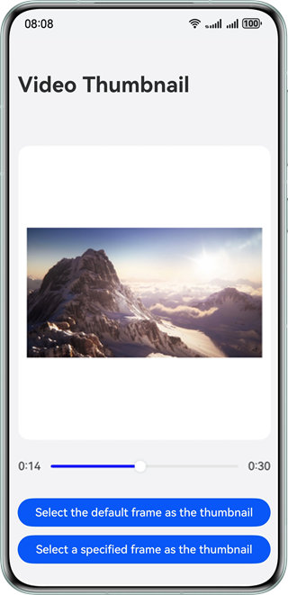

# Obtaining Video Thumbnails Using System Capabilities

### Overview

This sample demonstrates two methods of obtaining video thumbnails: call getThumbnail() to obtain the default video thumbnail, or use the AVImageGenerator class to obtain the thumbnail of the video at the specified time. You can quickly develop the scenario where video thumbnails need to be obtained, for example, video browsing and sharing scenarios where users can quickly browse and select desired contents according to the video cover.


### Preview



### How to Use

1. Touch the first button to start the gallery picker. After a video is selected, the application page displays the default video thumbnail.
2. Touch the second button to start the gallery picker. After a video is selected, the application page displays the first frame of the video as the thumbnail. You can drag the progress bar below to select the thumbnail of the video at the specified time.

### Project Directory

```
├──entry/src/main/ets
│  ├──common
│  │  └──utils 
│  │     ├──PhotoUtils.ets              // Image utility          
│  │     └──TimeUtils.ets               // Time utility 
│  ├──entryability
│  │  └──EntryAbility.ets               // Entry ability 
│  ├──entrybackupability
│  │  └──EntryBackupAbility.ets        
│  ├──model
│  │  └──VideoSizeData.ets              // Video data
│  └──pages                  
│     └──Index.ets                      // Home page
└──entry/src/main/resource              // Static resources of the application
```

### Permissions

-  N/A

### Constraints

1. The sample is only supported on Huawei phones with standard systems.
2. The HarmonyOS version must be HarmonyOS 5.0.5 Release or later.
3. The DevEco Studio version must be DevEco Studio 5.0.5 Release or later.
4. The HarmonyOS SDK version must be HarmonyOS 5.0.5 Release SDK or later.