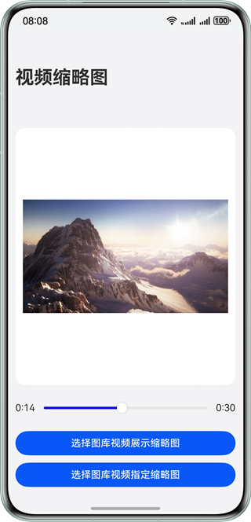

# 基于系统能力获取视频缩略图

### 项目简介

本示例展示了通过系统能力获取视频缩略图的两种方法；第一种是获取视频的默认缩略图封面，主要通过getThumbnail()接口实现；第二种是获取指定视频时间的缩略图，主要通过AVImageGenerator类实现；参考本项目可快速开发需要获取视频缩略图的场景，例如生成视频的封面，在视频浏览、分享等场景帮助用户快速浏览和选择想要的内容。

### 效果预览：



### 使用说明：

1. 点击第一个按钮，会拉起图库picker，选择一个视频后会返回应用页面展示该视频的默认缩略图封面。

2. 点击第二个按钮，会拉起图库picker，选择一个视频后会返回应用页面展示该视频的首帧作为缩略图，此时拉动图片下方的进度条可选择指定时间的缩略图。


### 工程目录

```
├──entry/src/main/ets
│  ├──common
│  │  └──utils 
│  │     ├──PhotoUtils.ets              // 视频图片操作类         
│  │     └──TimeUtils.ets               // 视频时间工具类
│  ├──entryability
│  │  └──EntryAbility.ets               // 程序入口类
│  ├──entrybackupability
│  │  └──EntryBackupAbility.ets        
│  ├──model
│  │  └──VideoSizeData.ets              // 视频数据类
│  └──pages                  
│     └──Index.ets                      // 首页
└──entry/src/main/resource              // 应用静态资源目录
```

### 相关权限

- 不涉及

### 约束与限制

1. 本示例仅支持标准系统上运行，支持设备：华为手机。

2. HarmonyOS系统：HarmonyOS 5.0.5 Release及以上。

3. DevEco Studio版本：DevEco Studio 5.0.5 Release及以上。

4. HarmonyOS SDK版本：HarmonyOS 5.0.5 Release SDK及以上。