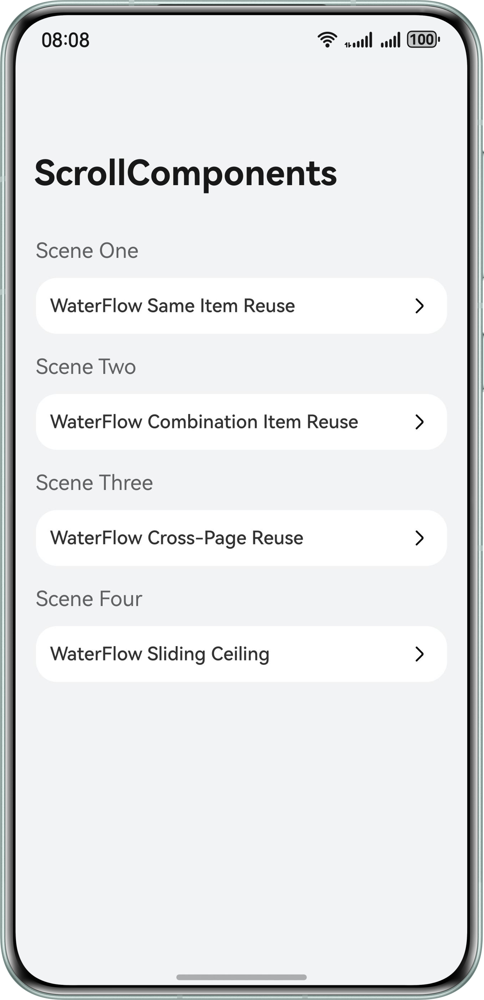

# Waterfall Based on ScrollComponents

## Overview
This sample demonstrates how to use ScrollComponents to build a waterfall page, covering the following scenarios:

- Waterfall Item reuse and cross-page component reuse;
- Accelerated rendering for the first waterfall page;
- Infinite scrolling of waterfall;
- Waterfall data processing, including pull-to-refresh, pull-up loading, and long-press deletion;
- Mixed section layout on the waterfall page;
- Waterfall sliding ceiling;
- Dynamic column switching via screen rotation in the waterfall layout;
- Waterfall flow effect, including fading edge and animation for deleting components.


## Preview


## Dependencies
- HarmonyOS 6.0.0 Release or later

## Project Directory
```
├─entry/src/main/ets
├─common
│  ├─constants
│  │  └─CommonConstants.ets
│  │
│  └─util
│     ├─Logger.ets
│     └─Utils.ets
│
├─entryability
│  └─EntryAbility.ets
│
├─entrybackupability
│  └─EntryBackupAbility.ets
│
├─model
│  ├─mock.ets
│  └─types.ets
│
├─pages
│  ├─CombineWaterFlowPage.ets           // Waterfall list items with composable child
│  ├─Index.ets
│  ├─MultiFlowItemPage.ets
│  ├─SharedPoolPage.ets
│  ├─SharedPoolSecondPage.ets
│  ├─StandardWaterFlowPage.ets          // Waterfall list same-structure items reuse
│  ├─StickyWaterFlowPage.ets            // Waterfall sliding ceiling
│  └─TabBarPage.ets                     // Waterfall cross-page reuse
│
└─workers
   ├─FetchAgent.ets
   └─GetNetworkData.ets
```

## Description
1. StandardWaterFlowPage.ets: implements the reuse of list same-structure items, accelerated rendering for the first screen, dynamic column switching via screen rotation, long-press deletion and animation for deleting components, and fading edge of waterfall.
2. CombineWaterFlowPage.ets: implements the reuse of list items with composable child components, accelerated rendering for the first screen, and infinite scrolling of waterfall.
3. TabBarPage.ets: implements the cross-page reuse between SharedPoolPage.ets and SharedPoolSecondPage.ets, and pull-down refresh and pull-up loading.
4. StickyWaterFlowPage.ets: implements the waterfall sliding ceiling and mixed section layout.

## How to Implement
> The following describes how to efficiently render the infinite waterfall page.

### 1. Define the waterfall view management class and register the item node template.
WaterFlowManager is a view manager. You can customize the view manager class based on service requirements.
- During page initialization, you can customize child node templates and bind them to components to enable reuse capabilities.
- If a pre-created node is used, the corresponding template should be registered before pre-creation.

```c
// src/main/ets/pages/StandardWaterFlowPage.ets

import { NodeItem, RecyclerView } from '@hadss/scroll_components';

/**
 * Item template 
 * */
@Builder
function StandardGridImageContainer($$: ESObject) {
  GridImageView({blogItem: $$.blogItem})
}

// 1. Customize the view manager. 
class MyWaterFlowManager extends WaterFlowManager {

  onWillCreateItem(index: number, data: BlogData) {
    // 3. Obtain reusable node by unique identifier and pass node data.
    let node: NodeItem<Params> | null = this.dequeueReusableNodeByType('StandardGridImageContainer');
    node?.setData({ blogItem: data });
    return node;
  }
}

@Entry
@Component
export struct StandardWaterFlowPage {
    // Instantiate the view manager.
    waterFlowView: MyWaterFlowManager = new MyWaterFlowManager({
        defaultNodeItem: 'StandardGridImageContainer',
        context: this.getUIContext()
    });
    // ...

    aboutToAppear(): void {
        // ...
        this.initView();
        // 2. Register the node template.
        this.waterFlowView.registerNodeItem('StandardGridImageContainer', wrapBuilder(StandardGridImageContainer));
    }
    // ...
}
```

### 2. Initialize the WaterFlow component.

```c
// src/main/ets/pages/StandardWaterFlowPage.ets

initView() {
    this.waterFlowView.setViewStyle({scroller: this.scroller})
      .width(CommonConstants.FULL_WIDTH)
      .height(CommonConstants.FULL_HEIGHT)
      .columnsTemplate(CommonConstants.WATER_FLOW_COLUMNS_TEMPLATE)
      .columnsGap(CommonConstants.COLUMNS_GAP)
      .rowsGap(CommonConstants.ROWS_GAP)
      .padding(CommonConstants.PADDING)
}
```

### 3. Set the data source for the data-rendering component.
- ScrollComponents supports lazy loading by default. You can use setDataSource to set a common array. You do not need to define data sources similar to lazyForEach.
- The RecyclerView is a view placeholder component, which can render a waterfall list after being bound to a view container instance.
```c
// src/main/ets/pages/StandardWaterFlowPage.ets

import { RecyclerView } from '@hadss/scroll_components';

@Observed
class BlogData{
  id: number = -1;
  images: string[] = [];
  imagePixelMap: image.PixelMap | undefined;
  // ...
}

@Entry
@Component
export struct StandardWaterFlowPage {
    waterFlowView: MyWaterFlowManager = new MyWaterFlowManager({
        defaultNodeItem: 'StandardGridImageContainer',
        context: this.getUIContext()
    });
    scroller: Scroller = new Scroller();
    @State data: BlogData[] = [];
    // ...

    aboutToAppear(): void {
        // ...
        this.initView();
        // 1. Use setDataSource to set the waterfall data.
        this.waterFlowView.setDataSource(data);
    }

    build() {
        Column() {
            // ...
            // 2. Bind the view container instance.
            RecyclerView({
                viewManager: this.waterFlowView
            })
        }
    }
}
```

# ScrollComponents Introduction

ScrollComponents is a high-performance scrolling solution that helps developers achieve better scrolling smoothness in complex scenarios such as long lists and waterfalls.

The base uses custom reuse pools to improve the component reuse efficiency in complex scenarios, which is higher than that of the native Reusable component.

You do not need to focus on reuse pool management or other performance optimization details. You can implement high-performance scrolling development through minimal code.

# Feature
- Supports smooth scrolling of the waterfall page;
- Supports lazy loading by default;
- Supports component frame-based pre-creation, helping developers reduce the time required for a single frame;
- Supports reuse pool sharing across pages, reducing frame loss during scrolling;
- Supports content dynamic preloading, reducing white blocks during scrolling.

# FAQ
[View Details](https://gitcode.com/openharmony-sig/scroll_components/blob/master/docs/FAQ.md)

# Principles
[View Details](https://gitcode.com/openharmony-sig/scroll_components/blob/master/README.md#%E5%8E%9F%E7%90%86%E4%BB%8B%E7%BB%8D)

# Open Source License
This project is licensed under [Apache License 2.0](./LICENSE).