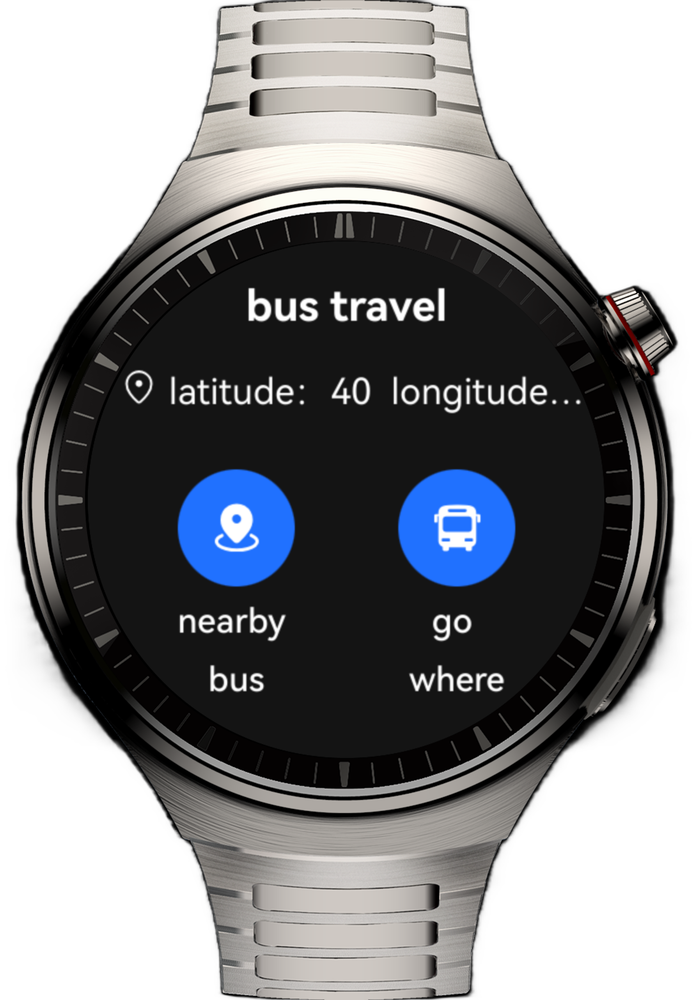
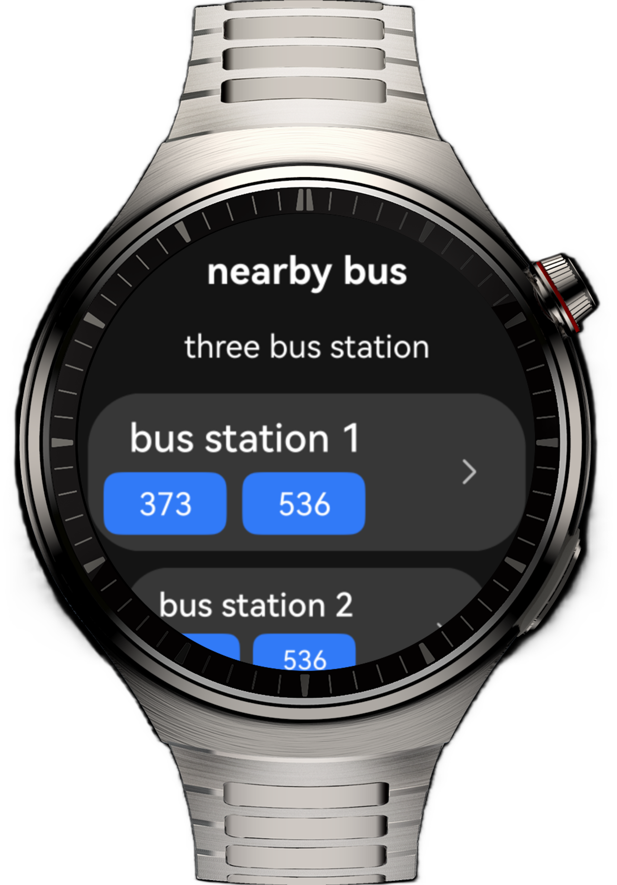
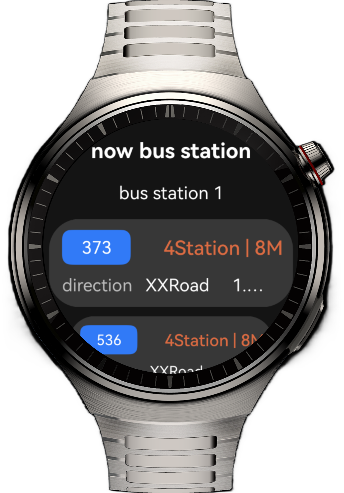
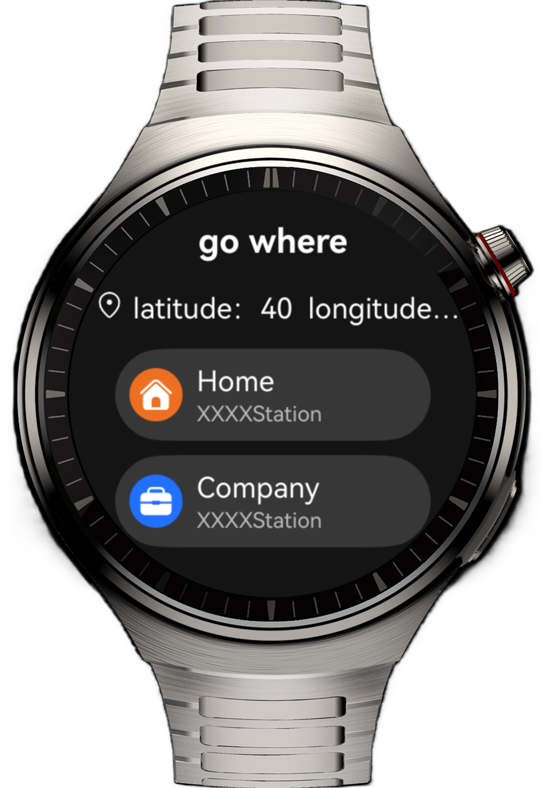
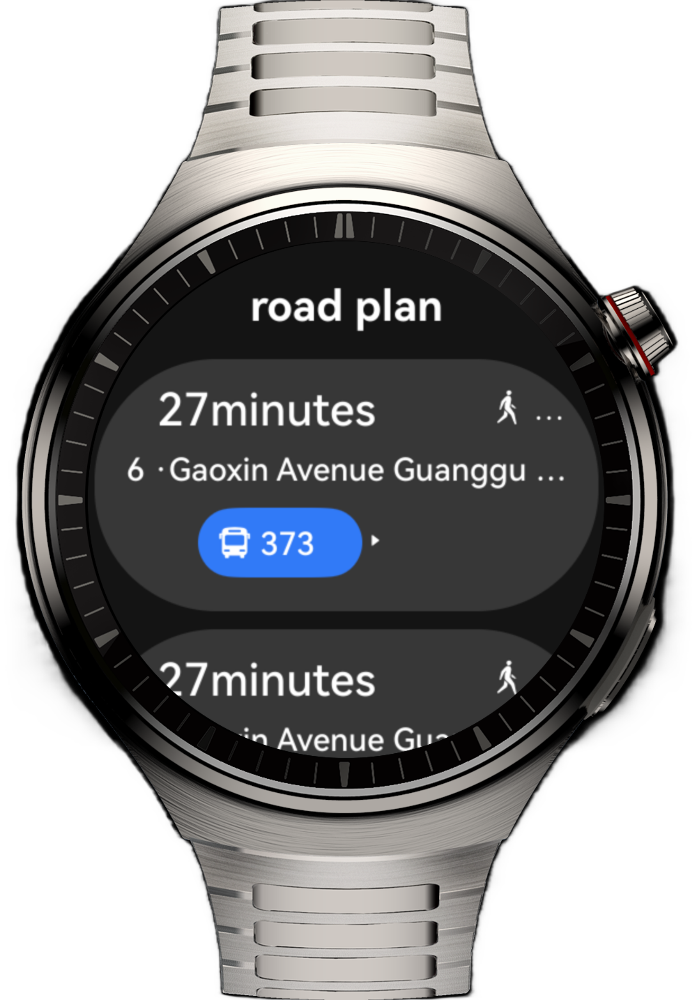

# Bus Application on Smart Watches

## Overview

This sample demonstrates a bus application on the smart watch and completes the page redirection by using the Navigation component, aiming to help you learn the layout modes and unique features of smart watches.

## Preview

| Home Page                                    | Nearby Bus                               | Real-Time Bus                               | Destination                                | Route                               |
|-------------------------------------|------------------------------------|------------------------------------|------------------------------------|------------------------------------|
|  |  |  |  |  |

## How to Use

1.	The home page obtains the location and contains two level-2 page entries.
2.	Tap **Nearby Bus** on the home page to access the nearby bus list. Select a bus in the list to go to the Now Bus Station page.
3.	Tap **Go where** on the home page to enter the destination list. Select **Home** or **Company** in the list to go to the route page.

## Project Directory

```
├──entry/src/main/ets                           
│  ├──common 
│  │  ├──Constants.ets                  // Common constants 
│  │  └──GlobalBuilderContext.ets       // Global @Builder 
│  ├──entryability 
│  │  └──EntryAbility.ets               // Entry point class 
│  ├──entrybackupability 
│  │  └──EntryBackupAbility.ets         // Data conversion and migration 
│  ├──model                               
│  │  ├──BusStationModel.ets            // Bus station data model 
│  │  └──RoadModel.ets                  // Road data model 
│  ├──pages 
│  │   └──Index.ets                     // Home page 
│  ├──util 
│  │  ├──LocationUtil.ets               // Obtain the location utility 
│  │  ├──PermissionUtil.ets             // Permission utility 
│  │  └──ScaleUtil.ets                  // List sliding and scaling calculating utility 
│  └──view 
│     ├──CommonBusListView.ets          // Reusable list component 
│     ├──CommonHomeView.ets             // Reusable multi-icon component 
│     ├──GoWhereDesView.ets             // Route page 
│     ├──GoWhereView.ets                // Destination page 
│     ├──LiveBusView.ets                // Real-time bus page 
│     └──NearbyBusView.ets              // Nearby bus page 
└──entry/src/main/resources             // Application resources
```

## Required Permissions

* ohos.permission.LOCATION: Allows the use of the location service.

* ohos.permission.APPROXIMATELY_LOCATION: Allows the use of precise location.

## Constraints

1. This sample is only supported on Huawei smart wearables running standard systems.
2. The HarmonyOS version must be HarmonyOS 5.1.0 Release or later.
3. The DevEco Studio version must be DevEco Studio 5.1.0 Release or later.
4. The HarmonyOS SDK version must be HarmonyOS 5.1.0 Release SDK or later.
