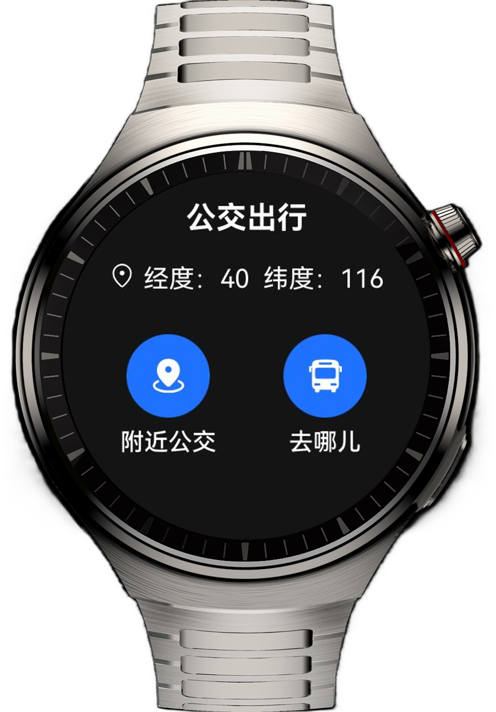
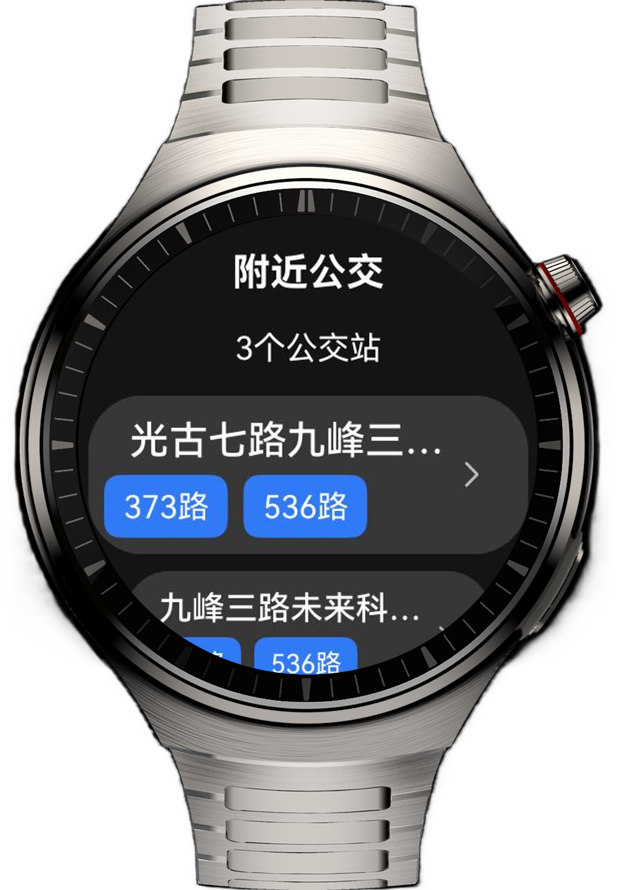
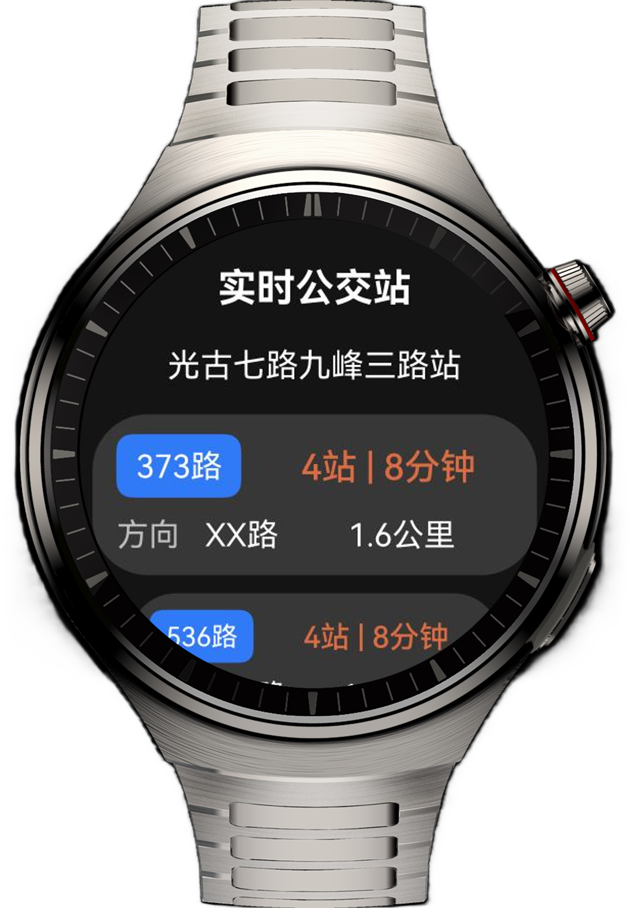
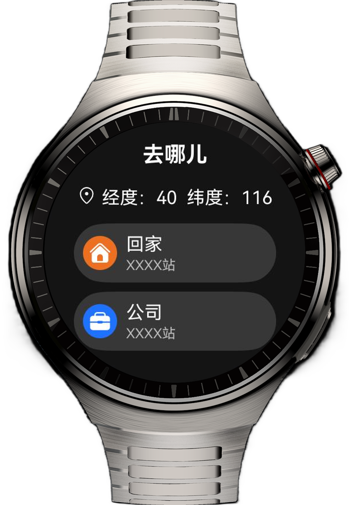
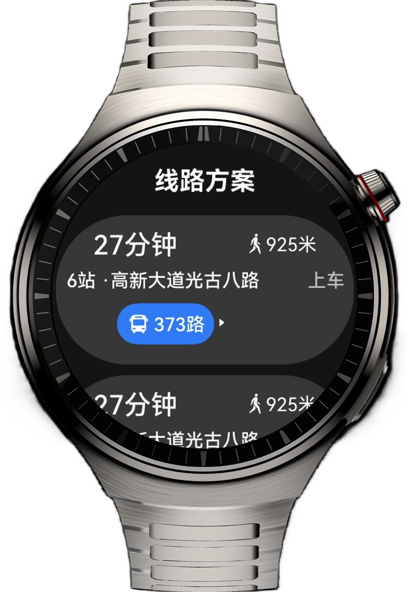

# 实现智能手表上的公交出行应用

## 介绍

本实例实现了智能手表上公交出行应用的页面布局，通过Navigation组件完成智能手表设备的页面跳转，帮助开发者学习智能手表设备的布局特点以及布局方式。

## 预览效果

| 首页                                 | 附近公交                               | 实时公交                               | 去哪儿                                | 线路方案                               |
|------------------------------------|------------------------------------|------------------------------------|------------------------------------|------------------------------------|
|  |  |  |  |  |


## 使用说明

1. 首页包含获取定位，2个二级页面入口
2. 从首页点击“附近公交”，进入附近公交列表，选中列表中的某一趟公交，跳转实时公交页面。
3. 从首页点击“去哪儿”，进入“去哪儿”列表，选中列表中的“回家”或“公司”，跳转线路方案页面。

## 工程目录

``` 
├──entry/src/main/ets                          
│  ├──common
│  │  ├──Constants.ets                  // 公共常量
│  │  └──GlobalBuilderContext.ets       // 缓存全局@Builder
│  ├──entryability
│  │  └──EntryAbility.ets               // 程序入口类
│  ├──entrybackupability
│  │  └──EntryBackupAbility.ets         // 自定义应用数据转换和迁移模板类
│  ├──model                              
│  │  ├──BusStationModel.ets            // 公交数据结构
│  │  └──RoadModel.ets                  // 线路数据结构
│  ├──pages
│  │   └──Index.ets                     // 首页
│  ├──util
│  │  ├──LocationUtil.ets               // 获取定位工具类                              
│  │  ├──PermissionUtil.ets             // 权限工具类
│  │  └──ScaleUtil.ets                  // 列表滑动缩放计算工具类
│  └──view
│     ├──CommonBusListView.ets          // 可复用的列表组件   
│     ├──CommonHomeView.ets             // 可复用的多icon项组件
│     ├──GoWhereDesView.ets             // 线路方案页               
│     ├──GoWhereView.ets                // 去哪儿页  
│     ├──LiveBusView.ets                // 实时公交页
│     └──NearbyBusView.ets              // 附近公交页
└──entry/src/main/resources             // 应用资源目录
```

## 相关权限
* ohos.permission.LOCATION 位置定位权限
* ohos.permission.APPROXIMATELY_LOCATION 位置精度权限

## 约束与限制

1. 本示例仅支持标准系统上运行，支持设备：华为智能穿戴。
2. HarmonyOS系统：HarmonyOS 5.1.0 Release及以上。
3. DevEco Studio版本：DevEco Studio 5.1.0 Release及以上。
4. HarmonyOS SDK版本：HarmonyOS 5.1.0 Release SDK及以上。