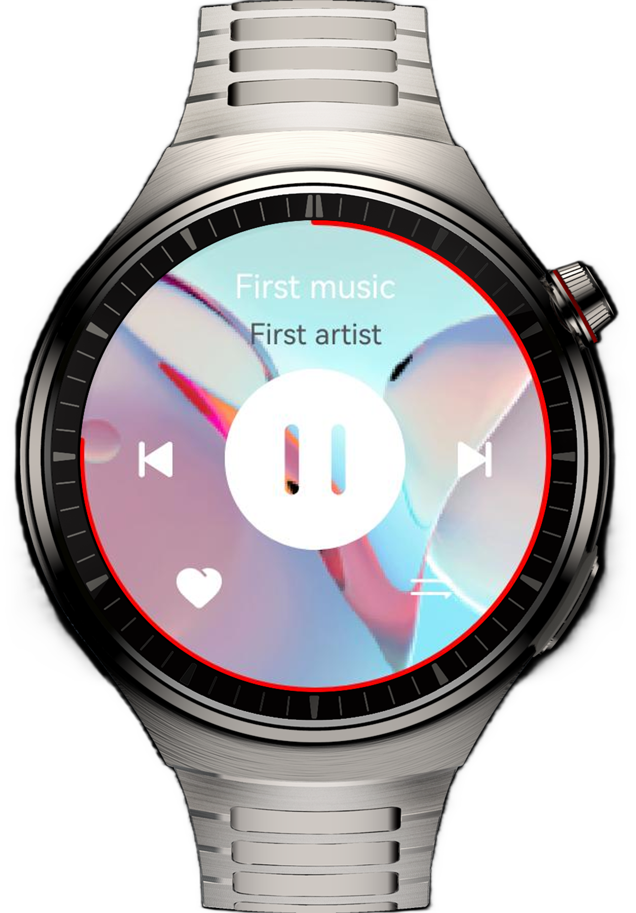

# 实现智能手表播放音乐功能

## 介绍

本示例通过实现一个智能手表上的播放音乐应用，帮助开发者掌握在穿戴设备上开发一款应用的布局方式以及布局特点。

## 预览效果


## 使用说明

1. 安装应用，启动应用。
2. 点击播放按钮，开始播放音乐
3. 点击暂停按钮，暂停音乐。
4. 点击上一首按钮，音乐切到上一首开始播放。
5. 点击下一首按钮，音乐切到下一首开始播放。
6. 点击收藏按钮，收藏按钮点亮。
7. 点击播放模式，可以切换不同的播放模式（注：播放模式未实现实际功能）。

## 工程目录

``` 
├──entry/src/main/ets/
│  ├──common
│  │  └──Constants.ets                          // 常量类
│  ├──entryability
│  │  └──EntryAbility.ets                       // 程序入口类
│  ├──entrybackupability
│  │  └──EntryBackupAbility.ets                 // 数据迁移类
│  ├──model
│  │  └──mediaData.ets                          // 媒体数据类型  
│  ├──pages
│  │  └──Index.ets                              // 界面 page
│  ├──utils
│  │  ├──GlobalContextUtils.ets                 // 缓存context
│  │  ├──Logger.ets                             // 日志工具类
│  │  └──MediaPlayerUtils.ets                   // 音乐播放控制类
│  ├──view
│  │  └──MusicHomeView.ets                      // 界面 UI
│  └──viewmodel
│     └──ProviderManager.ets                    // 媒体提供方状态管理
└───entry/src/main/resources                    // 应用资源目录
``` 

## 具体实现

1. 在[module.json](entry/src/main/module.json5)中设置deviceTypes为wearable
2. 将页面适配为圆形[borderRadius：“50%”](entry/src/main/ets/pages/Index.ets)
3. 采用[AVPlayer](entry/src/main/ets/utils/MediaPlayerUtils.ets)播控音乐
4. 采用[AVSession](entry/src/main/ets/viewmodel/ProviderManager.ets)后台播放音乐

## 相关权限

后台播放音乐：ohos.permission.KEEP_BACKGROUND_RUNNING

## 约束与限制

1. 本示例仅支持标准系统上运行，支持设备：华为智能穿戴。
2. HarmonyOS系统：HarmonyOS 5.1.0 Release及以上。
3. DevEco Studio版本：DevEco Studio 5.1.0 Release及以上。
4. HarmonyOS SDK版本：HarmonyOS 5.1.0 Release SDK及以上。