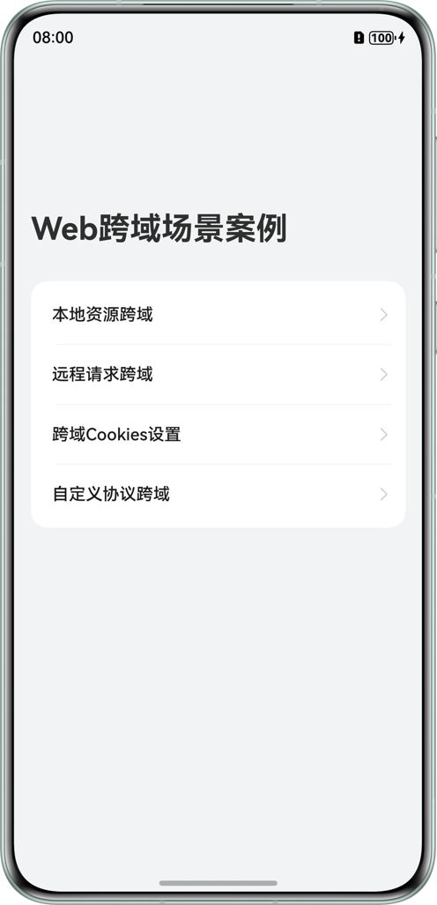
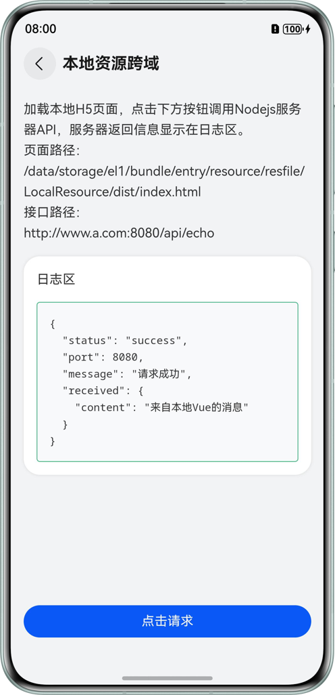
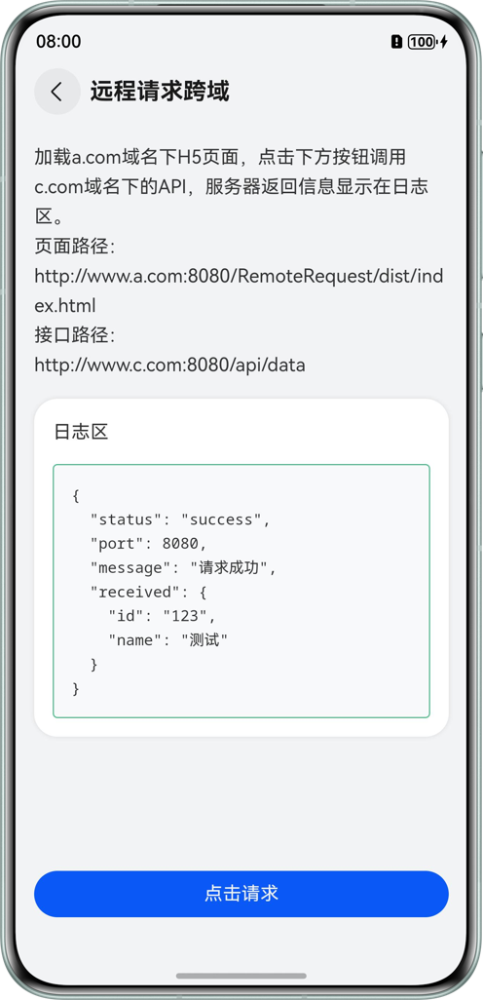
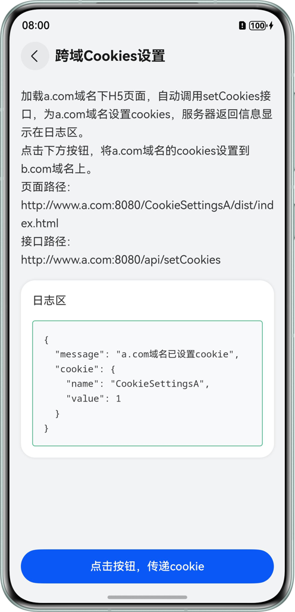
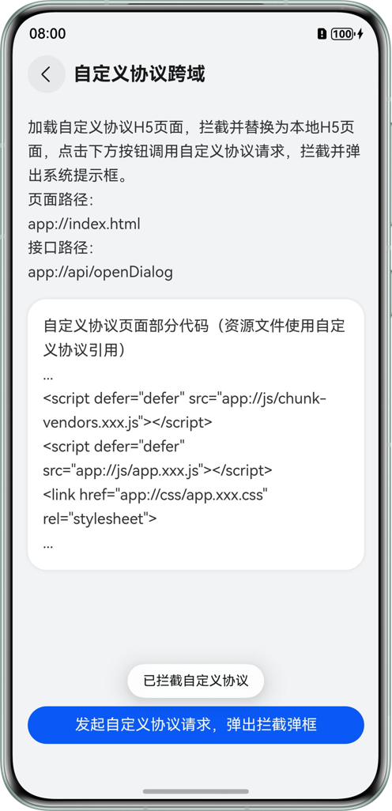

# Web Page Cross-Domain

## Overview

This example implements web page cross-domain based on ArkWeb interceptor and cookie management capabilities, focusing on web page cross-domain issues. Through typical scenario cases, it intuitively demonstrates cross-domain solutions. It covers scenarios such as local resource cross-domain, remote request cross-domain, cross-domain cookie setting, and custom protocol cross-domain, providing reference implementation ideas and code examples to help developers understand cross-domain principles and quickly solve cross-domain problems in actual projects quickly.

## Preview

<table>
  <tr>
    <td align="center">Home Page</td>
    <td align="center">Local Resource Cross-Domain</td>
    <td align="center">Remote Request Cross-Domain</td>
  </tr>
  <tr>
    <td align="center"></td>
    <td align="center"></td>
    <td align="center"></td>
  </tr>
  <tr>
    <td align="center">Cross-Domain Cookie Setting</td>
    <td align="center">Custom Protocol Cross-Domain</td>
    <td></td>
  </tr>
  <tr>
    <td align="center"></td>
    <td align="center"></td>
    <td></td>
  </tr>
</table>

## How to Use

1. Open this project with DevEco, open the console/terminal in the root directory, and execute the `hvigorw startServer` command to start the local server.
2. Click Run and wait for the compilation to complete.
3. Restart the local server and execute the `hvigorw restartServer` command.
4. Stop the local server and execute the `hvigorw stopServer` command.

## Usage Instructions

1. On the local resource cross-domain page, click the button to send a request, and the request result will be displayed in the log area.
2. On the remote request cross-domain page, click the button to send a request, and the request result will be displayed in the log area.
3. On the cross-domain cookie setting page, when entering the page, a request will be automatically sent to domain A to set cookies, and the request result will be displayed in the log area.
4. On the cross-domain cookie setting page, click the button to obtain cookies under domain A and pass them to domain B, load the page of domain B and send a request to domain B, and the request result will be displayed in the log area.
5. On the custom protocol cross-domain page, click the button to send a request, and a system prompt box will pop up, showing "Custom protocol intercepted".

## Project Directory

```
├── entry/src/main/ets                              
│  ├── common
│  │  ├── Constants.ets                  // Static constant data
│  │  ├── HttpProxy.ets                  // Network request proxy
│  │  ├── Logger.ets                     // Log file
│  │  └── PageLoadError.ets              // Web page loading error page
│  ├── component                  
│  │  ├── CardItem.ets                   // Home page list item
│  │  └── Header.ets                     // Detail page header
│  ├── entryability  
│  │  └── EntryAbility.ets               // Program entry
│  ├── pages                                     
│  │  └── Index.ets                      // Home page
│  └── view
│     ├── CookiesSettings.ets            // Cross-domain cookie setting scenario detail page
│     ├── CustomProtocol.ets             // Custom protocol cross-domain scenario detail page
│     ├── LocalResource.ets              // Local resource cross-domain scenario detail page
│     └── RemoteRequest.ets              // Remote request cross-domain scenario detail page
├── entry/src/main/resources             // Application static resource directory
├── LocalVue                             // H5 pages
├── LocalServer                          // Local server
└── scripts/commandTask.ts               // Command file
```

## How to Implement

1. For local resource cross-domain, set a path list through `setPathAllowingUniversalAccess()`. When accessing resources in this list using the file protocol, cross-domain access to local files is allowed.
2. For remote request cross-domain, set a WebSchemeHandler interceptor in WebView to intercept requests from the web page, use rcp requests as proxy requests for cross-domain requests, and forward them to the target remote server. The communication between the proxy request and the remote server is not restricted by the browser, so the server's response result can be received. However, when passing the result back to WebView, cross-domain response headers still need to be configured to solve the cross-domain problem.
3. For cross-domain cookie setting, use `putAcceptCookieEnabled()` to set the WebCookieManager instance to have the permission to send and receive cookies, use `fetchCookiesync()` to obtain cookies under domain A, use `configCookiesync()` to set cookies for domain B, and cookies will be automatically carried when sending requests to domain B.
4. For custom protocol cross-domain, set a WebSchemeHandler interceptor in WebView to intercept requests and call system capabilities to pop up a system prompt box.

## Permissions

ohos.permission.INTERNET: allows an application to access the Internet.

## Constraints

1. This example only supports running on standard systems, supported devices: Huawei phones.
2. HarmonyOS system: HarmonyOS 5.0.5 Release and above.
3. DevEco Studio version: DevEco Studio 5.0.5 Release and above.
4. HarmonyOS SDK version: HarmonyOS 5.0.5 Release SDK and above.