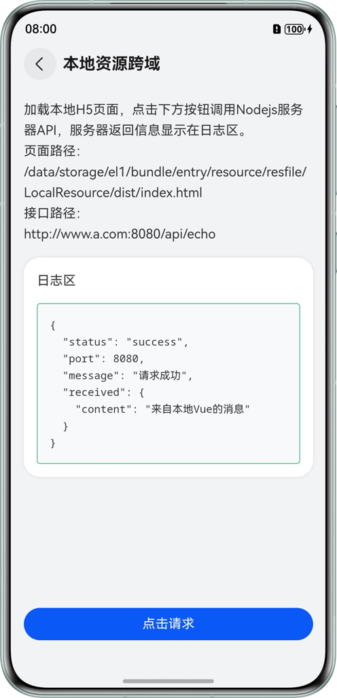
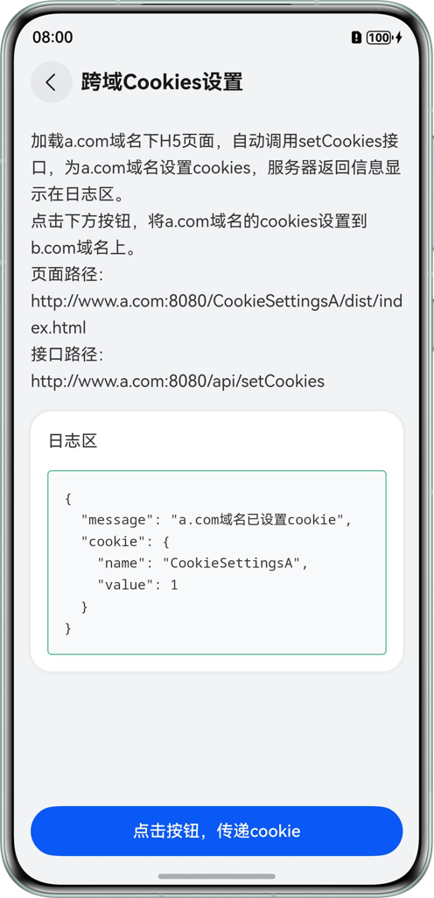
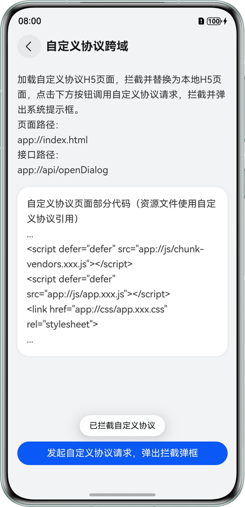

# 基于ArkWeb拦截器和Cookies管理能力实现Web页面跨域

## 介绍

本示例基于ArkWeb拦截器和Cookies管理能力实现Web页面跨域，聚焦Web页面跨域问题，通过典型场景案例，直观演示跨域解决方案。涵盖本地资源跨域、远程请求跨域、跨域Cookies设置场景及自定义协议跨域，提供可参考的实现思路与代码示例，助力开发者理解跨域原理，快速解决实际项目中的跨域难题。

## 效果预览

<table>
  <tr>
    <td align="center">首页</td>
    <td align="center">本地资源跨域场景详情页</td>
    <td align="center">远程请求跨域场景详情页</td>
  </tr>
  <tr>
    <td align="center"></td>
    <td align="center"></td>
    <td align="center"></td>
  </tr>
  <tr>
    <td align="center">跨域Cookies设置场景详情页</td>
    <td align="center">自定义协议跨域场景详情页</td>
    <td></td>
  </tr>
  <tr>
    <td align="center"></td>
    <td align="center"></td>
    <td></td>
  </tr>
</table>


## 运行步骤

1. 使用DevEco打开本工程，在根目录打开DevEco的Terminal，执行`hvigorw startServer`命令，启动本地服务器。

   

2. 点击运行，等待编译完成。

3. 重启本地服务器，执行`hvigorw restartServer`命令。

4. 关闭本地服务器，执行`hvigorw stopServer`命令。

## 使用说明

1. 在本地资源跨域页面，点击按钮发出请求，日志区显示请求结果。
2. 在远程请求跨域页面，点击按钮发出请求，日志区显示请求结果。
3. 在跨域Cookies设置页面，进入页面会自动向A域名发出请求，设置cookies，日志区显示请求结果。
4. 在跨域Cookies设置页面点击按钮，获取A域名下的cookies传递给B域名，加载B域名页面并向B域名发出请求，日志区显示请求结果。
5. 在自定义协议跨域页面，点击按钮发出请求，弹出系统提示框，显示“已拦截自定义协议”。

## 工程目录

```
├──entry/src/main/ets                              
│  ├──common
│  │  ├──Constants.ets                  // 静态常量数据
│  │  ├──HttpProxy.ets                  // 网络请求代理
│  │  ├──Logger.ets                     // 日志文件
│  │  └──PageLoadError.ets              // Web页面加载错误页
│  ├──component                  
│  │  ├──CardItem.ets                   // 主页列表项
│  │  └──Header.ets                     // 详情页头部
│  ├──entryability  
│  │  └──EntryAbility.ets               // 程序入口
│  ├──pages                                     
│  │  └──Index.ets                      // 首页
│  └──view
│     ├──CookiesSettings.ets            // 跨域Cookies设置场景详情页
│     ├──CustomProtocol.ets             // 自定义协议跨域场景详情页
│     ├──LocalResource.ets              // 本地资源跨域场景详情页
│     └──RemoteRequest.ets              // 远程请求跨域场景详情页
├──entry/src/main/resources             // 应用静态资源目录
├──LocalVue                             // H5页面
├──LocalServer                          // 本地服务器
└──scripts/commandTask.ts               // 命令文件
```

## 具体实现

1. 在本地资源跨域时，通过setPathAllowingUniversalAccess()设置一个路径列表。当使用file协议访问该列表中的资源时，允许进行跨域访问本地文件。
2. 在远程请求跨域时，在WebView中设置WebSchemeHandler拦截器，将Web页面的请求拦截，使用rcp请求作为跨域请求的代理请求，转发到目标远程服务器。代理请求与远程服务器的通信不受浏览器限制，因此可以接收到服务器的响应结果，但将结果传回WebView时仍需配置跨域响应头来解决跨域问题。
3. 在跨域Cookies设置时，使用putAcceptCookieEnabled()设置WebCookieManager实例拥有发送和接收cookies的权限，使用fetchCookiesync()获取A域名下的cookies，使用configCookiesync()给B域名设置cookies，向B域名发送请求时自动携带cookies。
4. 在自定义协议跨域时，在WebView中设置WebSchemeHandler拦截器，拦截请求并调用系统能力，弹出系统提示框。

## 相关权限

Internet网络权限：ohos.permission.INTERNET。

## 约束与限制

1. 本示例仅支持标准系统上运行，支持设备：华为手机。

2. HarmonyOS系统：HarmonyOS 5.0.5 Release及以上。

3. DevEco Studio版本：DevEco Studio 5.0.5 Release及以上。

4. HarmonyOS SDK版本：HarmonyOS 5.0.5 Release SDK及以上。
