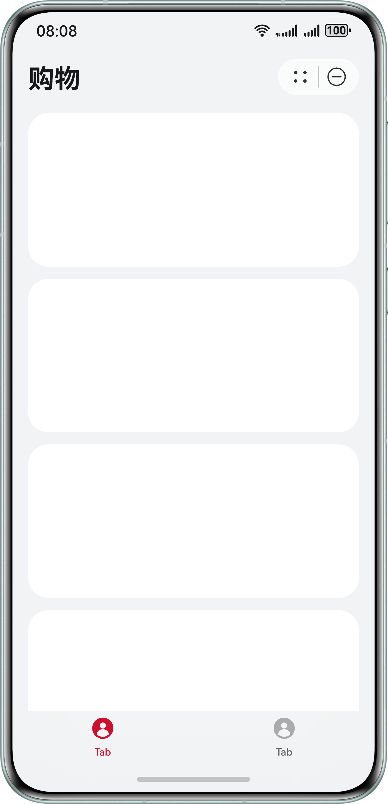
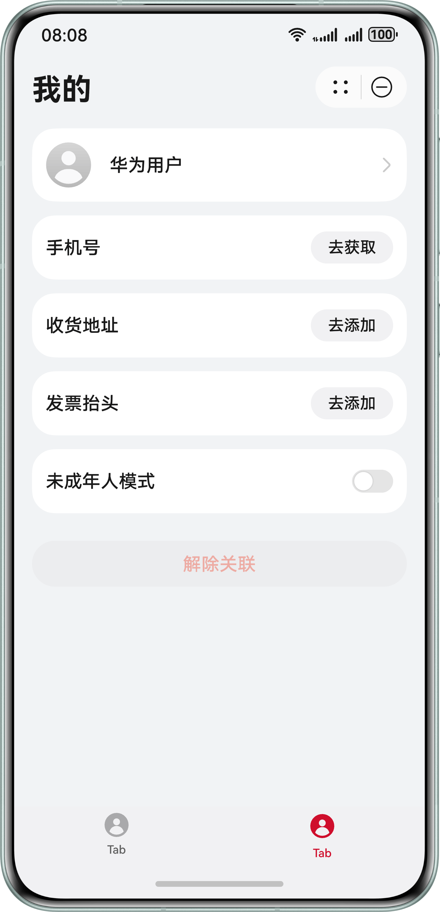
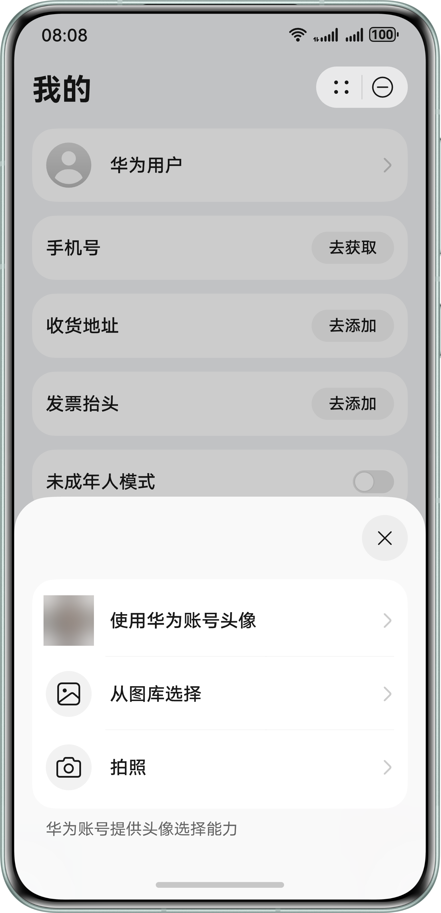
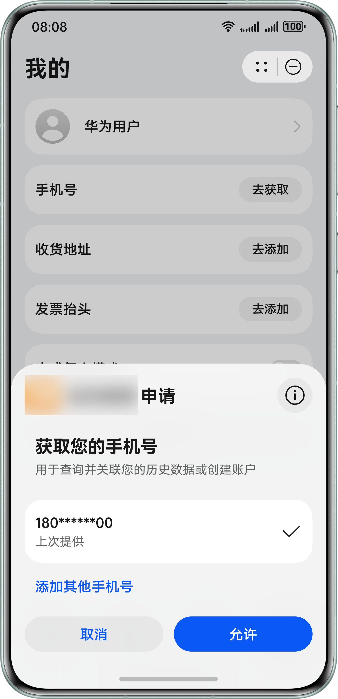
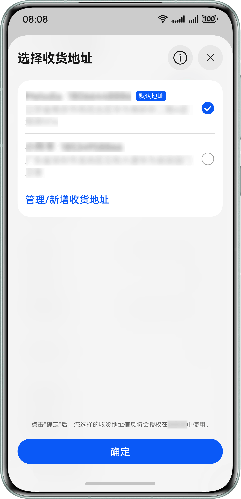
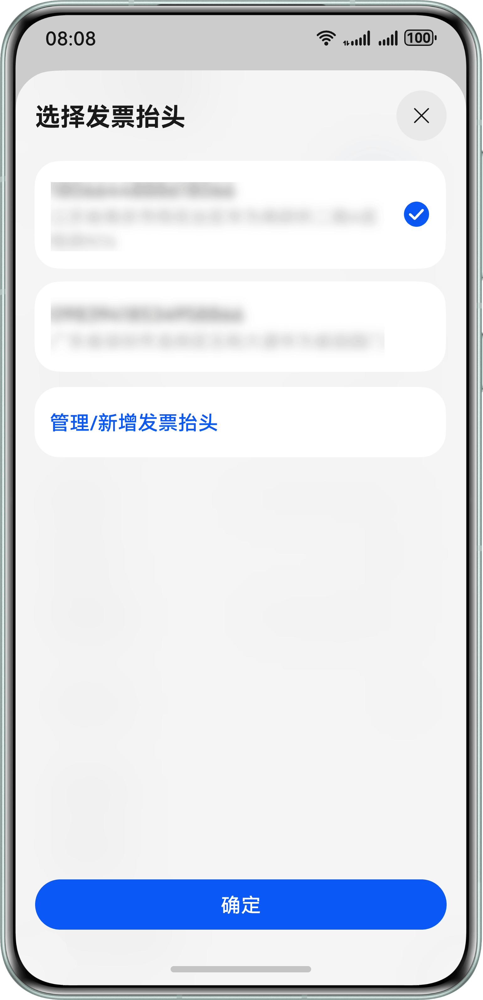
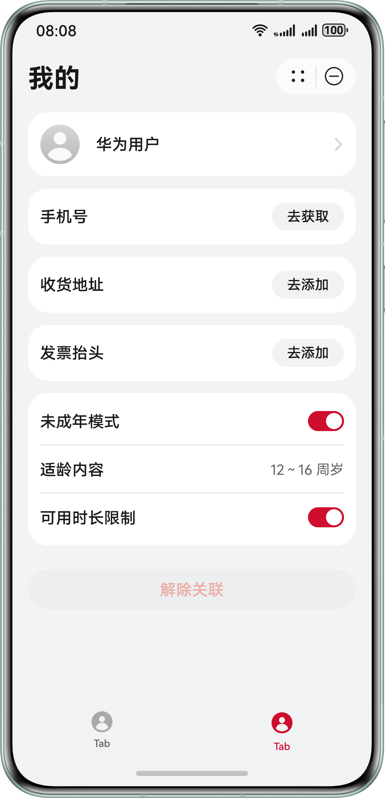
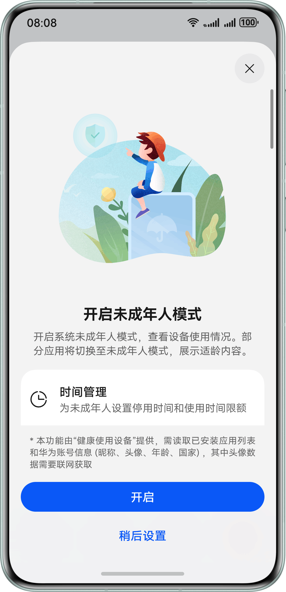

# Account Kit

## 介绍

本示例展示了使用 authentication.AuthenticationController 接口实现静默登录的能力，使用 FunctionalButton 组件提供的获取头像、手机号、收货地址、发票抬头的能力以及使用 Account Kit 开启或关闭未成年人模式的能力。

本示例模拟了在元服务里调用登录接口实现静默登录；使用 FunctionalButton 组件获取头像功能获取头像；使用 FunctionalButton 组件获取手机号功能获取手机号；使用 FunctionalButton 组件获取收货地址功能获取收货地址；使用 FunctionalButton 组件获取发票抬头功能获取发票抬头；调用未成年人模式接口开启或关闭未成年人模式，订阅未成年人模式公共事件，调用未成年人模式验密接口验证未成年人模式密码。

需要使用 Account Kit 接口 **@kit.AccountKit** 以及 **FunctionalButton** 组件。

## 效果预览

|                                                    |                                                    |                                                    |
|:--------------------------------------------------:|:--------------------------------------------------:|:--------------------------------------------------:|
|                      **购物页面**                      |                      **我的页面**                      |                      **获取头像**                      |
|  |  |  |
|                     **获取手机号**                      |                     **获取收货地址**                     |                     **获取发票抬头**                     |
|  |  |  |
|                      **个人中心**                      |                    **开启未成年人模式**                    |                                                    |
|  |  |                                                    |


## 本示例的配置与使用

### 在DevEco中配置本示例的步骤如下

1. 参考Account Kit开发指南的[开发准备](https://developer.huawei.com/consumer/cn/doc/atomic-guides/account-guide-atomic-preparations)章节，创建项目和元服务、配置签名和指纹、配置Client ID、申请账号权限（获取您的手机号和获取收货地址）。
2. 使用[AppGallery Connect](https://developer.huawei.com/consumer/cn/service/josp/agc/index.html)配置的包名替换app.json5文件中的bundleName属性值。

## 本示例使用说明

1. 运行本示例，在底部 navBar 上点击可切换“购物”和“我的”页面。
2. 申请获取收货地址 API 权限后，在我的页面点击收货地址拉起选择收货地址页面，用户选择对应的地址后展示收货地址信息。
3. 元服务启动时，会调用 authentication.AuthenticationController 接口进行华为账号登录。
4. 当前元服务启动后会订阅未成年人模式开启/关闭事件，当订阅到系统未成年人模式开启/关闭时，则元服务未成年人模式开关状态会跟随系统未成年人模式状态进行切换。
5. 在我的页面点击头像，会拉起头像选择弹窗，用户选择对应图片后可展示头像信息。
6. 申请phone权限后，在页面上点击“去获取”，会拉起手机号授权页面，授权成功后展示180******00（本示例只获取code，获取code后需要将code传给元服务服务器，调用华为账号服务器接口换取Access Token，然后再[获取用户手机号](https://developer.huawei.com/consumer/cn/doc/harmonyos-references/account-api-get-user-info-get-phone)），如未申请权限则弹出错误提示。
7. 在我的页面点击发票抬头拉起选择发票抬头页面，用户选择对应的抬头后展示发票抬头信息。
8. 当前元服务启动后会订阅未成年人模式开启/关闭事件:
    * 当订阅到系统未成年人模式开启时，会再判断元服务内未成年人模式单独关闭标记（userTurnOffFlag）是否为true（true表示用户主动关闭元服务的未成年人模式），如果元服务内单独关闭标记为true，则关闭元服务内未成年人模式，如果元服务内单独关闭标记为false（false表示用户未主动关闭元服务的未成年人模式），则元服务内未成年人模式开启，并获取适龄内容年龄段。
    * 当订阅到系统未成年人模式关闭时，会关闭元服务内未成年人模式，并设置元服务内未成年人模式单独关闭标记为false。
9. 元服务启动时，会调用 getMinorsProtectionInfoSync 接口，查询系统未成年人模式的开启状态，当查询到系统未成年人模式已关闭时，设置元服务内未成年人模式单独关闭标记为false。
10. 当元服务内未成年人模式未开启时，点击未成年人模式开关，如当前系统未成年人模式状态为已开启，则元服务直接开启自身未成年人模式，展示当前从系统获取的年龄段信息；如当前系统未成年人模式状态为未开启，则引导用户开启系统未成年人模式。
11. 当元服务内未成年人模式开启时：
    * 可以点击可用时长限制开关，系统会校验健康使用设备密码，校验通过后，才可修改可用时长限制开关的状态。
    * 可以点击未成年人模式开关，系统会校验健康使用设备密码，校验通过后，元服务的未成年人模式成功关闭，设置元服务内未成年人模式单独关闭标记为true。
12. 在我的页面，点击取消关联按钮后，会清除头像、手机号收货地址、发票抬头信息。
13. 元服务启动时，会调用 getMinorsProtectionInfoSync 接口，查询未成年人模式的开启状态，当查询到系统未成年人模式已关闭时，设置元服务内未成年人模式单独关闭标记为false。
14. 当未成年人模式开启时，当前设备的开发者调试模式会被禁用，开发者可以进入设置-系统-开发者选项，点击USB调试开关，会校验健康使用设备密码，校验成功后可解除开发者调试模式限制。

## 工程目录
```
├─entry/src/main/ets // 代码区  
│ ├─common  
│ │ └─CommonEventUtil.ets    // 公共类，包含监听未成年人状态变化的事件
│ │ └─ErrorCodeEntity.ets    // 登录过程中可能遇到的错误码信息页面
│ │ └─UserInfo.ets           // 用户信息数据结构
│ │ └─Utils.ets              // 业务方法
│ ├─components               // 存放组件文件目录
│ │ └─Address.ets            // 获取收获地址组件
│ │ └─Avatar.ets             // 获取头像组件
│ │ └─InvoiceTitle.ets       // 获取发票抬头组件
│ │ └─MinorsProtection.ets   // 未成年人模式开关组件
│ │ └─Phone.ets              // 获取手机号组件
│ ├─entryability
│ │ └─EntryAbility.ets       // 程序入口类
│ ├─pages                    // 存放页面文件目录
│ │ └─Index.ets              // 主页面
│ │ └─PersonalInfoPage.ets   // 个人信息页，包含头像、获取手机号、获取收货地址、获取发票抬头、设置未成年人模式场景
│ │ └─ShoppingPage.ets       // 购物页面
└──entry/src/main/resources  // 资源文件目录
```

## 具体实现

打开元服务立即登录当前华为账号，参考 Index.ets:
* 使用 new authentication.HuaweiIDProvider().createLoginWithHuaweiIDRequest() 创建静默登录请求，配合 PersistentStorage 模拟静默登录

本示例有头像设置、获取用户手机号、获取收货地址信息、获取发票抬头信息、设置未成年人模式，参考 PersonalInfoPage.ets：
* 使用 FunctionalButton 组件获取用户头像，参考 Avatar.ets
* 使用 FunctionalButton 组件获取用户手机号，参考 Phone.ets
* 使用 FunctionalButton 组件获取获取收货地址信息，参考 Address.ets
* 使用 FunctionalButton 组件获取获取获取发票抬头信息，参考 InvoiceTitle.ets

参考 MinorsProtection.ets 设置未成年人模式
* 使用 minorsProtection.leadToTurnOnMinorsMode 引导用户开启未成年人模式，元服务内提供入口，帮助用户快速开启未成年人模式，参考 MinorsProtection.ets
* 使用 minorsProtection.verifyMinorsProtectionCredential 校验用户开启未成年人模式的密码，防止未成年人更改系统未成年人模式设置，参考 MinorsProtection.ets

在 EntryAbility.ets 的 onCreate 函数内调用公共事件函数订阅未成年人模式公共事件，参考 CommonEventUtil.ets 实现相关事件注册和回调等功能：
* 使用 @ohos.commonEventManager 系统能力监听 COMMON_EVENT_MINORSMODE_ON 和 COMMON_EVENT_MINORSMODE_OFF 事件，当元服务进程存在时，元服务可以实时感知到系统未成年人模式的变化，从而与系统联动改变自己的未成年人模式

定义 UserInfo 的数据结构，参考 UserInfo.ets

参考
1. entry\src\main\ets\pages\Index.ets
2. entry\src\main\ets\pages\PersonalInfoPage.ets
3. entry\src\main\ets\components\Avatar.ets
4. entry\src\main\ets\components\Phone.ets
5. entry\src\main\ets\components\Address.ets
6. entry\src\main\ets\components\InvoiceTitle.ets
7. entry\src\main\ets\components\MinorsProtection.ets
8. entry\src\main\ets\common\CommonEventUtil.ets
9. entry\src\main\ets\common\UserInfo.ets
10. entry\src\main\ets\entryability\EntryAbility.ets

## 依赖

依赖设备具备 WIFI 能力

## 约束与限制

1. 本示例仅支持标准系统上运行，支持设备：phone、tablet，支持账号：已绑定手机号的中国境内（不包含中国香港、中国澳门、中国台湾）成人账号。
2. 本示例不支持大字体模式、隐私空间模式。
3. Harmony OS系统：HarmonyOS 5.0.5 Release 及以上。
4. DevEco Studio 版本：DevEco Studio 5.0.5 Release 及以上。
5. HarmonyOS SDK 版本：HarmonyOS 5.0.5 Release SDK 及以上。